# x-kv 功能详解文档

x-kv 是一个面向 TiKV v8.x 线协议兼容的分布式事务 KV 存储系统，基于 Java 17、RocksDB（JNI）、gRPC 和 Multi-Raft（via x-raft-lib）构建。本文档按功能域逐一展开，覆盖全部 15 个功能域、50+ 个子功能点。

---

## 目录

1. [存储引擎](#1-存储引擎)
2. [Raft 共识与复制](#2-raft-共识与复制)
3. [MVCC + Percolator 事务](#3-mvcc--percolator-事务)
4. [PD Region 管理与调度](#4-pd-region-管理与调度)
5. [Placement Rules（放置规则）](#5-placement-rules放置规则)
6. [TSO（Timestamp Oracle）](#6-tsotimestamp-oracle)
7. [GC（垃圾回收）](#7-gc垃圾回收)
8. [死锁检测](#8-死锁检测)
9. [Raw KV API](#9-raw-kv-api)
10. [Client SDK](#10-client-sdk)
11. [Coprocessor（协处理器）](#11-coprocessor协处理器)
12. [CDC（Change Data Capture）](#12-cdcchange-data-capture)
13. [Backup & Restore（备份与恢复）](#13-backup--restore备份与恢复)
14. [多租户（Keyspace & Resource Group）](#14-多租户keyspace--resource-group)
15. [运维工具链](#15-运维工具链)

---

## 1. 存储引擎

### 1.1 功能概述

存储引擎是 x-kv 的数据持久化基座。单个 KV 节点上的所有 region 数据共享一个 RocksDB 实例，通过四个 Column Family（CF）隔离不同类型的数据。这种设计避免了 per-region 独立 DB 带来的文件描述符爆炸和 compaction 资源竞争。

### 1.2 架构设计

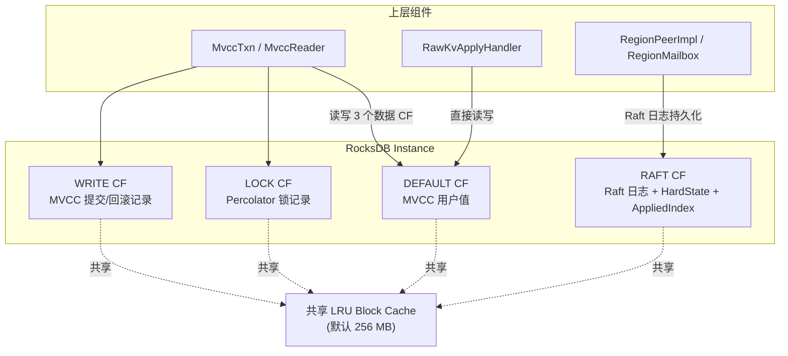
```mermaid
graph TD
    subgraph "RocksDB Instance"
        DEFAULT["DEFAULT CF<br/>MVCC 用户值"]
        LOCK["LOCK CF<br/>Percolator 锁记录"]
        WRITE["WRITE CF<br/>MVCC 提交/回滚记录"]
        RAFT["RAFT CF<br/>Raft 日志 + HardState + AppliedIndex"]
    end

    subgraph "上层组件"
        MVCC["MvccTxn / MvccReader"]
        RAW["RawKvApplyHandler"]
        PEER["RegionPeerImpl / RegionMailbox"]
    end

    MVCC -->|"读写 3 个数据 CF"| DEFAULT
    MVCC --> LOCK
    MVCC --> WRITE
    RAW -->|"直接读写"| DEFAULT
    PEER -->|"Raft 日志持久化"| RAFT

    CACHE["共享 LRU Block Cache<br/>(默认 256 MB)"]
    DEFAULT -.->|共享| CACHE
    LOCK -.->|共享| CACHE
    WRITE -.->|共享| CACHE
    RAFT -.->|共享| CACHE
```

### 1.3 协议 / Wire Format

**RAFT CF 键编码**（`RaftCfKeys`）：

| 键类型 | 格式 | 长度 |
|--------|------|------|
| 日志条目 | `[0x01][regionId 8B BE][index 8B BE]` | 17B |
| HardState | `[0x02][regionId 8B BE]` | 9B |
| AppliedIndex | `[0x03][regionId 8B BE]` | 9B |
| 去重缓存 | `[0x04][regionId 8B BE][clientId 8B BE]` | 17B |
| SnapshotMeta | `[0x05][regionId 8B BE]` | 9B |
| MaxTs | `[0x08][regionId 8B BE]` | 9B |
| MergeState | `[0x09][regionId 8B BE]` | 9B |
| Region 描述符 | `[0x07][regionId 8B BE]` | 9B |

所有键使用大端序（Big-Endian），确保同一 region 的数据在 RocksDB 中物理连续。

### 1.4 核心实现

**Per-CF 调优策略**：

| CF | Bloom Filter | Block Size | Memtable | 压缩 | 适配场景 |
|----|-------------|------------|----------|------|---------|
| DEFAULT | 10-bit | 16 KB | 64 MB × 4 | LZ4 | 点查优化 |
| LOCK | 10-bit | 16 KB | 16 MB × 2 | LZ4 | 小且短命 |
| WRITE | Whole-key | 16 KB | 64 MB × 4 | LZ4 | 按 userKey seek |
| RAFT | 无 | 64 KB | 64 MB × 2 | LZ4 | 顺序追加 |

**WriteBatch 原子性保证**：

单个 Raft entry 的所有 CF 变更打包到一个 `WriteBatch` 中：

```
WriteBatch {
  PUT(LOCK CF, key, lockRecord)
  PUT(DEFAULT CF, mvccKey, value)
  PUT(RAFT CF, appliedKey, newAppliedIndex)
}
→ write(sync=false)
→ flushWal(true)  // Ready 轮次结束时统一 fsync
```

**Snapshot 生命周期**：

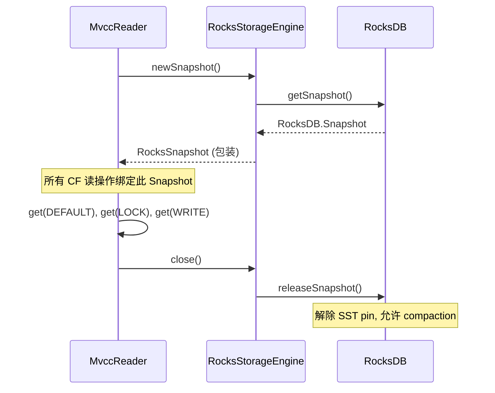
```mermaid
sequenceDiagram
    participant Caller as MvccReader
    participant Engine as RocksStorageEngine
    participant RocksDB

    Caller->>Engine: newSnapshot()
    Engine->>RocksDB: getSnapshot()
    RocksDB-->>Engine: RocksDB.Snapshot
    Engine-->>Caller: RocksSnapshot (包装)
    Note over Caller: 所有 CF 读操作绑定此 Snapshot
    Caller->>Caller: get(DEFAULT), get(LOCK), get(WRITE)
    Caller->>Engine: close()
    Engine->>RocksDB: releaseSnapshot()
    Note over RocksDB: 解除 SST pin, 允许 compaction
```

**SnapshotEngine（快照生成/安装）**：

- **生成**：Pin 一个 RocksDB Snapshot → 遍历 3 个数据 CF → 64 KB 分块 → 每 chunk 附 CRC32C
- **安装**：校验 CRC32C → 原子 `WriteBatch`（deleteRange 旧范围 + 插入新数据）→ `sync=true`
- Wire format：`[4B keyLen][key][4B valueLen][value]`

### 1.5 正确性保证

- **Inv-1（单 fsync 原子性）**：业务 CF 变更 + appliedIndex 更新在同一 WriteBatch 中，一次 `flushWal(true)` 落盘。崩溃时要么全部持久化，要么全部丢失
- **Inv-2（跨 CF 快照一致性）**：单次请求内所有 CF 读绑定同一 RocksDB Snapshot，避免看到 WRITE 记录却看不到 DEFAULT 值

### 1.6 配置项

| 配置键 | 默认值 | 说明 |
|--------|--------|------|
| `engine.blockCacheBytes` | 256 MB | 共享 LRU Block Cache 大小 |
| `engine.writeBufferBytes` | 64 MB | 单个 memtable 大小 |
| `engine.maxBackgroundJobs` | 4 | RocksDB 后台线程数 |
| `engine.enableStatistics` | false | 是否开启 RocksDB 统计 |

### 1.7 测试覆盖

- `RocksStorageEngineTest`：4-CF 开关、读写、WriteBatch 原子性、close 资源释放
- `PerRegionRaftEngineTest`：Raft 日志追加/截断/压缩、HardState 持久化、AppliedIndex 恢复、SnapshotMeta 序列化
- `SnapshotEngineTest`：快照生成 → 传输 → 安装的端到端验证
- `SnapshotCatchupTest`：跨节点快照追赶

### 1.8 源码分析

| 关键类 | 文件位置 | 入口方法 |
|--------|---------|---------|
| `RocksStorageEngine` | `kv/.../engine/RocksStorageEngine.java` | `open()` (L90)：打开 RocksDB 并创建 4 个 CF |
| | | `write()` (L282)：WriteBatch 原子写入 |
| | | `flushWal()` (L272)：WAL fsync |
| | | `newSnapshot()` (L258)：创建 point-in-time 快照 |
| `PerRegionRaftEngine` | `kv/.../engine/PerRegionRaftEngine.java` | `reload()` (L57)：从磁盘恢复 Raft 状态 |
| | | `appendEntries()` (L166)：追加日志条目 |
| | | `saveAppliedIndex()` (L213)：持久化 applied index |
| | | `destroy()` (L297)：删除 region 全部 Raft 数据 |
| `RaftCfKeys` | `kv/.../engine/RaftCfKeys.java` | `logKey()` (L53)：构造日志条目键 |
| `SnapshotEngineImpl` | `kv/.../engine/SnapshotEngineImpl.java` | `buildAndStream()` (L69)：生成快照并流式发送 |
| | | `receiveAndInstall()` (L172)：接收并原子安装快照 |

---

## 2. Raft 共识与复制

### 2.1 功能概述

x-kv 采用 Multi-Raft 模型：每个 region 是一个独立的 Raft group，拥有自己的 leader 选举、日志复制和快照传输。这使得系统可以将数据水平分片到任意多个 region，每个 region 独立选举 leader，从而实现负载均衡和高可用。

### 2.2 架构设计

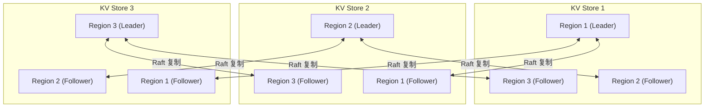
```mermaid
graph TD
    subgraph "KV Store 1"
        R1L["Region 1 (Leader)"]
        R2F["Region 2 (Follower)"]
        R3F["Region 3 (Follower)"]
    end

    subgraph "KV Store 2"
        R1F1["Region 1 (Follower)"]
        R2L["Region 2 (Leader)"]
        R3F2["Region 3 (Follower)"]
    end

    subgraph "KV Store 3"
        R1F2["Region 1 (Follower)"]
        R2F2["Region 2 (Follower)"]
        R3L["Region 3 (Leader)"]
    end

    R1L <-->|"Raft 复制"| R1F1
    R1L <-->|"Raft 复制"| R1F2
    R2L <-->|"Raft 复制"| R2F
    R2L <-->|"Raft 复制"| R2F2
    R3L <-->|"Raft 复制"| R3F
    R3L <-->|"Raft 复制"| R3F2
```

**BatchSystem 线程模型**：

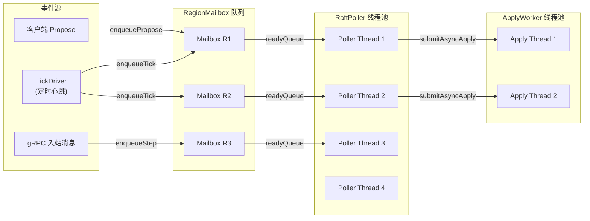
```mermaid
graph LR
    subgraph "事件源"
        TICK["TickDriver<br/>(定时心跳)"]
        GRPC["gRPC 入站消息"]
        CLIENT["客户端 Propose"]
    end

    subgraph "RegionMailbox 队列"
        M1["Mailbox R1"]
        M2["Mailbox R2"]
        M3["Mailbox R3"]
    end

    subgraph "RaftPoller 线程池"
        P1["Poller Thread 1"]
        P2["Poller Thread 2"]
        P3["Poller Thread 3"]
        P4["Poller Thread 4"]
    end

    subgraph "ApplyWorker 线程池"
        A1["Apply Thread 1"]
        A2["Apply Thread 2"]
    end

    TICK -->|enqueueTick| M1
    TICK -->|enqueueTick| M2
    GRPC -->|enqueueStep| M3
    CLIENT -->|enqueuePropose| M1

    M1 -->|"readyQueue"| P1
    M2 -->|"readyQueue"| P2
    M3 -->|"readyQueue"| P3

    P1 -->|"submitAsyncApply"| A1
    P2 -->|"submitAsyncApply"| A2
```

### 2.3 协议 / Wire Format

**gRPC 服务**：

| 服务 | RPC | 类型 | 说明 |
|------|-----|------|------|
| `KvRaft` | `Raft` | client-streaming | KV 节点间 Raft 消息传输 |
| `KvRaft` | `SendSnapshot` | client-streaming | 流式快照传输 |

**SnapshotChunk 消息结构**：

```
SnapshotChunk {
  meta: SnapshotMeta { region_id, region_epoch, raft_term, raft_index, ... }
  data: bytes          // 64 KB 数据块
  cf: string           // "default" / "lock" / "write"
  chunk_index: int32
  eof: bool
  crc32c: uint32       // 每块校验和
}
```

### 2.4 核心实现

**Apply Loop 三阶段流程**：

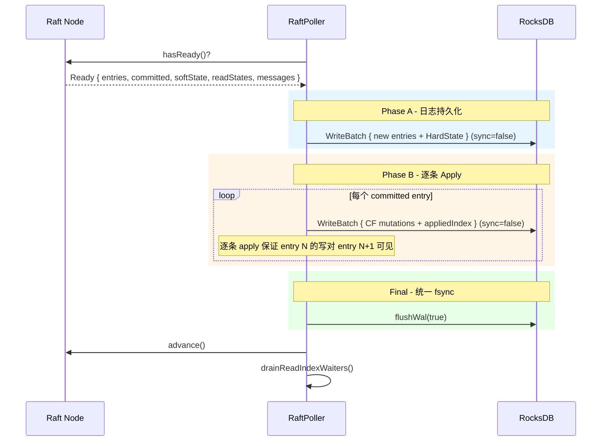
```mermaid
sequenceDiagram
    participant Node as Raft Node
    participant Poller as RaftPoller
    participant Engine as RocksDB

    Poller->>Node: hasReady()?
    Node-->>Poller: Ready { entries, committed, softState, readStates, messages }

    rect rgb(230, 245, 255)
        Note over Poller,Engine: Phase A - 日志持久化
        Poller->>Engine: WriteBatch { new entries + HardState } (sync=false)
    end

    rect rgb(255, 245, 230)
        Note over Poller,Engine: Phase B - 逐条 Apply
        loop 每个 committed entry
            Poller->>Engine: WriteBatch { CF mutations + appliedIndex } (sync=false)
            Note over Poller: 逐条 apply 保证 entry N 的写对 entry N+1 可见
        end
    end

    rect rgb(230, 255, 230)
        Note over Poller,Engine: Final - 统一 fsync
        Poller->>Engine: flushWal(true)
    end

    Poller->>Node: advance()
    Poller->>Poller: drainReadIndexWaiters()
```

**ReadIndex 线性读**：

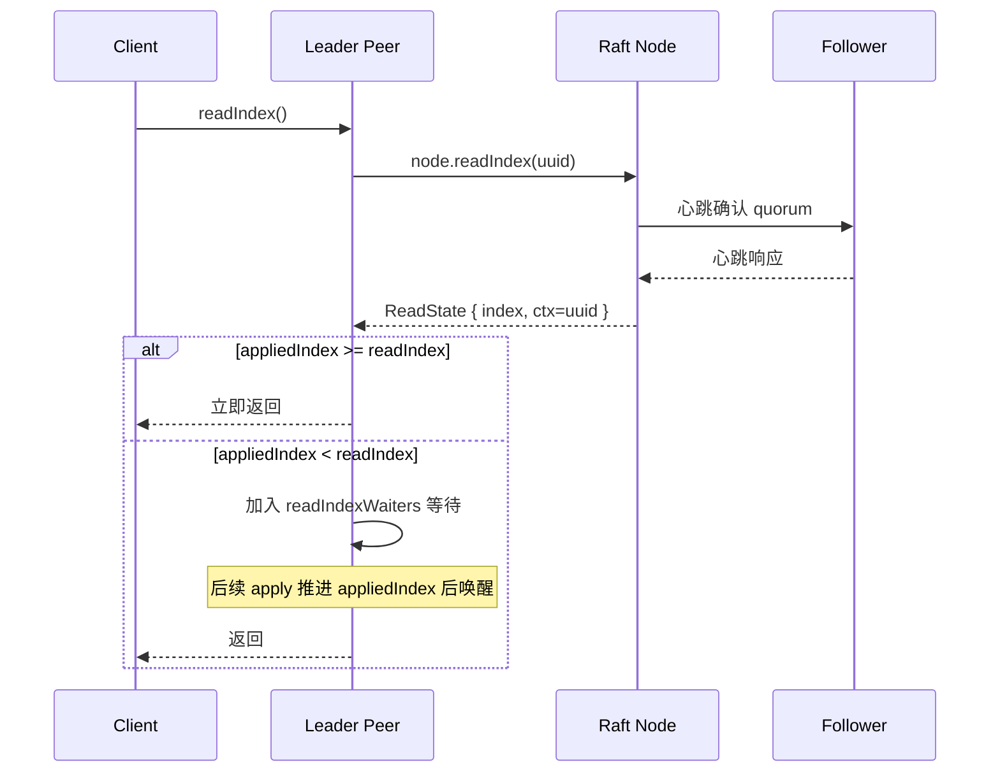
```mermaid
sequenceDiagram
    participant Client
    participant Leader as Leader Peer
    participant Raft as Raft Node
    participant Follower

    Client->>Leader: readIndex()
    Leader->>Raft: node.readIndex(uuid)
    Raft->>Follower: 心跳确认 quorum
    Follower-->>Raft: 心跳响应
    Raft-->>Leader: ReadState { index, ctx=uuid }

    alt appliedIndex >= readIndex
        Leader-->>Client: 立即返回
    else appliedIndex < readIndex
        Leader->>Leader: 加入 readIndexWaiters 等待
        Note over Leader: 后续 apply 推进 appliedIndex 后唤醒
        Leader-->>Client: 返回
    end
```

**Leader Lease**：当 Raft 心跳在 lease 有效期内时，leader 可以跳过 ReadIndex RTT 直接从本地引擎读取数据。

**两种线程模型**：

| 模型 | 类 | 适用场景 | 线程开销 |
|------|---|---------|---------|
| Per-Region 独立线程 | `RegionPeerImpl` | 少量 region（< 50）| N regions → 2N 线程 |
| BatchSystem 共享线程池 | `BatchRegionPeer` + `RaftPoller` + `RegionMailbox` | 大量 region（200+）| N regions → 固定 poller + apply 线程 |

### 2.5 正确性保证

- **Per-entry apply**：每个 committed entry 在独立的 WriteBatch 中 apply，保证 entry N 的 MVCC 写对 entry N+1 的冲突检测可见
- **Pre-Vote + Check Quorum**：防止网络分区的节点发起破坏性选举
- **ConfChangeV2**：支持 AddNode / RemoveNode / AddLearnerNode

### 2.6 配置项

| 配置键 | 默认值 | 说明 |
|--------|--------|------|
| `raft.electionTickMs` | 1000 ms | 选举超时基线 |
| `raft.heartbeatTickMs` | 100 ms | 心跳间隔 |
| `raft.maxSizePerMsg` | 1 MB | 单条 Raft 消息最大尺寸 |
| `raft.maxInflightMsgs` | 256 | pipeline 深度 |
| `raft.snapshotIntervalEntries` | 10000 | 快照触发阈值 |
| `worker.logCompactionIntervalMs` | 60s | 日志压缩检查间隔 |
| `worker.logCompactionGapThreshold` | 10000 | 压缩触发的 applied - first 差值 |
| `worker.logCompactionSafetyMargin` | 1000 | 压缩后保留的尾部条目数 |

### 2.7 测试覆盖

- `SingleRegionRawKvTest`：单 region Raft 读写
- `MultiPeerRaftE2ETest`：三副本 Raft 复制、leader 选举
- `SnapshotCatchupTest`：follower 落后后的快照追赶
- `ChangePeerApplyTest`：ConfChange 成员变更
- `TransferLeaderTest`：leader 转移
- `LinearizabilityE2ETest`：ReadIndex 线性一致性验证
- `ChaosTest`：leader kill / follower kill / 网络分区下的一致性

### 2.8 源码分析

| 关键类 | 文件位置 | 入口方法 |
|--------|---------|---------|
| `RegionPeerImpl` | `kv/.../raft/RegionPeerImpl.java` | `readyLoop()` (L481)：Raft Ready 主循环 |
| | | `applyReady()` (L499)：三阶段 apply |
| | | `propose()` (L352)：提交 Raft 提案 |
| | | `readIndex()` (L400)：发起线性读 |
| `RegionMailbox` | `kv/.../raft/RegionMailbox.java` | `processOnce()` (L192)：BatchSystem 单次处理 |
| | | `drainEvents()` (L216)：消费事件队列 |
| | | `applyReady()` (L240)：Ready 处理（含异步 apply） |
| `RaftPoller` | `kv/.../raft/RaftPoller.java` | `pollLoop()` (L55)：固定线程从 readyQueue 拉取 mailbox |
| `ApplyWorker` | `kv/.../raft/ApplyWorker.java` | `submit()` (L52)：提交异步 apply 任务 |
| `BatchRegionPeer` | `kv/.../raft/BatchRegionPeer.java` | 构造器 (L31)：创建 mailbox 并注册到 poller |
| `CompositeApplyHandler` | `kv/.../raft/CompositeApplyHandler.java` | `apply()` (L27)：按 Kind 分发到子 handler |
| `GrpcRaftTransport` | `kv/.../transport/GrpcRaftTransport.java` | `send()` (L106)：发送 Raft 消息 |
| | | `OutboundLink.sendViaSnapshotStream()` (L173)：快照流式传输 |
| `RaftMessageDispatcher` | `kv/.../transport/RaftMessageDispatcher.java` | `deliver()` (L66)：路由入站消息到目标 region |
| `LogCompactionWorker` | `kv/.../store/LogCompactionWorker.java` | `runOnce()` (L97)：一轮日志压缩 |
| `TickDriver` | `kv/.../raft/TickDriver.java` | 定时向每个 mailbox 投递 tick 事件 |

---

## 3. MVCC + Percolator 事务

### 3.1 功能概述

x-kv 实现了完整的 Percolator 分布式事务协议，支持乐观事务（Optimistic 2PC）、悲观锁（Pessimistic Locking）、异步提交（Async Commit）和一阶段提交（1PC）。MVCC 层通过多版本并发控制为每个 key 维护按时间戳排序的版本链，提供 Snapshot Isolation 隔离级别。

### 3.2 架构设计

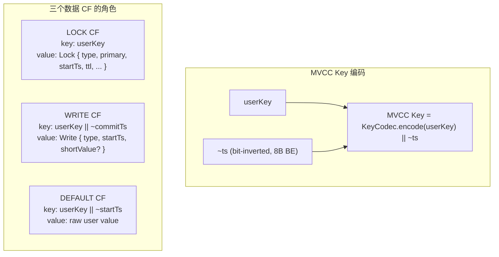
```mermaid
graph TD
    subgraph "MVCC Key 编码"
        UK["userKey"]
        TS["~ts (bit-inverted, 8B BE)"]
        MK["MVCC Key = KeyCodec.encode(userKey) || ~ts"]
    end

    subgraph "三个数据 CF 的角色"
        LCF["LOCK CF<br/>key: userKey<br/>value: Lock { type, primary, startTs, ttl, ... }"]
        WCF["WRITE CF<br/>key: userKey || ~commitTs<br/>value: Write { type, startTs, shortValue? }"]
        DCF["DEFAULT CF<br/>key: userKey || ~startTs<br/>value: raw user value"]
    end

    UK --> MK
    TS --> MK
```

**版本链示例**：

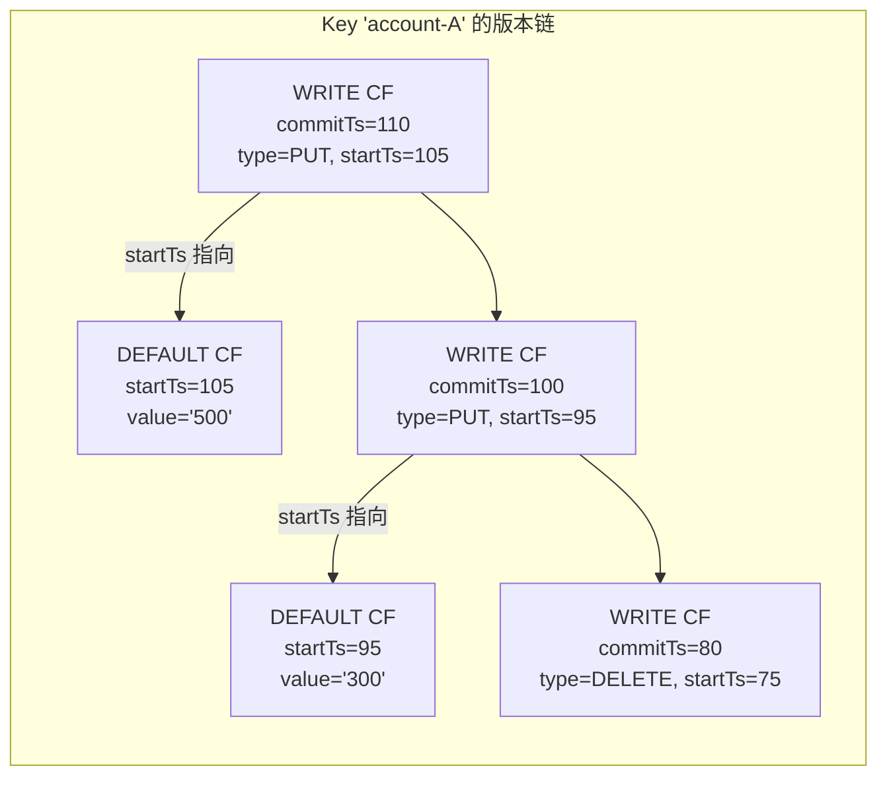
```mermaid
graph LR
    subgraph "Key 'account-A' 的版本链"
        W1["WRITE CF<br/>commitTs=110<br/>type=PUT, startTs=105"]
        W2["WRITE CF<br/>commitTs=100<br/>type=PUT, startTs=95"]
        W3["WRITE CF<br/>commitTs=80<br/>type=DELETE, startTs=75"]
        D1["DEFAULT CF<br/>startTs=105<br/>value='500'"]
        D2["DEFAULT CF<br/>startTs=95<br/>value='300'"]
    end

    W1 -->|"startTs 指向"| D1
    W2 -->|"startTs 指向"| D2
    W1 --> W2 --> W3
```

### 3.3 协议 / Wire Format

**Lock 编码 v3**：

```
[1B version=0x33] [1B type] [8B startTs] [8B ttlMs] [8B txnSize]
[8B minCommitTs] [8B forUpdateTs] [1B flags: bit0=useAsyncCommit]
[4B primaryLen] [primaryLen B primary]
[4B secondariesCount] { [4B keyLen] [keyLen B key] }*
```

**Write 编码 v3**：

```
[1B version=0x33] [1B type] [8B startTs] [1B flags: bit0=hasOverlappedRollback]
[4B shortValueLen] [shortValueLen B shortValue]
```

**核心 RPC**（14 个事务 RPC）：

| RPC | 说明 |
|-----|------|
| `KvPrewrite` | 两阶段提交第一阶段：加锁 |
| `KvCommit` | 两阶段提交第二阶段：提交 |
| `KvPessimisticLock` | 悲观锁获取 |
| `KvPessimisticRollback` | 悲观锁释放 |
| `KvBatchRollback` | 批量回滚 |
| `KvCheckTxnStatus` | 检查事务状态（TTL / 已提交 / 已回滚） |
| `KvCheckSecondaryLocks` | 异步提交恢复路径 |
| `KvResolveLock` | 解锁（提交或回滚已过期的锁） |
| `KvTxnHeartBeat` | 事务心跳（延长 TTL） |
| `KvScanLock` | 扫描锁 |
| `KvCleanup` | 清理事务（legacy） |
| `KvGC` | 垃圾回收 |
| `KvDeleteRange` | 范围删除 |
| `KvGet / KvScan / KvBatchGet` | 事务读 |

### 3.4 核心实现

**Prewrite 两阶段协议**：

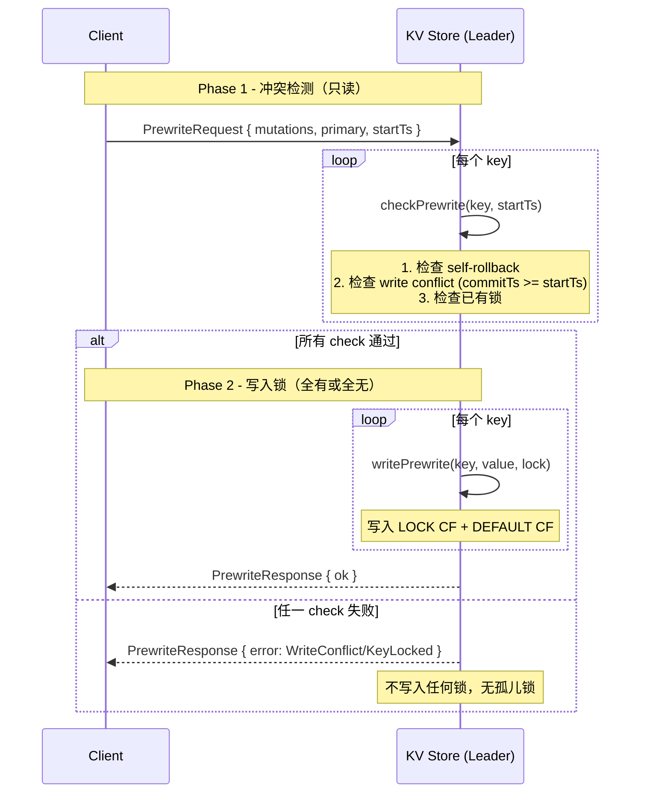
```mermaid
sequenceDiagram
    participant Client
    participant KV as KV Store (Leader)

    Note over Client,KV: Phase 1 - 冲突检测（只读）
    Client->>KV: PrewriteRequest { mutations, primary, startTs }
    loop 每个 key
        KV->>KV: checkPrewrite(key, startTs)
        Note over KV: 1. 检查 self-rollback<br/>2. 检查 write conflict (commitTs >= startTs)<br/>3. 检查已有锁
    end

    alt 所有 check 通过
        Note over Client,KV: Phase 2 - 写入锁（全有或全无）
        loop 每个 key
            KV->>KV: writePrewrite(key, value, lock)
            Note over KV: 写入 LOCK CF + DEFAULT CF
        end
        KV-->>Client: PrewriteResponse { ok }
    else 任一 check 失败
        KV-->>Client: PrewriteResponse { error: WriteConflict/KeyLocked }
        Note over KV: 不写入任何锁，无孤儿锁
    end
```

**Commit 流程**：

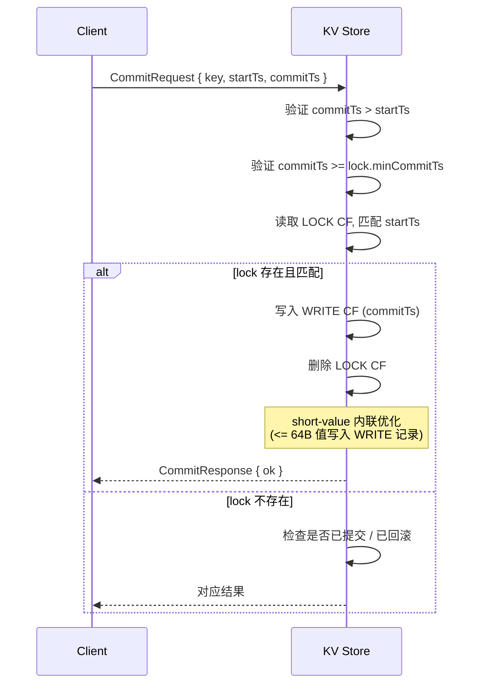
```mermaid
sequenceDiagram
    participant Client
    participant KV as KV Store

    Client->>KV: CommitRequest { key, startTs, commitTs }
    KV->>KV: 验证 commitTs > startTs
    KV->>KV: 验证 commitTs >= lock.minCommitTs
    KV->>KV: 读取 LOCK CF, 匹配 startTs
    alt lock 存在且匹配
        KV->>KV: 写入 WRITE CF (commitTs)
        KV->>KV: 删除 LOCK CF
        Note over KV: short-value 内联优化<br/>(<= 64B 值写入 WRITE 记录)
        KV-->>Client: CommitResponse { ok }
    else lock 不存在
        KV->>KV: 检查是否已提交 / 已回滚
        KV-->>Client: 对应结果
    end
```

**ConcurrencyManager（32 条纹锁）**：

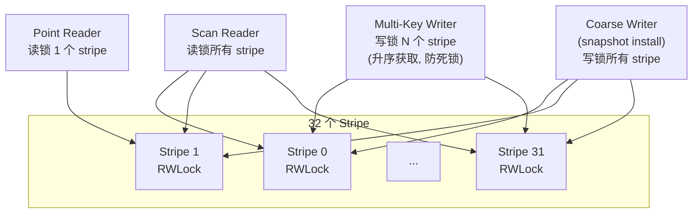
```mermaid
graph TD
    subgraph "32 个 Stripe"
        S0["Stripe 0<br/>RWLock"]
        S1["Stripe 1<br/>RWLock"]
        S2["..."]
        S31["Stripe 31<br/>RWLock"]
    end

    PR["Point Reader<br/>读锁 1 个 stripe"]
    SR["Scan Reader<br/>读锁所有 stripe"]
    MW["Multi-Key Writer<br/>写锁 N 个 stripe<br/>(升序获取, 防死锁)"]
    CW["Coarse Writer<br/>(snapshot install)<br/>写锁所有 stripe"]

    PR --> S1
    SR --> S0
    SR --> S1
    SR --> S31
    MW --> S0
    MW --> S31
    CW --> S0
    CW --> S1
    CW --> S31
```

**MaxTsTracker**：每次读操作调用 `observe(readTs)` 更新最大读时间戳。Prewrite 时计算 `minCommitTs = max(startTs + 1, maxTs + 1)`，保证不会有提交偷偷"穿越"到已服务的读时间戳之下。

**InMemoryLockTable**（Pipeline 悲观锁）：

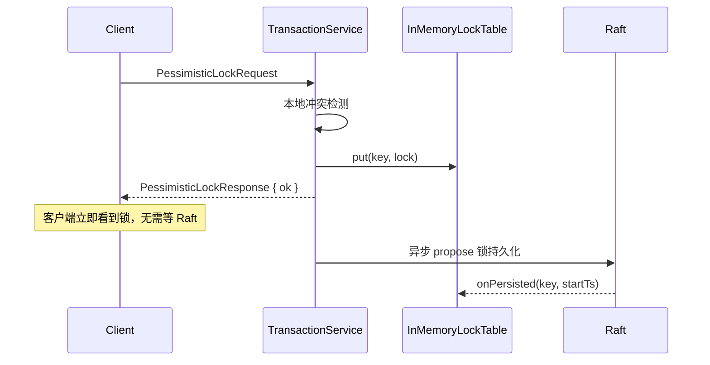
```mermaid
sequenceDiagram
    participant Client
    participant TxnSvc as TransactionService
    participant MemLock as InMemoryLockTable
    participant Raft

    Client->>TxnSvc: PessimisticLockRequest
    TxnSvc->>TxnSvc: 本地冲突检测
    TxnSvc->>MemLock: put(key, lock)
    TxnSvc-->>Client: PessimisticLockResponse { ok }
    Note over Client: 客户端立即看到锁，无需等 Raft
    TxnSvc->>Raft: 异步 propose 锁持久化
    Raft-->>MemLock: onPersisted(key, startTs)
```

### 3.5 正确性保证

- **两阶段 prewrite**：先 check 全部 key，再写入全部锁，杜绝孤儿锁
- **CheckTxnStatus race fix**：发现已提交时不强制回滚（v1 bug fix）
- **异步提交门控**：`useAsyncCommit` 的 primary 不可被强制回滚
- **三态提交结果**：`COMMITTED` / `ROLLED_BACK` / `UNKNOWN`，不合并 UNKNOWN
- **Overlapping rollback collapse**：防止 WRITE CF 膨胀

### 3.6 配置项

短值内联阈值 `SHORT_VALUE_MAX_LEN = 64` 字节（硬编码于 `Write.java`）。

### 3.7 测试覆盖

- `MvccTxnTest`：prewrite / commit / rollback / pessimisticLock / checkTxnStatus 全路径
- `MvccReaderTest`：Get / Scan / reverseScan，锁冲突行为
- `PercolatorE2ETest`：完整 2PC 端到端
- `BankTransferTxnTest`：银行转账 SI 一致性（余额守恒）
- `CrossRegionTxnE2ETest`：跨 region 事务
- `StressTxnTest`：并发事务压测
- `DeadlockDetectorTest` / `DistributedDeadlockTest`：死锁检测

### 3.8 源码分析

| 关键类 | 文件位置 | 入口方法 |
|--------|---------|---------|
| `MvccTxn` | `kv/.../mvcc/MvccTxn.java` | `checkPrewrite()` (L79)：冲突检测 |
| | | `writePrewrite()` (L212)：写入锁 |
| | | `commit()` (L265)：提交 |
| | | `rollback()` (L341)：回滚 |
| | | `checkTxnStatus()` (L475)：事务状态检查 |
| | | `acquirePessimisticLock()` (L414)：悲观锁获取 |
| `MvccReader` | `kv/.../mvcc/MvccReader.java` | `get()` (L64)：MVCC 点读 |
| | | `scan()` (L128)：正向扫描 |
| | | `reverseScan()` (L161)：反向扫描 |
| `MvccKey` | `kv/.../mvcc/MvccKey.java` | `encode()` (L32)：userKey + ~ts 编码 |
| | | `afterAllVersionsOf()` (L78)：跳过 userKey 全部版本 |
| `Lock` | `kv/.../mvcc/Lock.java` | `encode()` (L92) / `decode()` (L114)：v3 序列化 |
| `Write` | `kv/.../mvcc/Write.java` | `encode()` (L72) / `decode()` (L84)：v3 序列化 |
| `ConcurrencyManager` | `kv/.../mvcc/ConcurrencyManager.java` | `withReader()` (L86)：点读加锁 |
| | | `withWriter()` (L114)：多 key 写加锁 |
| `MaxTsTracker` | `kv/.../mvcc/MaxTsTracker.java` | `observe()` (L62)：更新最大读 TS |
| | | `minCommitTsFloor()` (L72)：返回 maxTs + 1 |
| `InMemoryLockTable` | `kv/.../mvcc/InMemoryLockTable.java` | `put()` (L34)：Pipeline 锁插入 |
| `MvccApplyHandler` | `kv/.../raft/MvccApplyHandler.java` | `apply()` (L93)：Raft apply 入口 |
| | | `applyPrewrite()` (L122)：prewrite apply |
| | | `applyCommit()` (L272)：commit apply |
| `TransactionService` | `kv/.../server/TransactionService.java` | `kvPrewrite()` (L364)：Prewrite RPC 入口 |
| | | `kvCommit()` (L378)：Commit RPC 入口 |
| | | `kvPessimisticLock()` (L429)：Pipeline 悲观锁入口 |
| | | `kvGet()` (L95)：事务读入口 |

---

## 4. PD Region 管理与调度

### 4.1 功能概述

Placement Driver（PD）是集群的"大脑"，负责全局元数据管理和自动调度。PD 管理所有 region 的生命周期——包括心跳收集、自动分裂（Split）、自动合并（Merge）、leader 均衡、region 均衡和热点调度——并通过 Operator 机制将调度决策下发到 KV 节点执行。

### 4.2 架构设计

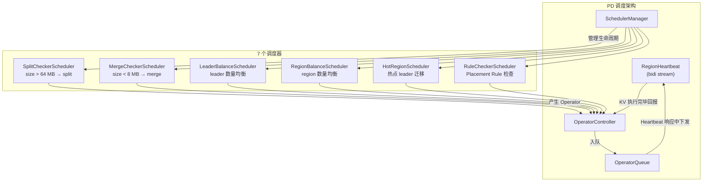
```mermaid
graph TD
    subgraph "PD 调度架构"
        HB["RegionHeartbeat<br/>(bidi stream)"]
        SC["SchedulerManager"]
        OC["OperatorController"]
        OQ["OperatorQueue"]
    end

    subgraph "7 个调度器"
        SPLIT["SplitCheckerScheduler<br/>size > 64 MB → split"]
        MERGE["MergeCheckerScheduler<br/>size < 8 MB → merge"]
        LB["LeaderBalanceScheduler<br/>leader 数量均衡"]
        RB["RegionBalanceScheduler<br/>region 数量均衡"]
        HOT["HotRegionScheduler<br/>热点 leader 迁移"]
        RC["RuleCheckerScheduler<br/>Placement Rule 检查"]
    end

    SPLIT -->|"产生 Operator"| OC
    MERGE --> OC
    LB --> OC
    RB --> OC
    HOT --> OC
    RC --> OC

    OC -->|"入队"| OQ
    OQ -->|"Heartbeat 响应中下发"| HB
    HB -->|"KV 执行完毕回报"| OC

    SC -->|"管理生命周期"| SPLIT
    SC --> MERGE
    SC --> LB
    SC --> RB
    SC --> HOT
    SC --> RC
```

**Operator 生命周期**：

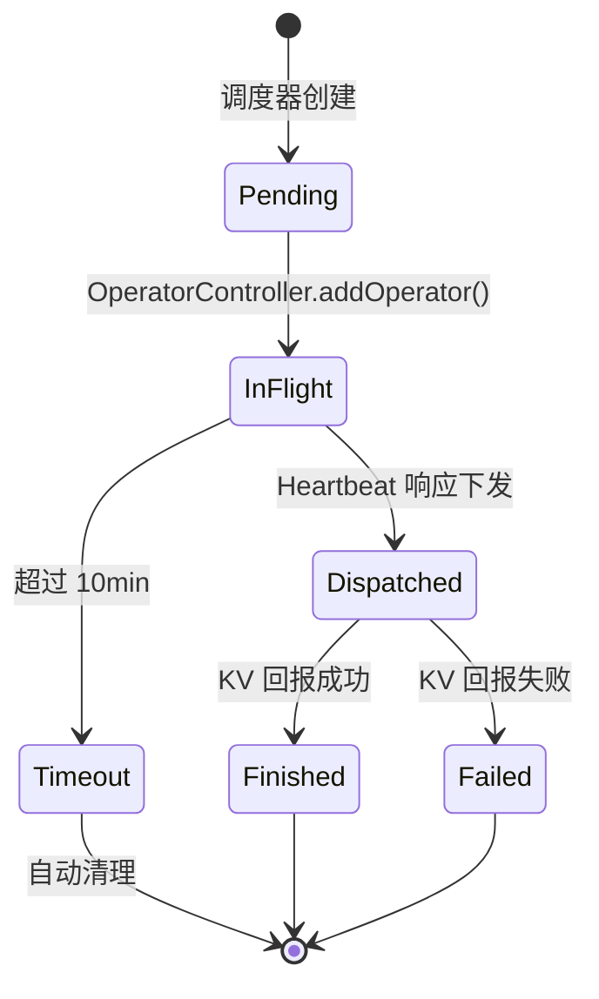
```mermaid
stateDiagram-v2
    [*] --> Pending: 调度器创建
    Pending --> InFlight: OperatorController.addOperator()
    InFlight --> Dispatched: Heartbeat 响应下发
    Dispatched --> Finished: KV 回报成功
    Dispatched --> Failed: KV 回报失败
    InFlight --> Timeout: 超过 10min
    Timeout --> [*]: 自动清理
    Finished --> [*]
    Failed --> [*]
```

### 4.3 协议 / Wire Format

**核心 PD RPC**：

| RPC | 类型 | 说明 |
|-----|------|------|
| `RegionHeartbeat` | bidi-stream | Region 心跳 + Operator 下发 |
| `StoreHeartbeat` | unary | Store 级心跳 |
| `AskBatchSplit` | unary | 请求 split 的 region/peer ID |
| `ReportBatchSplit` | unary | 报告 split 完成 |
| `SplitRegions` | unary | PD 主动发起 split |
| `ScatterRegion` | unary | 打散 region |
| `GetRegion` / `GetRegionByID` / `ScanRegions` | unary | 查询 region |
| `GetOperator` | unary | 查询 pending operator |

**Heartbeat 响应中的调度指令**：

```protobuf
RegionHeartbeatResponse {
  change_peer: ChangePeer { peer, change_type: ADD/REMOVE }
  transfer_leader: TransferLeader { peer }
  split_region: SplitRegion { policy: APPROXIMATE/SCAN }
  merge: Merge { target }
}
```

### 4.4 核心实现

#### 4.4.1 Region Split

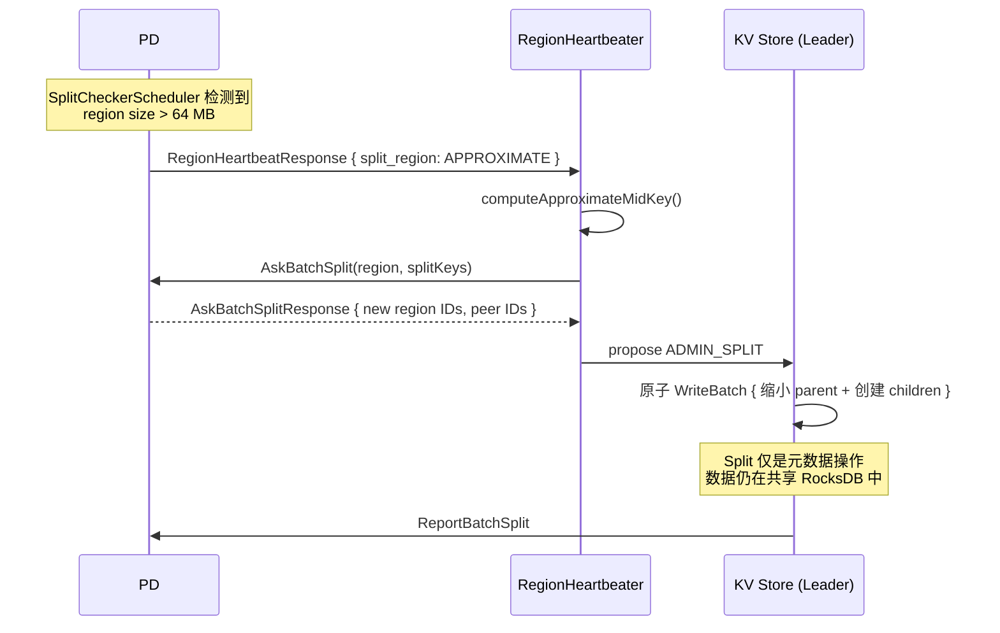
```mermaid
sequenceDiagram
    participant PD
    participant HB as RegionHeartbeater
    participant KV as KV Store (Leader)

    Note over PD: SplitCheckerScheduler 检测到<br/>region size > 64 MB

    PD->>HB: RegionHeartbeatResponse { split_region: APPROXIMATE }
    HB->>HB: computeApproximateMidKey()
    HB->>PD: AskBatchSplit(region, splitKeys)
    PD-->>HB: AskBatchSplitResponse { new region IDs, peer IDs }
    HB->>KV: propose ADMIN_SPLIT
    KV->>KV: 原子 WriteBatch { 缩小 parent + 创建 children }
    Note over KV: Split 仅是元数据操作<br/>数据仍在共享 RocksDB 中
    KV->>PD: ReportBatchSplit
```

#### 4.4.2 Region Merge

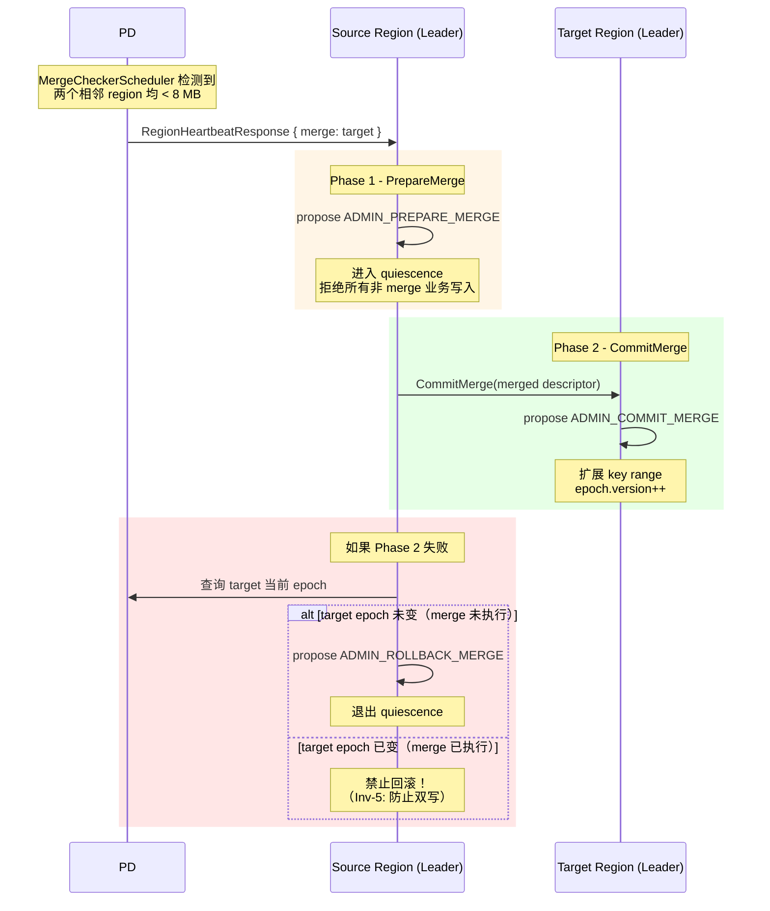
```mermaid
sequenceDiagram
    participant PD
    participant Source as Source Region (Leader)
    participant Target as Target Region (Leader)

    Note over PD: MergeCheckerScheduler 检测到<br/>两个相邻 region 均 < 8 MB

    PD->>Source: RegionHeartbeatResponse { merge: target }

    rect rgb(255, 245, 230)
        Note over Source: Phase 1 - PrepareMerge
        Source->>Source: propose ADMIN_PREPARE_MERGE
        Note over Source: 进入 quiescence<br/>拒绝所有非 merge 业务写入
    end

    rect rgb(230, 255, 230)
        Note over Target: Phase 2 - CommitMerge
        Source->>Target: CommitMerge(merged descriptor)
        Target->>Target: propose ADMIN_COMMIT_MERGE
        Note over Target: 扩展 key range<br/>epoch.version++
    end

    rect rgb(255, 230, 230)
        Note over Source: 如果 Phase 2 失败
        Source->>PD: 查询 target 当前 epoch
        alt target epoch 未变（merge 未执行）
            Source->>Source: propose ADMIN_ROLLBACK_MERGE
            Note over Source: 退出 quiescence
        else target epoch 已变（merge 已执行）
            Note over Source: 禁止回滚！<br/>（Inv-5: 防止双写）
        end
    end
```

#### 4.4.3 Leader Balance

算法逻辑：
1. 统计每个 store 的 leader 数量
2. 计算最优均值 `total_leaders / store_count`
3. 选择 leader 最多的 store 作为 source
4. 选择 leader 最少的 store 作为 target（排除 busy 和 slow 的 store）
5. 从 source 选一个 region，其 follower 在 target 上 → 发起 TransferLeader

#### 4.4.4 Region Balance

算法逻辑：
1. 统计每个 store 的 region 数量
2. 排除磁盘空间不足（< 5%）的 store
3. 从 region 最多的 store 选 region → AddPeer 到 region 最少的 store
4. 每 tick 最多 4 个 operator

#### 4.4.5 Hot Region 调度

- 热点判定：region 的 `approximateKeys > 2 × 集群平均`
- 从 hot-leader 最多的 store 迁移 leader 到 hot-leader 最少的 store
- 每 tick 最多 2 个 operator（merge 是重操作，保守执行）

### 4.5 正确性保证

- **Epoch 支配检查**：旧 heartbeat 不会覆盖新 region 信息
- **OperatorController 并发限制**：每个 store 最多 `maxPerStore`（默认 5）个并行 operator
- **Merge epoch-idempotent**：重放同一 merge proposal 是安全的
- **Inv-5（Merge 双侧验证）**：rollback 前必须查询 PD 确认 target epoch 未变

### 4.6 配置项

| 配置键 | 默认值 | 说明 |
|--------|--------|------|
| `region.splitRegionBytes` | 64 MB | Split 触发阈值 |
| `region.mergeRegionBytes` | 8 MB | Merge 触发阈值 |
| `region.maxRegionBytes` | 96 MB | region 最大尺寸 |
| `scheduler.maxOperatorsPerStore` | 5 | 每 store 并行 operator 上限 |
| `scheduler.regionScheduleLimit` | 32 | region 调度并发限制 |
| `scheduler.leaderScheduleLimit` | 4 | leader 调度并发限制 |
| `scheduler.hotRegionScheduleLimit` | 4 | 热点调度并发限制 |
| `scheduler.heartbeatIntervalMs` | 10s | 心跳间隔 |
| `scheduler.storeStateTimeoutMs` | 30s | store 状态超时 |

### 4.7 测试覆盖

- `AutoSplitE2ETest`：PD 驱动的自动 split
- `SplitDriverE2ETest`：批量 split
- `RegionSplitApplyTest`：split apply 原子性
- `MergeDriverE2ETest`：完整 merge 流程
- `MergeProtocolSafetyTest`：merge rollback 安全性
- `PrepareMergeQuiescenceTest`：merge quiescence 写拒绝
- `MergeCheckerSchedulerTest`：merge 调度器逻辑
- `LeaderBalanceSchedulerTest`：leader 均衡
- `RegionBalanceSchedulerTest`：region 均衡
- `HotRegionSchedulerTest`：热点调度
- `PdOperatorDispatchTest`：operator 下发与回报
- `SplitMergeClientE2ETest`：客户端感知的 split/merge

### 4.8 源码分析

| 关键类 | 文件位置 | 入口方法 |
|--------|---------|---------|
| `SplitCheckerScheduler` | `pd/.../state/SplitCheckerScheduler.java` | `tick()` (L65)：扫描 region stats |
| `MergeCheckerScheduler` | `pd/.../state/MergeCheckerScheduler.java` | `runOnce()` (L86)：合并检查 |
| `LeaderBalanceScheduler` | `pd/.../state/LeaderBalanceScheduler.java` | `runOnce()` (L93)：leader 均衡 |
| `RegionBalanceScheduler` | `pd/.../state/RegionBalanceScheduler.java` | `runOnce()` (L96)：region 均衡 |
| `HotRegionScheduler` | `pd/.../state/HotRegionScheduler.java` | `runOnce()` (L83)：热点调度 |
| `OperatorControllerImpl` | `pd/.../state/OperatorControllerImpl.java` | `addOperator()` (L49)：注册 operator |
| | | `dispatch()` (L112)：心跳驱动的 operator 下发 |
| `SchedulerManager` | `pd/.../state/SchedulerManager.java` | `register()` / `pause()` / `resume()` |
| `SplitDriver` | `kv/.../store/SplitDriver.java` | `split()` (L55)：执行 batch split |
| `MergeDriver` | `kv/.../store/MergeDriver.java` | `merge()` (L62)：执行两阶段 merge |
| `MergeProtocolImpl` | `kv/.../store/MergeProtocolImpl.java` | `prepareAsSource()` (L63)：prepare merge |
| | | `commitAsTarget()` (L101)：commit merge |
| | | `rollbackAsSource()` (L152)：PD 验证后 rollback |
| `AdminApplyHandler` | `kv/.../raft/AdminApplyHandler.java` | `applySplit()` (L148)：split apply |
| | | `applyPrepareMerge()` (L196)：prepare merge apply |
| | | `applyCommitMerge()` (L245)：commit merge apply |
| `RegionHeartbeater` | `kv/.../store/RegionHeartbeater.java` | `tick()` (L90)：发送心跳 |
| | | `dispatchOperator()` (L148)：处理 PD 下发的调度指令 |
| `PdServiceImpl` | `pd/.../server/PdServiceImpl.java` | `regionHeartbeat()` (L481)：bidi stream 处理 |
| | | `askBatchSplit()` (L592)：分配 split ID |

---

## 5. Placement Rules（放置规则）

### 5.1 功能概述

Placement Rules 是一套 label 约束引擎，允许管理员根据 store 的物理部署标签（如 zone、rack、host）定义数据副本的放置策略。它支持 voter/learner 角色、key range 匹配、label 约束（IN / NOT_IN / EXISTS / NOT_EXISTS）和隔离度评分。

### 5.2 架构设计

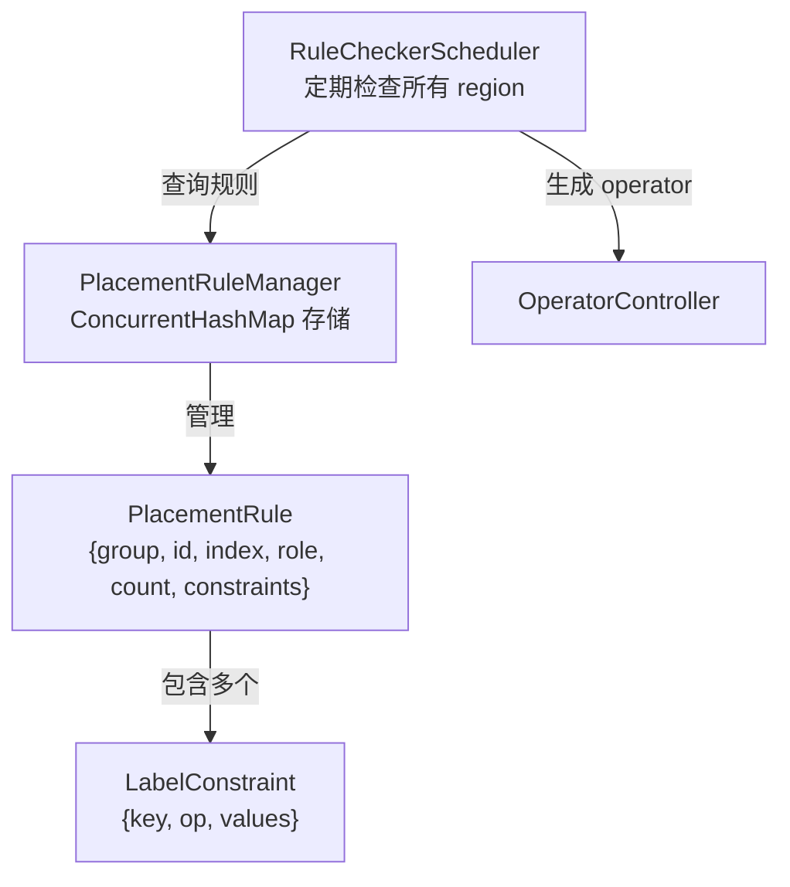
```mermaid
graph TD
    PR["PlacementRule<br/>{group, id, index, role, count, constraints}"]
    LC["LabelConstraint<br/>{key, op, values}"]
    PRM["PlacementRuleManager<br/>ConcurrentHashMap 存储"]
    RCS["RuleCheckerScheduler<br/>定期检查所有 region"]
    OC["OperatorController"]

    PR -->|"包含多个"| LC
    PRM -->|"管理"| PR
    RCS -->|"查询规则"| PRM
    RCS -->|"生成 operator"| OC
```

### 5.3 协议 / Wire Format

| RPC | 说明 |
|-----|------|
| `GetPlacementRules` | 查询所有放置规则 |
| `SetPlacementRule` | 创建/更新规则 |
| `DeletePlacementRule` | 删除规则 |

```protobuf
PlacementRule {
  group_id: string          // 规则组（如 "pd"）
  id: string                // 规则 ID
  index: int32              // 优先级
  override: bool            // 是否覆盖同组其他规则
  start_key / end_key: bytes // key range 匹配
  role: string              // "voter" / "learner"
  count: int32              // 副本数
  label_constraints: [LabelConstraint]  // label 约束
  location_labels: [string]  // 隔离度标签（如 ["zone", "rack", "host"]）
}
```

### 5.4 核心实现

**RuleCheckerScheduler 两种模式**：

1. **无规则模式**：简单的副本数检查，低于 / 高于 `maxPeerCount` → AddPeer / RemovePeer
2. **有规则模式**：Label-aware 检查
   - 对每个 region 匹配适用的规则
   - 按 role（voter/learner）统计当前副本数
   - 不足时：过滤满足 constraint 的 store → 按 `isolationScore` 排序 → 选最优 store → AddPeer
   - 过多时：优先移除 Down/Tombstone peer → 优先移除 non-leader peer

**隔离度评分**（`isolationScore`）：

```
score = 已有 peer 所在 store 与候选 store 在 locationLabels 上不同的标签数
```

分数越高，隔离度越好（例如跨 zone > 跨 rack > 同 host）。

### 5.5 正确性保证

- 默认规则（`pd/default`）在 PD 启动时种入，确保即使没有自定义规则也有副本数保障
- 约束匹配使用 `Set.contains()` 确保 O(1) 判定

### 5.6 配置项

通过 gRPC 或 HTTP API 动态管理，无静态配置文件。

### 5.7 测试覆盖

- `LabelConstraintTest`：IN / NOT_IN / EXISTS / NOT_EXISTS 逻辑
- `PlacementRuleManagerTest`：CRUD、key range 匹配、隔离度评分
- `RuleCheckerSchedulerTest`：under/over-replicated 修复、label 约束遵守

### 5.8 源码分析

| 关键类 | 文件位置 | 入口方法 |
|--------|---------|---------|
| `PlacementRuleManager` | `pd/.../placement/PlacementRuleManager.java` | `setRule()` (L32)：添加规则 |
| | | `rulesForRegion()` (L50)：匹配 region 的规则 |
| | | `isolationScore()` (L61)：计算隔离度 |
| `LabelConstraint` | `pd/.../placement/LabelConstraint.java` | `matches()` (L34)：约束匹配 |
| `PlacementRule` | `pd/.../placement/PlacementRule.java` | `matchesRegion()` (L73)：key range 匹配 |
| | | `storeMatchesConstraints()` (L90)：store 约束检查 |
| `RuleCheckerScheduler` | `pd/.../state/RuleCheckerScheduler.java` | `runOnce()` (L96)：全量检查入口 |
| | | `checkByRules()` (L256)：label-aware 检查 |

---

## 6. TSO（Timestamp Oracle）

### 6.1 功能概述

TSO 为整个集群提供全局单调递增的时间戳，用于 MVCC 事务的 `startTs` 和 `commitTs`。采用 HLC（Hybrid Logical Clock）编码，物理部分 + 逻辑部分合并为 64-bit 整数，在 leader 切换时保证严格单调。

### 6.2 架构设计

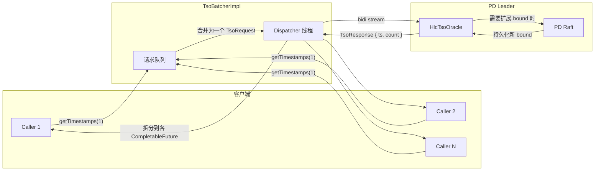
```mermaid
graph LR
    subgraph "客户端"
        C1["Caller 1"]
        C2["Caller 2"]
        C3["Caller N"]
    end

    subgraph "TsoBatcherImpl"
        Q["请求队列"]
        D["Dispatcher 线程"]
    end

    subgraph "PD Leader"
        TSO["HlcTsoOracle"]
        RAFT["PD Raft"]
    end

    C1 -->|"getTimestamps(1)"| Q
    C2 -->|"getTimestamps(1)"| Q
    C3 -->|"getTimestamps(1)"| Q
    Q -->|"合并为一个 TsoRequest"| D
    D -->|"bidi stream"| TSO
    TSO -->|"需要扩展 bound 时"| RAFT
    RAFT -->|"持久化新 bound"| TSO
    TSO -->|"TsoResponse { ts, count }"| D
    D -->|"拆分到各 CompletableFuture"| C1
    D --> C2
    D --> C3
```

### 6.3 协议 / Wire Format

```protobuf
// bidi-stream
rpc GetTimestamp(stream TsoRequest) returns (stream TsoResponse);

TsoRequest { header, count }
TsoResponse { header, timestamp { physical, logical }, count }
```

**HLC 编码**：`ts = (physical_ms << 18) | logical`

- 18-bit 逻辑计数器：每毫秒最多 262,143 次分配
- 物理部分：毫秒级壁钟时间

### 6.4 核心实现

**分配流程**：

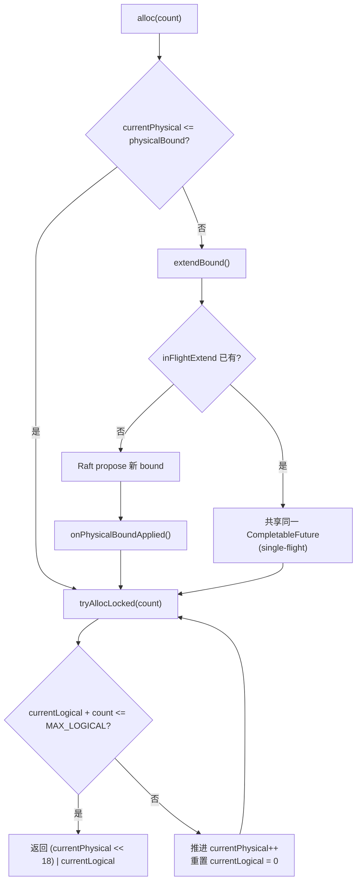
```mermaid
flowchart TD
    A["alloc(count)"] --> B{"currentPhysical <= physicalBound?"}
    B -->|"是"| C["tryAllocLocked(count)"]
    B -->|"否"| D["extendBound()"]

    C --> E{"currentLogical + count <= MAX_LOGICAL?"}
    E -->|"是"| F["返回 (currentPhysical << 18) | currentLogical"]
    E -->|"否"| G["推进 currentPhysical++<br/>重置 currentLogical = 0"]
    G --> C

    D --> H{"inFlightExtend 已有?"}
    H -->|"是"| I["共享同一 CompletableFuture<br/>(single-flight)"]
    H -->|"否"| J["Raft propose 新 bound"]
    J --> K["onPhysicalBoundApplied()"]
    K --> C
    I --> C
```

**Leader 切换安全性**：

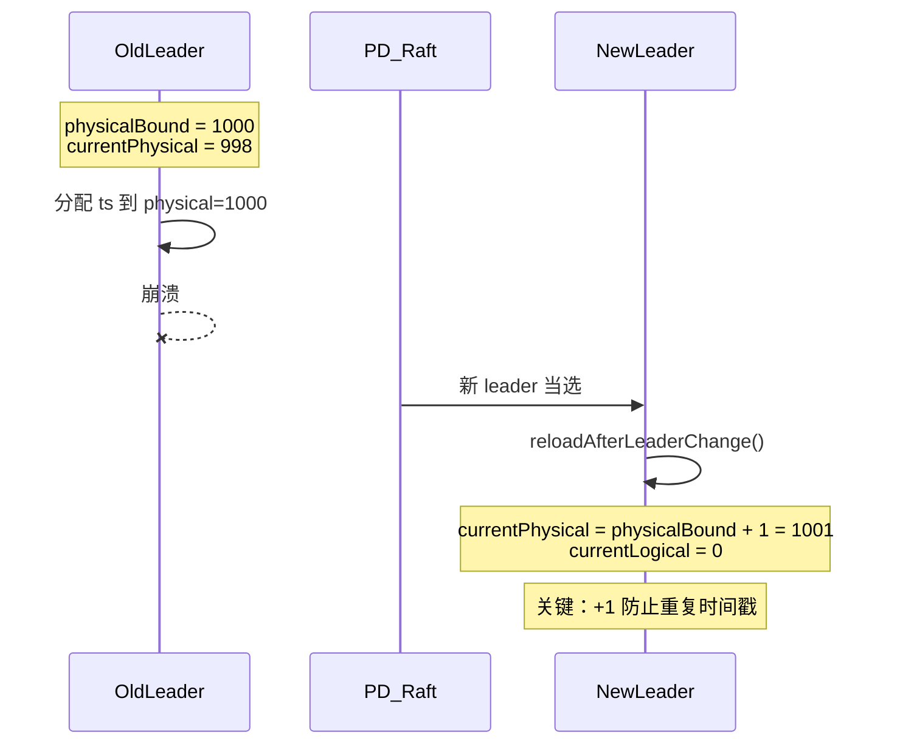
```mermaid
sequenceDiagram
    participant OldLeader
    participant PD_Raft
    participant NewLeader

    Note over OldLeader: physicalBound = 1000<br/>currentPhysical = 998
    OldLeader->>OldLeader: 分配 ts 到 physical=1000
    OldLeader--xOldLeader: 崩溃

    PD_Raft->>NewLeader: 新 leader 当选
    NewLeader->>NewLeader: reloadAfterLeaderChange()
    Note over NewLeader: currentPhysical = physicalBound + 1 = 1001<br/>currentLogical = 0
    Note over NewLeader: 关键：+1 防止重复时间戳
```

### 6.5 正确性保证

- **Inv-4（跨 leader 切换严格单调）**：新 leader 从 `physicalBound + 1` 开始
- **Single-flight extend**：并发 allocator 共享一次 Raft proposal
- **无 NTP 依赖**：壁钟仅作为 hint，单调性依赖持久化 bound + Raft 排序

### 6.6 配置项

| 配置键 | 默认值 | 说明 |
|--------|--------|------|
| `tso.savedIntervalMs` | 50 ms | 预分配窗口 |
| `tso.updateIntervalMs` | 10 ms | 更新间隔 |

### 6.7 测试覆盖

- `HlcTsoOracleTest`：单调性、并发分配、leader 切换 +1、bound 扩展
- `PdLeaderFailoverE2ETest`：PD leader 故障转移后 TSO 连续性
- `PdRaftHATest`：3 节点 PD Raft HA

### 6.8 源码分析

| 关键类 | 文件位置 | 入口方法 |
|--------|---------|---------|
| `HlcTsoOracle` | `pd/.../state/HlcTsoOracle.java` | `alloc()` (L107)：分配 TSO |
| | | `extendBound()` (L156)：扩展 bound（single-flight） |
| | | `reloadAfterLeaderChange()` (L210)：leader 切换重载 |
| `TsoBatcherImpl` | `client/.../tso/TsoBatcherImpl.java` | `getTimestamps()` (L63)：客户端入口 |
| | | `dispatchLoop()` (L99)：合并分发循环 |
| `PdServiceImpl` | `pd/.../server/PdServiceImpl.java` | `getTimestamp()` (L400)：bidi stream TSO |

---

## 7. GC（垃圾回收）

### 7.1 功能概述

GC 清理 MVCC 版本链中不再需要的旧版本。PD 维护全局 GC safe-point，KV 节点的 GcWorker 定期从 PD 获取 safe-point 并对每个 leader region 发起 GC 提案。Service safe-point 机制允许 BR / CDC 等长时间运行的任务阻止 safe-point 推进，防止它们需要的旧版本被过早回收。

### 7.2 架构设计

```mermaid
sequenceDiagram
    participant Operator as 运维/tidb-gc
    participant PD
    participant BR as BR/CDC 服务
    participant GcW as GcWorker (KV)
    participant Region as Region Leader

    BR->>PD: UpdateServiceGCSafePoint(service="br", safePoint=100, ttl=5min)
    Operator->>PD: UpdateGCSafePoint(target=200)
    PD->>PD: 有效 safePoint = min(200, 100) = 100

    GcW->>PD: GetGCSafePoint()
    PD-->>GcW: safePoint = 100

    loop 每个 leader region
        GcW->>Region: propose GC(safePoint=100)
        Region->>Region: 删除 commitTs < 100 的旧 MVCC 版本
    end

    Note over BR: 5 分钟后 TTL 过期
    PD->>PD: 有效 safePoint 推进到 200
```

### 7.3 核心实现

- **SafePointService**：全局 `gcSafePoint`（`AtomicLong`，单调递增） + 每服务 `ServiceEntry`（带 TTL）
- **advance() 逻辑**：`effectiveSafePoint = min(operatorFloor, min(non-expired services))`
- **GcWorker**：`ScheduledExecutorService` 定期执行，每轮扫描所有 leader region → propose GC

### 7.4 配置项

| 配置键 | 默认值 | 说明 |
|--------|--------|------|
| `safePoint.defaultGcLifetimeMs` | 600s (10min) | GC lifetime |
| `safePoint.advanceIntervalMs` | 60s | safe-point 推进间隔 |
| `safePoint.serviceSafePointTtlMs` | 300s (5min) | 服务 safe-point TTL |
| `worker.gcIntervalMs` | 60s | GcWorker 检查间隔 |

### 7.5 测试覆盖

- `InMemorySafePointServiceTest`：advance、service 注册/过期、单调性
- `GcWorkerTest`：safe-point 获取 + per-region GC 提案

### 7.6 源码分析

| 关键类 | 文件位置 | 入口方法 |
|--------|---------|---------|
| `InMemorySafePointService` | `pd/.../state/InMemorySafePointService.java` | `advance()` (L104)：推进 safe-point |
| | | `updateServiceSafePoint()` (L73)：注册服务 safe-point |
| | | `updateGcSafePoint()` (L121)：运维更新 safe-point |
| `GcWorker` | `kv/.../store/GcWorker.java` | `runOnce()` (L90)：一轮 GC |
| | | `tick()` (L123)：获取 safe-point + 发起 GC |
| `MvccApplyHandler` | `kv/.../raft/MvccApplyHandler.java` | `applyGc()` (L858)：GC apply 逻辑 |

---

## 8. 死锁检测

### 8.1 功能概述

悲观事务中，多个事务可能形成循环等待导致死锁。x-kv 采用集中式（PD 端）wait-for graph 进行死锁检测。每当事务获取悲观锁被阻塞时，向 PD 注册 wait-for 边；PD 通过 BFS 检测环路。

### 8.2 架构设计

```mermaid
graph LR
    subgraph "KV Store"
        DC["DeadlockClient"]
    end

    subgraph "PD"
        DD["DeadlockDetector<br/>wait-for graph"]
    end

    DC -->|"DetectDeadlock(waiter, holder, key)"| DD
    DD -->|"BFS 检测环路"| DD
    DD -->|"发现死锁: 返回 cycle chain"| DC
    DC -->|"CleanupWaitFor(txn)"| DD

    subgraph "Wait-For Graph"
        T1["Txn 1"] -->|"等待"| T2["Txn 2"]
        T2 -->|"等待"| T3["Txn 3"]
        T3 -.->|"新边: 构成环?"| T1
    end
```

### 8.3 核心实现

- **数据结构**：`Map<Long, Set<WaitForEdge>>` 邻接表
- **检测算法**：`addWaitFor()` 时先 BFS（`findPath(holder → waiter)`），若可达则发现环路，**不插入该边**
- **TTL 清理**：`cleanupExpired()` 移除超过 `entryTtlMs`（默认 60s）的边，防止崩溃客户端残留
- **复杂度**：O(V + E) per insertion

### 8.4 测试覆盖

- `DeadlockDetectorTest`：环路检测、TTL 过期、边移除
- `DistributedDeadlockTest`：跨 KV 节点的分布式死锁检测

### 8.5 源码分析

| 关键类 | 文件位置 | 入口方法 |
|--------|---------|---------|
| `DeadlockDetector` | `pd/.../state/DeadlockDetector.java` | `addWaitFor()` (L92)：添加边 + BFS 检测 |
| | | `removeHolder()` (L115)：事务提交后清理 |
| | | `cleanupExpired()` (L133)：TTL 过期清理 |
| `DeadlockClient` | `kv/.../transport/DeadlockClient.java` | 发送 DetectDeadlock / CleanupWaitFor RPC |
| `PdServiceImpl` | `pd/.../server/PdServiceImpl.java` | `detectDeadlock()` (L746) |
| | | `cleanupWaitFor()` (L777) |

---

## 9. Raw KV API

### 9.1 功能概述

Raw KV 提供不经过 MVCC/事务层的低延迟 KV 操作，适用于无事务需求的场景。数据直接写入 DEFAULT CF，使用裸 userKey 而非 MVCC 编码。

### 9.2 协议 / Wire Format

| RPC | 说明 |
|-----|------|
| `RawGet` | 单 key 读取 |
| `RawBatchGet` | 批量读取 |
| `RawPut` | 单 key 写入（可选 TTL） |
| `RawBatchPut` | 批量写入 |
| `RawDelete` | 单 key 删除 |
| `RawBatchDelete` | 批量删除 |
| `RawDeleteRange` | 范围删除 |
| `RawScan` | 正向/反向扫描 |
| `RawCAS` | 原子 Compare-And-Swap |

### 9.3 核心实现

- **读路径**：`readIndex()` 保证线性一致性 → 直接读 RocksDB DEFAULT CF
- **写路径**：编码为 Raft proposal → 复制到 quorum → apply 时写 DEFAULT CF
- **Follower Read**：支持 stale read（通过 `safeTs` 检查当前 follower 的数据新鲜度）
- **CAS**：在 Raft apply 串行化下读当前值 → 比较 → 条件写入

### 9.4 测试覆盖

- `RawKvE2ETest`：全 API 端到端测试
- `PdRoutedRawKvE2ETest`：PD 路由的 Raw KV
- `FollowerReadE2ETest` / `FollowerReadStaleTest`：Follower Read
- `StressRawKvTest`：并发压测

### 9.5 源码分析

| 关键类 | 文件位置 | 入口方法 |
|--------|---------|---------|
| `RawKvService` | `kv/.../server/RawKvService.java` | `rawGet()` (L46) / `rawPut()` (L148) / `rawCAS()` (L249) |
| `RawKvApplyHandler` | `kv/.../raft/RawKvApplyHandler.java` | `apply()` (L35)：apply 入口 |
| `RawKvClientImpl` | `client/.../raw/RawKvClientImpl.java` | `get()` (L44) / `put()` (L80) / `scan()` (L161) / `cas()` (L223) |

---

## 10. Client SDK

### 10.1 功能概述

x-kv Client SDK 是一个 PD-aware 的 Java 客户端，封装了 PD leader 发现、region 路由缓存、TSO 批量分配、锁解析、两阶段提交、重试退避等复杂逻辑，向上提供简洁的 Raw KV 和 Transaction API。

### 10.2 架构设计

```mermaid
graph TD
    subgraph "用户 API"
        RAW["RawKvClient"]
        TXN["TxnClient / Transaction"]
        COP["CopClient"]
    end

    subgraph "核心组件"
        PD["PdClient<br/>PD leader 发现"]
        RC["RegionCacheImpl<br/>双索引 region 路由"]
        SC["StoreChannelCache<br/>per-store 多通道"]
        TSO["TsoBatcherImpl<br/>bidi-stream 合并分配"]
        RS["RegionRequestSenderImpl<br/>重试 + region error 处理"]
        BC["BatchCommandsClient<br/>bidi-stream 多路复用"]
        LR["LockResolverImpl<br/>Caffeine LRU + single-flight"]
        TPC["TwoPhaseCommitterImpl<br/>2PC 编排"]
        BO["BackofferImpl<br/>指数退避 + jitter"]
    end

    RAW --> RS
    TXN --> TPC
    TXN --> LR
    COP --> RS

    RS --> RC
    RS --> SC
    RS --> BC
    TPC --> RS
    TPC --> TSO
    LR --> RS
    LR --> TSO
    TSO --> PD
    RC --> PD
    SC --> PD
```

### 10.3 核心实现

**RegionCache 双索引**：

```mermaid
graph LR
    subgraph "byStartKey (TreeMap)"
        K1["[a, f) → Region 1"]
        K2["[f, m) → Region 2"]
        K3["[m, z) → Region 3"]
    end

    subgraph "byId (ConcurrentHashMap)"
        I1["1 → Region 1"]
        I2["2 → Region 2"]
        I3["3 → Region 3"]
    end

    Q["locateKey('hello')"] -->|"floorEntry('hello')"| K2
```

- **Epoch 支配检查**：`dominates(newEpoch, oldEpoch)` → 只有更新的 epoch 才能覆盖缓存
- **Range invalidation**：Split/Merge 时用 `TreeMap.subMap()` 做 O(log N + k) 范围清除

**BatchCommands 多路复用**：

```mermaid
sequenceDiagram
    participant C1 as Caller 1
    participant C2 as Caller 2
    participant BC as BatchCommandsClient
    participant KV as KV Store

    C1->>BC: send(store1, req1)
    C2->>BC: send(store1, req2)
    BC->>KV: BatchCommandsRequest { req_id=1: req1, req_id=2: req2 }
    KV-->>BC: BatchCommandsResponse { req_id=1: resp1, req_id=2: resp2 }
    BC-->>C1: resp1
    BC-->>C2: resp2
```

**LockResolver（Caffeine LRU + single-flight）**：

```mermaid
flowchart TD
    A["遇到锁 lock_ts=500"] --> B{"verdictCache.get(500)?"}
    B -->|"命中: COMMITTED"| C["ResolveLock(commit)"]
    B -->|"未命中"| D{"inFlight.get(500)?"}
    D -->|"已有 in-flight"| E["共享 CompletableFuture"]
    D -->|"无"| F["CheckTxnStatus(500)"]
    F --> G{"TTL 过期?"}
    G -->|"是"| H["强制 rollback"]
    G -->|"否（ALIVE）"| I["不操作, 返回 false"]
    H --> J["缓存 verdict"]
    C --> K["完成"]
```

### 10.4 配置项

| 配置键 | 默认值 | 说明 |
|--------|--------|------|
| `backoff.maxOverallElapsedMs` | 40s | 总退避预算 |
| `tso.maxBatchSize` | 100 | TSO 合并批次大小 |
| `tso.batchWaitMicros` | 500 μs | TSO 批次等待时间 |
| `regionCache.maxSize` | 10000 | region 缓存最大条目 |

### 10.5 测试覆盖

- `ClientSdkE2ETest`：完整 SDK 集成测试
- `PdAwareRoutingE2ETest`：PD 路由
- `BatchCommandsE2ETest`：BatchCommands 多路复用
- `TxnRetryE2ETest`：事务冲突重试

### 10.6 源码分析

| 关键类 | 文件位置 | 入口方法 |
|--------|---------|---------|
| `PdClient` | `client/.../pd/PdClient.java` | `switchLeader()` (L79)：PD leader 故障转移 |
| `RegionCacheImpl` | `client/.../region/RegionCacheImpl.java` | `locateKey()` (L57)：key → region 路由 |
| | | `update()` (L99)：epoch 支配更新 |
| `StoreChannelCache` | `client/.../region/StoreChannelCache.java` | `stubFor()` (L63)：获取 per-store 连接 |
| `TsoBatcherImpl` | `client/.../tso/TsoBatcherImpl.java` | `getTimestamps()` (L63)：TSO 分配入口 |
| | | `dispatchLoop()` (L99)：合并分发 |
| `RegionRequestSenderImpl` | `client/.../region/RegionRequestSenderImpl.java` | `sendKeyed()` (L70)：带重试的请求发送 |
| | | `handleRegionError()` (L229)：region error 处理 |
| `BatchCommandsClient` | `client/.../region/BatchCommandsClient.java` | `send()` (L40)：多路复用发送 |
| `LockResolverImpl` | `client/.../txn/LockResolverImpl.java` | `resolveLock()` (L68)：单锁解析 |
| | | `resolveLocks()` (L96)：批量解析 |
| `TwoPhaseCommitterImpl` | `client/.../txn/TwoPhaseCommitterImpl.java` | `commit()` (L68)：2PC 编排入口 |
| `TransactionImpl` | `client/.../txn/TransactionImpl.java` | `get()` (L88)：read-your-own-writes 读 |
| | | `commit()` (L392)：提交事务 |
| | | `lockKeysForUpdate()` (L289)：悲观加锁 |
| `BackofferImpl` | `client/.../backoff/BackofferImpl.java` | `backoff()` (L63)：指数退避 |
| `TxnClientImpl` | `client/TxnClientImpl.java` | `executeWithRetry()` (L82)：自动重试入口 |

---

## 11. Coprocessor（协处理器）

### 11.1 功能概述

Coprocessor 将计算下推到存储层执行，减少数据在网络上的传输量。支持 DAG 执行器（Volcano 拉模型）、TableScan / IndexScan / IndexLookup、Selection（过滤下推）、Limit、TopN、聚合（COUNT/SUM/AVG/MIN/MAX）、表达式求值、向量化执行（chunk-based）、统计收集（Analyze）和批量 split-region coprocessor。

### 11.2 架构设计

```mermaid
graph TD
    subgraph "DAG 执行管线 (Volcano 模型)"
        TS["TableScanOp / IndexScanOp"]
        SEL["SelectionOp<br/>(过滤下推)"]
        TOPN["TopNOp<br/>(排序 + 限制)"]
        LIM["LimitOp"]
        AGG["聚合<br/>(COUNT/SUM/AVG/MIN/MAX)"]
    end

    subgraph "向量化执行管线 (Chunk-based)"
        VTS["VecTableScanOp / VecIndexScanOp"]
        VSEL["VecSelectionOp"]
        VTOPN["VecTopNOp"]
        VLIM["VecLimitOp"]
    end

    TS -->|"next()"| SEL
    SEL -->|"next()"| TOPN
    TOPN -->|"next()"| LIM

    VTS -->|"next() → CopChunk"| VSEL
    VSEL -->|"next() → CopChunk"| VTOPN
    VTOPN -->|"next() → CopChunk"| VLIM

    subgraph "Coprocessor 类型"
        SQL["SQLScanCoprocessor<br/>(tp=1, DAG)"]
        TBL["TableScanCoprocessor<br/>(tp=2, 简单 scan)"]
        IDX["IndexScanCoprocessor<br/>(tp=3, 索引扫描)"]
        ANL["AnalyzeCoprocessor<br/>(tp=4, 统计收集)"]
        SPK["SplitKeysCoprocessor<br/>(tp=5, 分裂键计算)"]
    end
```

### 11.3 协议 / Wire Format

| RPC | 类型 | 说明 |
|-----|------|------|
| `Coprocessor` | unary | 单次 coprocessor 请求 |
| `CoprocessorStream` | server-streaming | 流式结果返回 |
| `BatchCoprocessor` | server-streaming | 多 region 并行 |

```protobuf
Request {
  context: Context
  tp: int64           // 1=SQL/DAG, 2=Table, 3=Index, 4=Analyze, 5=SplitKeys
  data: bytes         // DAGRequest / AnalyzeReq 序列化
  start_ts: uint64
  ranges: [KeyRange]
  paging_size: uint64
}
```

### 11.4 核心实现

- **行式执行**（`CopOperator`）：`next()` 返回 `CopRecord`，逐行处理
- **向量化执行**（`VecOperator`）：`next()` 返回 `CopChunk`（行批次），减少虚函数调用开销
- **IndexLookup（双读）**：IndexScan 拿到 rowId → TableScan 读完整行
- **表达式求值**（`ExprEvaluator`）：支持常量、列引用、二元运算、Like、In、Between、Cast 等
- **聚合**（`CopAggFunction`）：COUNT、SUM、AVG、MIN、MAX

### 11.5 测试覆盖

- `SQLScanCoprocessorTest`：DAG 执行器全路径
- `CoprocessorE2ETest`：端到端 coprocessor
- `SplitKeysCoprocessorTest`：分裂键计算

### 11.6 源码分析

| 关键类 | 文件位置 | 入口方法 |
|--------|---------|---------|
| `CoprocessorService` | `kv/.../server/CoprocessorService.java` | `handle()` (L27)：按 tp 分发 |
| `SQLScanCoprocessor` | `kv/.../coprocessor/SQLScanCoprocessor.java` | `handle()` (入口)：DAG 执行 |
| `IndexScanCoprocessor` | `kv/.../coprocessor/IndexScanCoprocessor.java` | `handle()` (入口)：索引扫描 |
| `AnalyzeCoprocessor` | `kv/.../coprocessor/AnalyzeCoprocessor.java` | `handle()` (入口)：统计收集 |
| `VecTableScanOp` | `kv/.../coprocessor/dag/VecTableScanOp.java` | `next()` (入口)：向量化 TableScan |
| `VecIndexScanOp` | `kv/.../coprocessor/dag/VecIndexScanOp.java` | `next()` (入口)：向量化 IndexScan |
| `CopClientImpl` | `client/.../cop/CopClientImpl.java` | `sendToRangeParallel()` (L57)：并行分发 |

---

## 12. CDC（Change Data Capture）

### 12.1 功能概述

CDC 提供实时数据变更捕获能力。KV 节点在 Raft apply 时发布 CDC 事件，通过 gRPC bidi-stream 推送到订阅者。支持增量扫描（catch-up）、per-region resolved TS 追踪和周期性 resolved TS 推送。

### 12.2 架构设计

```mermaid
sequenceDiagram
    participant Sub as CDC 订阅者
    participant CDC as ChangeDataServiceImpl
    participant EB as CdcEventBus
    participant Apply as MvccApplyHandler

    Sub->>CDC: ChangeDataRequest(register, regionId, checkpointTs)

    rect rgb(230, 245, 255)
        Note over CDC: 增量扫描 (catch-up)
        CDC->>CDC: CdcIncrementalScanner.scan(checkpointTs, currentTs)
        CDC->>Sub: 批量历史事件
    end

    CDC->>EB: subscribe(regionId, consumer)

    rect rgb(230, 255, 230)
        Note over Apply,Sub: 实时事件流
        Apply->>EB: publish(CdcEvent { PUT, key, value, commitTs })
        EB->>CDC: consumer.accept(event)
        CDC->>Sub: ChangeDataEvent { entries }
    end

    loop 每 1 秒
        CDC->>Sub: ResolvedTsEvent { regions, ts }
    end

    Sub->>CDC: ChangeDataRequest(deregister, regionId)
    CDC->>EB: unsubscribe(regionId, consumer)
```

### 12.3 核心实现

- **CdcEventBus**：`ConcurrentHashMap<Long, CopyOnWriteArrayList<Consumer<CdcEvent>>>` 实现 per-region pub/sub
- **CdcIncrementalScanner**：扫描 WRITE CF 中 `(checkpointTs, scanTs]` 的已提交写，只取每个 userKey 的最新版本
- **RegionResolvedTsTracker**：`ConcurrentHashMap<Long, ConcurrentSkipListSet<Long>>`，resolved TS = min(in-flight lock) - 1
- **线程安全发送**：`synchronized(sendLock)` 串行化 outbound 写

### 12.4 测试覆盖

- `CdcE2ETest`：完整 CDC 端到端（注册/取消注册/事件推送）
- `CdcKeyFilterTest`：key 过滤
- `CdcIncrementalScannerTest`：增量扫描逻辑
- `RegionResolvedTsTrackerTest`：resolved TS 追踪

### 12.5 源码分析

| 关键类 | 文件位置 | 入口方法 |
|--------|---------|---------|
| `CdcEventBus` | `kv/.../cdc/CdcEventBus.java` | `subscribe()` (L16) / `publish()` (L29) |
| `CdcIncrementalScanner` | `kv/.../cdc/CdcIncrementalScanner.java` | `scan()` (L51)：增量扫描 |
| `RegionResolvedTsTracker` | `kv/.../cdc/RegionResolvedTsTracker.java` | `resolvedTs()` (L31)：计算 resolved TS |
| `ChangeDataServiceImpl` | `kv/.../server/ChangeDataServiceImpl.java` | `eventFeed()` (L59)：EventFeed bidi stream |
| | | `resolvedTs()` (L167)：resolved TS bidi stream |

---

## 13. Backup & Restore（备份与恢复）

### 13.1 功能概述

BR（Backup & Restore）支持 SST 级别的数据导出和导入。Backup 将 3 个数据 CF 的 RocksDB 数据导出为 SST 文件并通过 gRPC streaming 传输；Restore 接收 SST 文件并通过 `IngestExternalFile` 原子导入。Service safe-point 机制保护备份期间的 MVCC 版本不被 GC 回收。

### 13.2 架构设计

```mermaid
sequenceDiagram
    participant Client as BR Client
    participant KV as KV Store
    participant PD

    Client->>PD: UpdateServiceGCSafePoint(service="br", safePoint)
    Note over PD: 阻止 GC 推进

    Client->>KV: Backup(startKey, endKey)

    loop 每个 CF (default, lock, write)
        KV->>KV: Pin Snapshot → 遍历 CF → 写 SST
        KV->>KV: SHA-256 校验
        KV-->>Client: BackupResponse { files: [BackupFile] }
    end

    Client->>KV: Restore(ssts)
    KV->>KV: 写 SST 临时文件
    KV->>KV: engine.ingestSst(cf, paths)
    KV-->>Client: RestoreResponse { ok }

    Client->>PD: 删除 service safe-point
```

### 13.3 协议 / Wire Format

| RPC | 类型 | 说明 |
|-----|------|------|
| `Backup` | server-streaming | 导出 SST 数据 |
| `Restore` | unary | 导入 SST 数据 |

### 13.4 测试覆盖

- `BackupRestoreTest`：单元测试 SST 导出/导入
- `CrashRecoveryE2ETest`：含备份恢复的崩溃恢复

### 13.5 源码分析

| 关键类 | 文件位置 | 入口方法 |
|--------|---------|---------|
| `BackupManager` | `kv/.../backup/BackupManager.java` | `backup()` (L36)：导出入口 |
| `RestoreManager` | `kv/.../backup/RestoreManager.java` | `restore()` (L27)：导入入口 |
| `TikvServiceImpl` | `kv/.../server/TikvServiceImpl.java` | `backup()` (L389) / `restore()` (L404) |

---

## 14. 多租户（Keyspace & Resource Group）

### 14.1 功能概述

Keyspace 提供逻辑隔离的命名空间，每个 keyspace 有独立的生命周期状态（ENABLED → DISABLED → ARCHIVED → TOMBSTONE）。Resource Group 提供基于 Request Unit（RU）的资源限流，通过 Token Bucket 算法控制每个租户的资源消耗。

### 14.2 架构设计

```mermaid
graph TD
    subgraph "PD 侧"
        KM["KeyspaceManager<br/>byId + byName 双索引"]
        RGM["ResourceGroupManager<br/>CRUD"]
    end

    subgraph "KV 侧"
        RGT["ResourceGroupThrottler<br/>per-group TokenBucket"]
        RGI["ResourceGroupInterceptor<br/>gRPC 拦截器"]
    end

    RGM -->|"同步 RU 设置"| RGT
    RGI -->|"请求时检查"| RGT
    RGI -->|"x-resource-group 头"| RGI
```

**Keyspace 状态机**：

```mermaid
stateDiagram-v2
    [*] --> ENABLED: createKeyspace
    ENABLED --> DISABLED: updateState
    DISABLED --> ENABLED: updateState
    DISABLED --> ARCHIVED: updateState
    ARCHIVED --> TOMBSTONE: updateState
    TOMBSTONE --> [*]
```

### 14.3 协议 / Wire Format

| RPC | 说明 |
|-----|------|
| `LoadKeyspace` / `ListKeyspaces` / `UpdateKeyspaceState` | Keyspace 管理 |
| `GetResourceGroup` / `AddResourceGroup` / `ModifyResourceGroup` / `DeleteResourceGroup` / `ListResourceGroups` | Resource Group 管理 |

### 14.4 核心实现

- **TokenBucket**：CAS-based token 消费，纳秒级 refill
- **ResourceGroupInterceptor**：从 gRPC metadata `x-resource-group` 头提取 group name → `throttler.tryConsume()` → 不足时返回 `RESOURCE_EXHAUSTED`
- **默认 group**（`"default"`）不可删除

### 14.5 测试覆盖

- `KeyspaceManagerTest`：CRUD、状态转换合法性
- `ResourceGroupManagerTest`：CRUD、默认 group 保护
- `ResourceGroupThrottlerTest`：Token Bucket 消费/退还/refill
- `RateLimitE2ETest`：端到端限流

### 14.6 源码分析

| 关键类 | 文件位置 | 入口方法 |
|--------|---------|---------|
| `KeyspaceManager` | `pd/.../keyspace/KeyspaceManager.java` | `createKeyspace()` (L38) |
| | | `updateState()` (L76) |
| `ResourceGroupManager` | `pd/.../keyspace/ResourceGroupManager.java` | `addGroup()` (L36) / `modifyGroup()` (L47) |
| `ResourceGroupThrottler` | `kv/.../ratelimit/ResourceGroupThrottler.java` | `tryConsume()` (L31) |
| `ResourceGroupInterceptor` | `kv/.../ratelimit/ResourceGroupInterceptor.java` | `interceptCall()` (L28) |

---

## 15. 运维工具链

### 15.1 功能概述

x-kv 提供完整的运维工具链，包括 CLI 工具（xkv-ctl）、Prometheus 指标暴露、结构化日志、健康检查、TLS/mTLS、认证、速率限制、优雅下线、在线配置变更和 Docker Compose 部署。

### 15.2 架构设计

```mermaid
graph TD
    subgraph "CLI (xkv-ctl)"
        CC["ClusterCommand<br/>members, health"]
        SC["StoreCommand<br/>list"]
        RC["RegionCommand<br/>list, info, split"]
        GCC["GcCommand<br/>safepoint"]
        CFG["ConfigCommand<br/>get, set"]
    end

    subgraph "可观测性"
        PROM["Prometheus 指标<br/>MetricsHttpServer :20180"]
        LOG["结构化日志<br/>logstash-logback-encoder"]
        HC["健康检查<br/>/healthz, /readyz"]
    end

    subgraph "安全"
        TLS["TLS/mTLS<br/>client + raft 双平面"]
        AUTH["Auth Token<br/>x-auth-token 头"]
    end

    subgraph "流量控制"
        RL["ConcurrencyLimitInterceptor<br/>Semaphore 并发限制"]
        DRAIN["DrainingInterceptor<br/>优雅下线"]
    end

    subgraph "Debug gRPC"
        DBI["GetRegionInfo / GetRaftState"]
        DBC["GetConfig / ModifyConfig"]
        DBM["GetMetrics / CompactionEvent"]
        DBU["UnsafeForceLeader"]
    end
```

### 15.3 gRPC 拦截器链

```mermaid
graph LR
    REQ["入站请求"] --> DRAIN["DrainingInterceptor"]
    DRAIN --> AUTH["AuthServerInterceptor"]
    AUTH --> CL["ConcurrencyLimitInterceptor"]
    CL --> RG["ResourceGroupInterceptor"]
    RG --> MDC["MdcServerInterceptor"]
    MDC --> MET["GrpcServerMetricsInterceptor"]
    MET --> SVC["业务 Handler"]
```

### 15.4 核心实现

**Prometheus 指标**：
- `xkv_errors_total{component, operation}`：错误计数
- gRPC 请求时延、计数、活跃请求数（通过 `GrpcServerMetricsInterceptor`）
- `/metrics` HTTP endpoint

**结构化日志**：
- `logstash-logback-encoder` 输出 JSON
- `MdcServerInterceptor` 注入 `store_id`, `region_id`, `rpc_method` 到 MDC

**优雅下线流程**：

```mermaid
sequenceDiagram
    participant Op as 运维
    participant KV as KV Server
    participant Client

    Op->>KV: SIGTERM / drain()
    KV->>KV: DrainingInterceptor.startDraining()
    Client->>KV: 新请求
    KV-->>Client: UNAVAILABLE (gRPC)
    Note over Client: 客户端重试到其他 store

    KV->>KV: 转移所有 leader
    KV->>KV: 等待 drainTimeoutMs (默认 10s)
    KV->>KV: 关闭 gRPC server
    KV->>KV: 关闭 peers + engine
```

**在线配置变更**（Debug gRPC）：

| RPC | 说明 |
|-----|------|
| `GetConfig` | 获取当前运行时配置 |
| `ModifyConfig` | 在线修改配置（触发 listener 通知） |

支持的可变配置项：raft heartbeat/election tick、region split/merge 阈值、log compaction 参数、slow log 阈值等。

**PD HTTP API**：

| 端点 | 方法 | 说明 |
|------|------|------|
| `/pd/api/v1/schedulers` | GET | 列出所有调度器状态 |
| `/pd/api/v1/schedulers/{name}/pause` | POST | 暂停调度器 |
| `/pd/api/v1/schedulers/{name}/resume` | POST | 恢复调度器 |
| `/pd/api/v1/config/schedule` | GET/POST | 查看/修改调度配置 |
| `/pd/api/v1/status` | GET | 集群状态 |
| `/pd/api/v1/keyspaces` | GET/POST | Keyspace 管理 |
| `/pd/api/v1/resource_groups` | GET/POST/PUT/DELETE | Resource Group 管理 |

### 15.5 配置项

| 配置键 | 默认值 | 说明 |
|--------|--------|------|
| `maxConcurrentRequests` | 10,000 (KV) / 5,000 (PD) | 并发请求上限 |
| `metricsPort` | 20180 (KV) / 9190 (PD) | Prometheus 端口 |
| `slowLogThresholdMs` | 1000 ms | 慢日志阈值 |
| `drainTimeoutMs` | 10,000 ms | 优雅下线超时 |
| `authToken` | 无 | 认证令牌 |
| `clientTls.certPath/keyPath/caPath` | 无 | 客户端 TLS |
| `raftTls.certPath/keyPath/caPath` | 无 | Raft 平面 TLS |

### 15.6 测试覆盖

- `AuthE2ETest`：认证拦截
- `TlsE2ETest`：TLS/mTLS
- `MetricsE2ETest`：指标暴露
- `HealthCheckE2ETest`：健康检查
- `RateLimitE2ETest`：并发限制
- `GracefulDrainTest`：优雅下线
- `DebugServiceE2ETest`：Debug gRPC 全部 RPC
- `ServerStartupTest`：服务器启动
- `NodeRestartTest`：节点重启恢复

### 15.7 源码分析

| 关键类 | 文件位置 | 入口方法 |
|--------|---------|---------|
| `KvServer` | `kv/.../server/KvServer.java` | `start()` (L117)：KV 节点启动 |
| | | `drain()` (L610)：优雅下线 |
| | | `stop()` (L670)：完全停止 |
| `TikvServiceImpl` | `kv/.../server/TikvServiceImpl.java` | `batchCommands()` (L282)：BatchCommands 入口 |
| | | `getVersion()` (L269)：版本协商 |
| `DebugServiceImpl` | `kv/.../server/DebugServiceImpl.java` | `getConfig()` (L222) / `modifyConfig()` (L240) |
| `ConfigManager` | `kv/.../config/ConfigManager.java` | `set()` (L96)：在线配置变更 |
| `PdServer` | `pd/.../server/PdServer.java` | `start()` (L85)：PD 节点启动 |
| `PdHttpApi` | `pd/.../server/PdHttpApi.java` | `register()` (L34)：注册 HTTP 端点 |
| `PdScheduleConfigManager` | `pd/.../config/PdScheduleConfigManager.java` | `set()` (L67)：调度配置变更 |
| `XKvMetrics` | `common/.../metrics/XKvMetrics.java` | 指标注册中心 |
| `DrainingInterceptor` | `common/.../ratelimit/DrainingInterceptor.java` | `startDraining()`：启动下线 |
| `ConcurrencyLimitInterceptor` | `common/.../ratelimit/ConcurrencyLimitInterceptor.java` | `interceptCall()`：并发限制 |
| `AuthServerInterceptor` | `common/.../auth/AuthServerInterceptor.java` | `interceptCall()`：认证校验 |
| `SslContextFactory` | `common/.../tls/SslContextFactory.java` | `buildServerContext()` / `buildClientContext()` |
| `XKvCtl` | `ctl/.../XKvCtl.java` | `main()`：CLI 入口 |
| `RegionCommand` | `ctl/.../cmd/RegionCommand.java` | `list()` / `info()` / `split()` |

---

## 附录：Proto 文件与 gRPC 服务总览

| 服务 | Proto 文件 | RPC 数量 | 说明 |
|------|-----------|---------|------|
| `Tikv` | `tikvpb.proto` | 30 | KV 读写 + 事务 + Coprocessor + 管理 |
| `PD` | `pdpb.proto` | 38 | 集群元数据 + TSO + 调度 + GC + 放置规则 + 多租户 |
| `ChangeData` | `cdcpb.proto` | 2 | CDC EventFeed + ResolvedTs |
| `Debug` | `debugpb.proto` | 11 | 调试 + 在线配置 |
| `KvRaft` | `kv_serverpb.proto` | 2 | KV 间 Raft 消息 + 快照 |
| `PDRaft` | `pd_internalpb.proto` | 1 | PD 间 Raft 消息 |
| **合计** | **11 个 .proto** | **84** | |

---

## 附录：测试矩阵

| 测试类别 | 文件数 | 测试方法数 | 典型测试 |
|---------|--------|----------|---------|
| 单元测试 | 18 | ~100 | MvccTxnTest, HlcTsoOracleTest, KeyCodecTest |
| E2E / 集成 | 50 | ~230 | PercolatorE2ETest, PdRoutedRawKvE2ETest |
| 线性一致性 | 1 | 3 | LinearizabilityE2ETest (Wing-Gong) |
| 混沌测试 | 1 | 3 | ChaosTest (leader kill / follower kill / partition) |
| 压力测试 | 2 | 4 | StressRawKvTest, StressTxnTest |
| 基准测试 | 1 | 4 | BenchmarkE2ETest (rawPut/rawGet/txnCommit/txnConflict) |
| **合计** | **68** | **~332** | |
