# x-kv 模块设计文档

> 本文档按 Maven 模块组织，详述每个模块的功能清单、设计思路与实现细节。

---

## 目录

- [模块总览](#模块总览)
- [1. proto — 协议定义](#1-proto--协议定义)
- [2. common — 共享基础设施](#2-common--共享基础设施)
- [3. pd — Placement Driver](#3-pd--placement-driver)
- [4. kv — Multi-Raft 存储引擎](#4-kv--multi-raft-存储引擎)
- [5. client — Java SDK](#5-client--java-sdk)
- [6. ctl — 命令行工具](#6-ctl--命令行工具)
- [7. tests — 测试体系](#7-tests--测试体系)
- [附录 A：跨模块数据流](#附录-a跨模块数据流)

---

## 模块总览

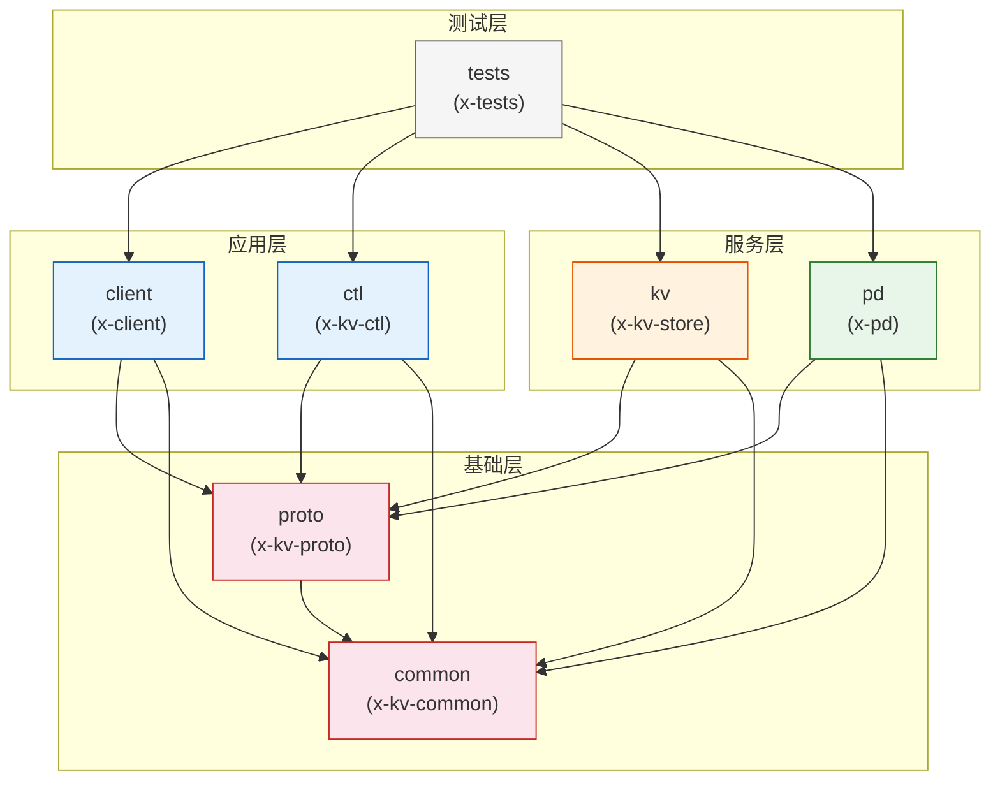
```mermaid
graph TD
    subgraph "测试层"
        TESTS["tests<br/>(x-tests)"]
    end
    subgraph "应用层"
        CLIENT["client<br/>(x-client)"]
        CTL["ctl<br/>(x-kv-ctl)"]
    end
    subgraph "服务层"
        KV["kv<br/>(x-kv-store)"]
        PD["pd<br/>(x-pd)"]
    end
    subgraph "基础层"
        PROTO["proto<br/>(x-kv-proto)"]
        COMMON["common<br/>(x-kv-common)"]
    end

    TESTS --> CLIENT & CTL & KV & PD
    CLIENT --> PROTO & COMMON
    CTL --> PROTO & COMMON
    KV --> PROTO & COMMON
    PD --> PROTO & COMMON
    PROTO --> COMMON

    style TESTS fill:#f5f5f5,stroke:#666
    style CLIENT fill:#e3f2fd,stroke:#1565c0
    style CTL fill:#e3f2fd,stroke:#1565c0
    style KV fill:#fff3e0,stroke:#e65100
    style PD fill:#e8f5e9,stroke:#2e7d32
    style PROTO fill:#fce4ec,stroke:#c62828
    style COMMON fill:#fce4ec,stroke:#c62828
```

| 模块 | Artifact | 源文件数 | 核心职责 |
|------|----------|---------|---------|
| `proto/` | x-kv-proto | 11 .proto | gRPC + Protobuf 协议定义，TiKV v8.x 线协议兼容 |
| `common/` | x-kv-common | 16 Java | TLS/认证/限流/指标/日志/配置等共享基础设施 |
| `pd/` | x-pd | 37 Java | 集群元数据、TSO、调度器、死锁检测、GC safe-point |
| `kv/` | x-kv-store | 90 Java | Multi-Raft 存储引擎、MVCC/Percolator、Coprocessor、CDC |
| `client/` | x-client | 28 Java | PD 感知路由、TSO 批量分配、锁解析、两阶段提交 |
| `ctl/` | x-kv-ctl | 6 Java | 集群运维 CLI 工具 |
| `tests/` | x-tests | 63 Java | E2E / 混沌 / 线性一致性 / 基准测试 |

**依赖关系**：无循环依赖。`proto` 和 `common` 是叶子模块；`pd` 和 `kv` 同层无交叉依赖；`client` 和 `ctl` 依赖 `proto` + `common`；`tests` 位于顶层，依赖所有模块。

---

## 1. proto — 协议定义

### 1.1 功能清单

proto 模块定义了 x-kv 的全部线协议，包含 **11 个 .proto 文件**、**6 个 gRPC Service**、**82 个 RPC 方法**。

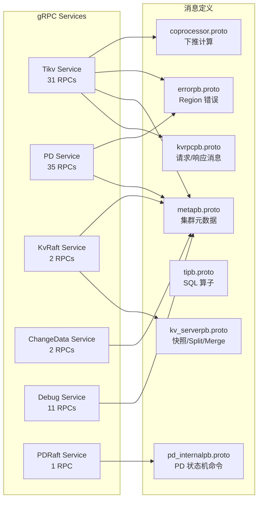
```mermaid
graph LR
    subgraph "gRPC Services"
        TIKV["Tikv Service<br/>31 RPCs"]
        PDS["PD Service<br/>35 RPCs"]
        KVRAFT["KvRaft Service<br/>2 RPCs"]
        CDC["ChangeData Service<br/>2 RPCs"]
        DEBUG["Debug Service<br/>11 RPCs"]
        PDRAFT["PDRaft Service<br/>1 RPC"]
    end

    subgraph "消息定义"
        KVRPC["kvrpcpb.proto<br/>请求/响应消息"]
        META["metapb.proto<br/>集群元数据"]
        ERR["errorpb.proto<br/>Region 错误"]
        COP["coprocessor.proto<br/>下推计算"]
        TIPB["tipb.proto<br/>SQL 算子"]
        KVSRV["kv_serverpb.proto<br/>快照/Split/Merge"]
        PDINT["pd_internalpb.proto<br/>PD 状态机命令"]
    end

    TIKV --> KVRPC & META & ERR & COP
    PDS --> META & ERR
    KVRAFT --> KVSRV & META
    CDC --> META
    DEBUG --> META
    PDRAFT --> PDINT
```

### 1.2 Proto 文件详解

#### 1.2.1 tikvpb.proto — KV 服务入口

定义 `Tikv` Service（31 个 RPC），是 KV 节点的主 gRPC 服务。

| 分类 | RPC 方法 | 说明 |
|------|---------|------|
| **事务读** | `KvGet`, `KvScan`, `KvBatchGet` | MVCC 快照读 |
| **事务写** | `KvPrewrite`, `KvCommit`, `KvBatchRollback`, `KvCleanup` | Percolator 2PC |
| **悲观锁** | `KvPessimisticLock`, `KvPessimisticRollback` | 悲观事务上锁/回滚 |
| **事务状态** | `KvCheckTxnStatus`, `KvCheckSecondaryLocks`, `KvTxnHeartBeat` | 锁状态查询与心跳 |
| **锁解析** | `KvResolveLock`, `KvScanLock` | 过期锁清理 |
| **GC** | `KvGC`, `KvDeleteRange` | 版本回收与范围删除 |
| **Raw KV** | `RawGet/Put/Delete/Scan/BatchGet/BatchPut/BatchDelete/DeleteRange/CAS` | 无事务 KV 接口 |
| **Coprocessor** | `Coprocessor`, `CoprocessorStream`, `BatchCoprocessor` | 下推计算 |
| **Region 管理** | `SplitRegion` | 客户端触发分裂 |
| **MVCC 调试** | `MvccGetByKey`, `MvccGetByStartTs` | MVCC 数据检查 |
| **版本协商** | `GetVersion` | 兼容性版本协商 |
| **备份恢复** | `Backup`, `Restore` | SST 级备份/恢复 |
| **批量复用** | `BatchCommands` | 双向流多路复用 |

**BatchCommands 设计**：`BatchCommandsRequest` 通过 `oneof cmd` 封装 26 种子请求，配合 `request_ids` 做请求-响应关联。客户端将多个独立 RPC 合并到一个 gRPC 流帧中发送，服务端原子解复用并返回，实现 fsync 摊还。

#### 1.2.2 kvrpcpb.proto — 事务消息体

纯消息定义（683 行），为 Tikv Service 的所有 RPC 提供请求/响应类型。

**核心消息**：

| 消息 | 用途 |
|------|------|
| `Context` | 每次 RPC 的路由上下文：region_id, epoch, peer, term, isolation_level, replica_read, resource_group_tag 等 |
| `KeyError` | 事务级错误信封：locked, write_conflict, deadlock, already_exist, commit_ts_expired 等 |
| `LockInfo` | 锁详情：primary_lock, lock_version, ttl, async_commit 字段, pessimistic 字段 |
| `WriteConflict` | 写冲突详情 + Reason 枚举（Optimistic / PessimisticRetry / RcCheckTs 等） |
| `Mutation` | 写操作单元：Op(Put/Del/Lock/Insert/PessimisticLock) + key + value |

#### 1.2.3 pdpb.proto — PD 服务

定义 `PD` Service（35 个 RPC），涵盖集群管理的全部功能：

| 分类 | RPC | 说明 |
|------|-----|------|
| **集群** | `GetMembers`, `GetClusterInfo`, `Bootstrap`, `IsBootstrapped` | PD 成员发现与集群引导 |
| **ID 分配** | `AllocID` | Raft 复制的单调 ID 分配器 |
| **TSO** | `GetTimestamp` (双向流) | 高吞吐时间戳分配 |
| **Store** | `PutStore`, `GetStore`, `GetAllStores` | Store 注册与查询 |
| **心跳** | `StoreHeartbeat`, `RegionHeartbeat` (双向流) | Store/Region 心跳上报 + 调度指令下发 |
| **Region 查询** | `GetRegion`, `GetRegionByID`, `ScanRegions` | Region 路由查询 |
| **Split** | `AskSplit`, `AskBatchSplit`, `ReportSplit`, `ReportBatchSplit`, `SplitRegions`, `ScatterRegion` | 分裂 ID 分配、上报、散列 |
| **GC** | `GetGCSafePoint`, `UpdateGCSafePoint`, `UpdateServiceGCSafePoint`, `GetAllServiceGCSafePoints` | GC 安全点管理 |
| **Operator** | `GetOperator` | 调度算子状态查询 |
| **死锁** | `DetectDeadlock`, `CleanupWaitFor` | 分布式死锁检测 |
| **Placement** | `GetPlacementRules`, `SetPlacementRule`, `DeletePlacementRule` | 放置规则 CRUD |
| **多租户** | `LoadKeyspace`, `UpdateKeyspaceState`, `ListKeyspaces` | Keyspace 管理 |
| **资源组** | `GetResourceGroup`, `AddResourceGroup`, `ModifyResourceGroup`, `DeleteResourceGroup`, `ListResourceGroups` | 资源组 CRUD |

#### 1.2.4 metapb.proto — 集群元数据

定义分布式系统的基础数据结构：

- **Region**：`id`, `start_key`, `end_key`, `region_epoch`, `peers` — 键空间到 Raft Group 的映射
- **RegionEpoch**：`conf_ver`（成员变更版本）, `version`（Split/Merge 版本）— 过期检测
- **Peer**：`id`, `store_id`, `role`（Voter/Learner/IncomingVoter/DemotingVoter）
- **Store**：`id`, `address`, `state`（Up/Offline/Tombstone/Down）, `labels`

#### 1.2.5 errorpb.proto — Region 级错误

`Error` 消息定义 18 种 Region 级错误变体，驱动客户端重试策略：

| 错误 | 客户端响应 |
|------|----------|
| `NotLeader` | 跟随 leader hint 重路由 |
| `EpochNotMatch` | 使用返回的 current_regions 更新路由缓存 |
| `ServerIsBusy` | 按 backoff_ms 退避 |
| `StaleCommand` | 直接重试 |
| `RegionNotFound` | 刷新路由缓存后重试 |
| `DataIsNotReady` | 跟随者 stale read 延迟不足，切换到 leader 读 |

#### 1.2.6 其他 Proto 文件

| 文件 | 用途 |
|------|------|
| `kv_serverpb.proto` | KvRaft 服务（2 RPC）：Raft 消息流、快照传输；Split/Merge/Backup 提案消息 |
| `coprocessor.proto` | 下推计算请求/响应：KeyRange, Request(tp+data), Response, 流式/批量变体 |
| `tipb.proto` | SQL 下推算子：DAGRequest, Expr, ColumnInfo, AggFuncDesc, AnalyzeReq |
| `debugpb.proto` | Debug 服务（11 RPC）：Region/Raft 状态查看、Compaction、指标、在线配置变更 |
| `cdcpb.proto` | ChangeData 服务（2 RPC）：EventFeed 双向流、ResolvedTs 推送 |
| `pd_internalpb.proto` | PD 内部 Raft（1 RPC）：PdCommand 状态机命令、PdSnapshot 全量快照 |

### 1.3 构建设计

使用 `protobuf-maven-plugin`（xolstice）+ `os-maven-plugin` 自动检测平台。构建产物输出到 `target/generated-sources/protobuf/`，同时生成 Protobuf 消息类（`compile`）和 gRPC Stub 类（`compile-custom`）。

### 1.4 源码分析

| 文件 | 行数 | 关键内容 |
|------|------|---------|
| `tikvpb.proto` | 174 | Tikv Service 定义（L21-77）、BatchCommands oneof（L84-120） |
| `kvrpcpb.proto` | 683 | Context（L23）、KeyError（L88）、LockInfo（L104）、Mutation（L213） |
| `pdpb.proto` | 670 | PD Service（L22-89）、Timestamp（L191）、RegionHeartbeatResponse（L292） |
| `metapb.proto` | 99 | Region（L11）、Peer（L50）、Store（L70）、PeerRole（L43） |
| `errorpb.proto` | 140 | Error（L14）、18 种错误变体 |
| `pd_internalpb.proto` | 136 | PdCommand（L40）、PdSnapshot（L113） |

---

## 2. common — 共享基础设施

### 2.1 功能清单

common 模块提供所有上层模块共享的横切关注点，包含 **16 个生产类** + **1 个测试类**，分布在 7 个包中。

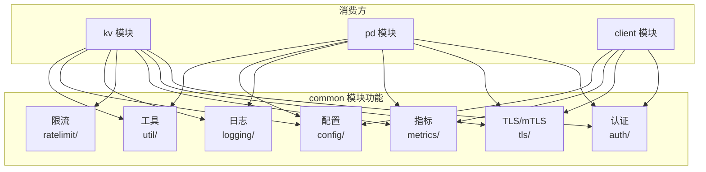
```mermaid
graph TD
    subgraph "common 模块功能"
        AUTH["认证<br/>auth/"]
        TLS["TLS/mTLS<br/>tls/"]
        METRICS["指标<br/>metrics/"]
        RATE["限流<br/>ratelimit/"]
        LOG["日志<br/>logging/"]
        CONFIG["配置<br/>config/"]
        UTIL["工具<br/>util/"]
    end

    subgraph "消费方"
        KV_MOD["kv 模块"]
        PD_MOD["pd 模块"]
        CLIENT_MOD["client 模块"]
    end

    KV_MOD --> AUTH & TLS & METRICS & RATE & LOG & CONFIG & UTIL
    PD_MOD --> AUTH & TLS & METRICS & LOG & CONFIG & UTIL
    CLIENT_MOD --> AUTH & TLS & METRICS & CONFIG
```

### 2.2 功能详解

#### 2.2.1 认证（auth/）

**设计目标**：基于 Token 的 gRPC 双向认证，支持在所有 RPC 上透明地附加/验证认证令牌。

| 类 | 角色 | 设计要点 |
|----|------|---------|
| `AuthConstants` | 常量 | 定义 Metadata Key `x-auth-token` |
| `AuthClientInterceptor` | 客户端拦截器 | 在出站请求 Metadata 中注入 Bearer Token |
| `AuthServerInterceptor` | 服务端拦截器 | 提取 Token 并用 `MessageDigest.isEqual` 做常量时间比较，防止时序攻击；失败返回 `UNAUTHENTICATED` |

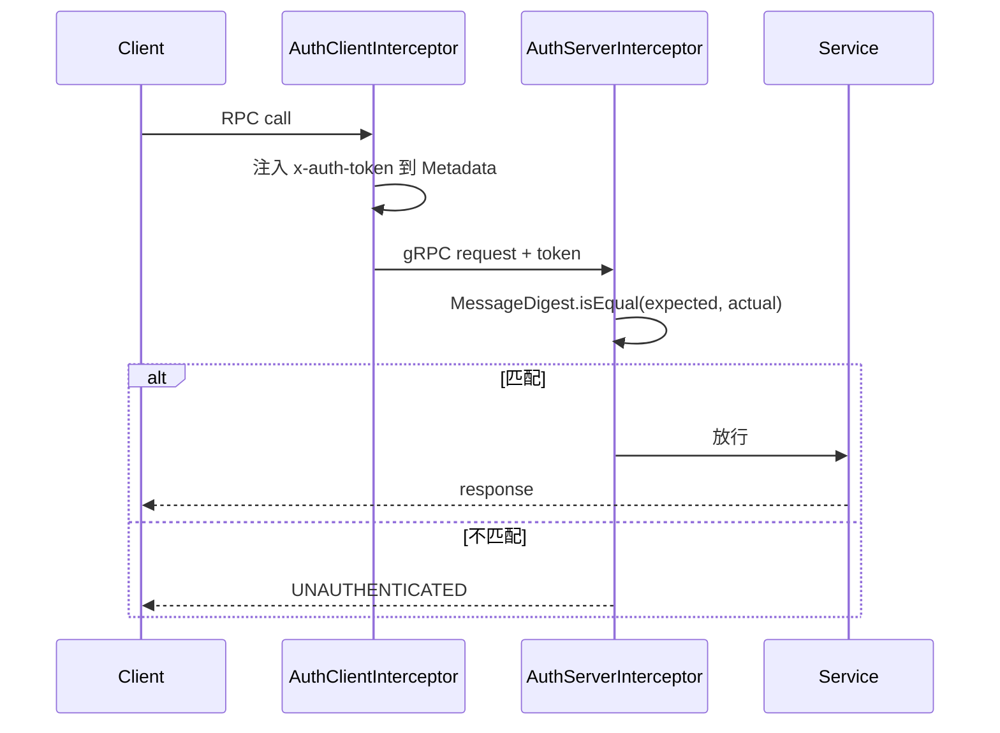
```mermaid
sequenceDiagram
    participant C as Client
    participant CI as AuthClientInterceptor
    participant SI as AuthServerInterceptor
    participant S as Service

    C->>CI: RPC call
    CI->>CI: 注入 x-auth-token 到 Metadata
    CI->>SI: gRPC request + token
    SI->>SI: MessageDigest.isEqual(expected, actual)
    alt 匹配
        SI->>S: 放行
        S-->>C: response
    else 不匹配
        SI-->>C: UNAUTHENTICATED
    end
```

#### 2.2.2 TLS/mTLS（tls/）

**设计目标**：为所有 gRPC 通道和服务器提供统一的 TLS 配置能力，支持单向 TLS 和双向 mTLS。

| 类 | 职责 |
|----|------|
| `TlsConfig` | 不可变 record：`certChain`, `privateKey`, `trustCerts`, `mtls`。提供 `of()`（mTLS）和 `clientOnly()`（单向）工厂方法 |
| `SslContextFactory` | 基于 Netty `SslContextBuilder` 构建 Server/Client SSL 上下文。mTLS 模式下服务端启用 `ClientAuth.REQUIRE` |
| `GrpcChannelFactory` | 统一工厂：`build()` 创建客户端 `ManagedChannel`（16MB 最大入站消息），`serverBuilder()` 创建 `NettyServerBuilder`。支持可选 TLS + 拦截器链 |

#### 2.2.3 指标（metrics/）

**设计目标**：基于 Micrometer + Prometheus 的全链路指标体系，同时提供 HTTP scrape 端点。

| 类 | 职责 | 关键指标 |
|----|------|---------|
| `XKvMetrics` | 全局单例 `PrometheusMeterRegistry` 持有者，惰性初始化，支持 component 标签 | `xkv_errors_total` |
| `GrpcServerMetricsInterceptor` | 服务端拦截器：请求延迟、请求计数（按状态）、活跃请求数、慢查询日志 | `grpc_server_request_duration_seconds`, `grpc_server_requests_total`, `grpc_server_active_requests` |
| `GrpcClientMetricsInterceptor` | 客户端拦截器：调用延迟、调用计数（按状态） | `grpc_client_request_duration_seconds`, `grpc_client_requests_total` |
| `MetricsHttpServer` | JDK HttpServer 暴露 `/metrics`（Prometheus scrape）、`/healthz`（始终 200）、`/readyz`（可配置就绪检查）。支持可选 Bearer Token 认证 | — |

#### 2.2.4 限流（ratelimit/）

| 类 | 职责 | 设计要点 |
|----|------|---------|
| `ConcurrencyLimitInterceptor` | gRPC 服务端拦截器，基于 `Semaphore` 控制最大并发请求数 | 请求达上限返回 `RESOURCE_EXHAUSTED`；在 complete/cancel/onHalfClose 异常时释放许可 |
| `DrainingInterceptor` | gRPC 服务端拦截器，激活后拒绝所有新请求 | `startDraining()` 设置原子标志（单向，不可恢复），返回 `UNAVAILABLE("store is draining")`。用于优雅下线 |

#### 2.2.5 日志（logging/）

| 类 | 职责 |
|----|------|
| `MdcContextUtil` | SLF4J MDC 工具：`setRegion(regionId)` / `clearRegion()`，让结构化日志携带 region_id 字段 |
| `MdcServerInterceptor` | gRPC 服务端拦截器：RPC 期间将 `store_id`/`node_id` 和 `rpc_method` 写入 MDC。提供 `forStore(storeId)` 和 `forPd(nodeId)` 工厂方法 |

#### 2.2.6 配置（config/）

`YamlConfigLoader` 实现三层配置加载：**YAML 文件 → 环境变量 → CLI 参数**，后者覆盖前者。

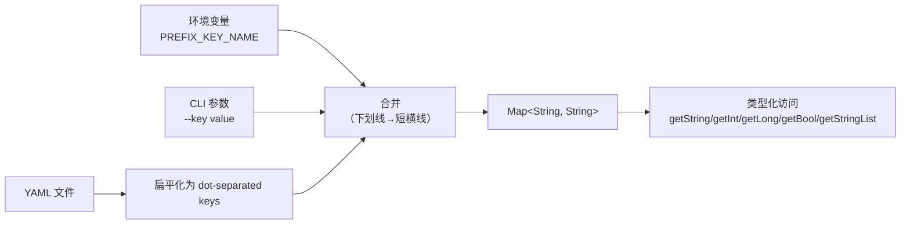
```mermaid
flowchart LR
    YAML["YAML 文件"] --> FLAT["扁平化为 dot-separated keys"]
    ENV["环境变量<br/>PREFIX_KEY_NAME"] --> MERGE["合并<br/>（下划线→短横线）"]
    CLI["CLI 参数<br/>--key value"] --> MERGE
    FLAT --> MERGE
    MERGE --> MAP["Map&lt;String, String&gt;"]
    MAP --> TYPED["类型化访问<br/>getString/getInt/getLong/getBool/getStringList"]
```

**关键方法**：

- `load(Path yamlFile)` — 读取 YAML 并递归扁平化嵌套 Map
- `mergeEnvVars(prefix, map)` — 环境变量名转换：`X_PD_NODE_ID` → `node-id`
- `mergeCliArgs(args, map)` — 解析 `--key value` 对
- `loadAll(args, envPrefix)` — 完整管线

#### 2.2.7 工具（util/）

`CloseUtils` 提供两个关停辅助方法：

- `closeQuietly(log, label, closeable)` — 关闭资源，异常仅打 warning
- `shutdownQuietly(log, label, executor, timeout, unit)` — `shutdownNow()` + `awaitTermination()`

### 2.3 源码分析

| 包 | 文件 | 关键入口 |
|----|------|---------|
| `auth/` | `AuthServerInterceptor.java` | `interceptCall`（L24）：Token 验证 |
| `tls/` | `GrpcChannelFactory.java` | `build`（L17）：创建客户端 Channel；`serverBuilder`（L43）：创建服务端 Builder |
| `metrics/` | `MetricsHttpServer.java` | 构造函数（L32）：注册 /metrics, /healthz, /readyz |
| `config/` | `YamlConfigLoader.java` | `loadAll`（L94）：三层配置完整管线 |
| `ratelimit/` | `ConcurrencyLimitInterceptor.java` | `interceptCall`（L20）：Semaphore 限流 |
| `logging/` | `MdcServerInterceptor.java` | `interceptCall`（L29）：MDC 上下文注入 |

---

## 3. pd — Placement Driver

### 3.1 功能清单

pd 模块是集群大脑，包含 **37 个 Java 类**，分布在 5 个子包中，提供 10 大功能域：

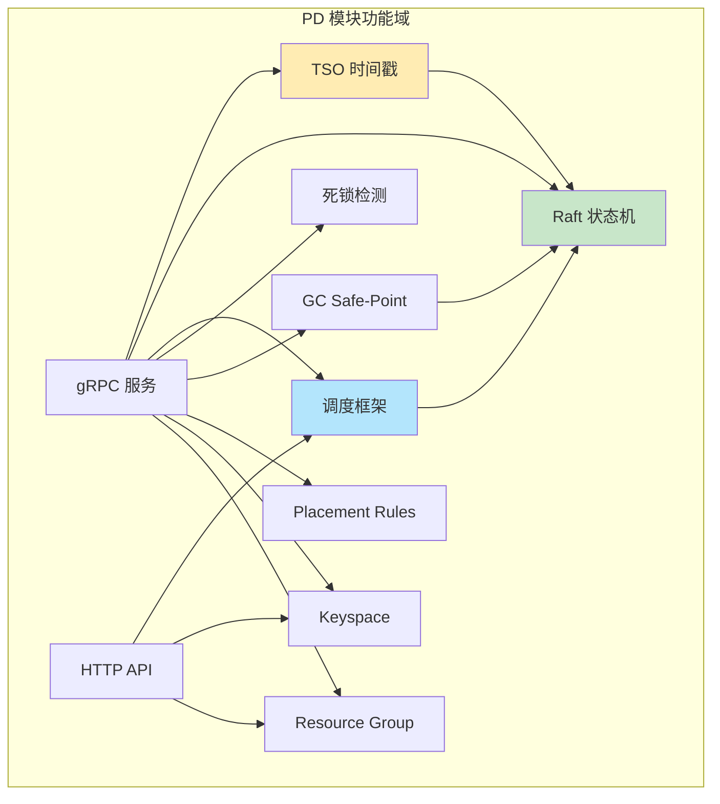
```mermaid
graph TD
    subgraph "PD 模块功能域"
        TSO["TSO 时间戳"]
        SM["Raft 状态机"]
        SCHED["调度框架"]
        DL["死锁检测"]
        GC["GC Safe-Point"]
        PLACE["Placement Rules"]
        KS["Keyspace"]
        RG["Resource Group"]
        HTTP["HTTP API"]
        SRV["gRPC 服务"]
    end

    SRV --> TSO & SM & SCHED & DL & GC & PLACE & KS & RG
    HTTP --> SCHED & KS & RG
    SCHED --> SM
    TSO --> SM
    GC --> SM

    style TSO fill:#ffecb3
    style SM fill:#c8e6c9
    style SCHED fill:#b3e5fc
```

| 功能域 | 类数 | 核心功能 |
|--------|------|---------|
| TSO | 2 | HLC 时间戳分配、单航班扩展、leader 切换重载 |
| Raft 状态机 | 4 | PD 元数据复制、快照/回放、InMemory/RocksDB 两种实现 |
| 调度框架 | 12 | 6 种内置调度器 + OperatorController + SchedulerManager |
| 死锁检测 | 1 | 集中式 wait-for 图 + BFS 环检测 |
| GC Safe-Point | 2 | 全局 safe-point + 服务级 safe-point（带 TTL） |
| Placement Rules | 3 | 标签约束引擎 + 隔离度评分 |
| Keyspace | 1 | 多租户 Keyspace 生命周期管理 |
| Resource Group | 1 | 资源组 CRUD + 令牌桶限速 |
| gRPC 服务 | 3 | PD Service 实现、HTTP REST API |
| 配置 | 3 | 静态配置 + 运行时可变调度配置 |

### 3.2 TSO（时间戳 Oracle）

#### 功能概述

TSO 为所有事务提供全局单调递增的时间戳。编码格式：`(物理时间_ms << 18) | 逻辑计数器`，18 位逻辑计数器支持每毫秒最多 262,143 次分配。

#### 设计实现

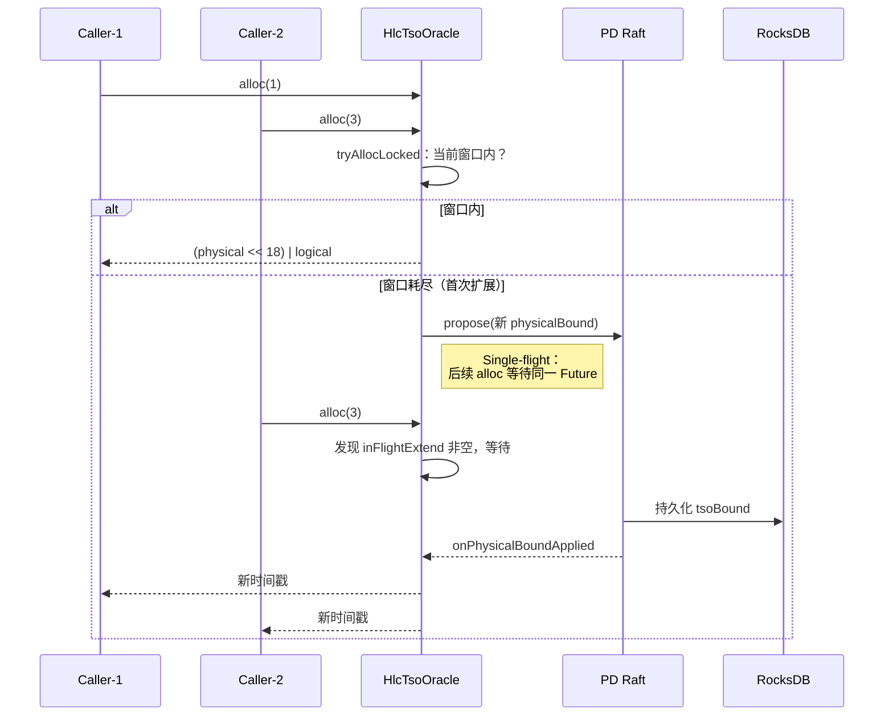
```mermaid
sequenceDiagram
    participant C1 as Caller-1
    participant C2 as Caller-2
    participant TSO as HlcTsoOracle
    participant RAFT as PD Raft
    participant DISK as RocksDB

    C1->>TSO: alloc(1)
    C2->>TSO: alloc(3)
    TSO->>TSO: tryAllocLocked：当前窗口内？
    alt 窗口内
        TSO-->>C1: (physical << 18) | logical
    else 窗口耗尽（首次扩展）
        TSO->>RAFT: propose(新 physicalBound)
        Note right of TSO: Single-flight：<br/>后续 alloc 等待同一 Future
        C2->>TSO: alloc(3)
        TSO->>TSO: 发现 inFlightExtend 非空，等待
        RAFT->>DISK: 持久化 tsoBound
        RAFT-->>TSO: onPhysicalBoundApplied
        TSO-->>C1: 新时间戳
        TSO-->>C2: 新时间戳
    end
```

**关键设计决策**：

1. **+1 偏移量**：Leader 切换时 `currentPhysical = physicalBound + 1`，保证跨 leader 切换的严格单调性
2. **单航班扩展**（Single-flight extend）：多个并发分配者触及物理边界时，只有一个 Raft propose 在飞行中，其他等待同一 `CompletableFuture`
3. **预分配窗口**：`savedIntervalMs`（默认 50ms）的前瞻窗口，减少 Raft propose 频率

#### 源码分析

| 文件 | 关键入口 |
|------|---------|
| `Tso.java` | 接口定义：`alloc(count)`, `reloadAfterLeaderChange()`, 静态 `compose/physicalPart/logicalPart` |
| `HlcTsoOracle.java` | `alloc`（L107）：spin+tryAllocLocked；`extendBound`（L156）：单航班 Raft 扩展；`reloadAfterLeaderChange`（L210）：重置光标 |

### 3.3 Raft 状态机

#### 功能概述

PD 使用内部 Raft 共识组（3 节点 HA）保证元数据一致性。硬规则：**状态 CF 的所有写入必须经过 Raft apply**，不存在 leader 旁路快写。

#### 设计实现

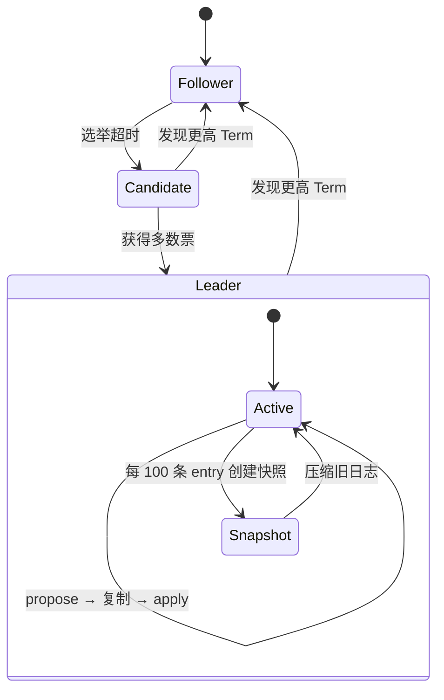
```mermaid
stateDiagram-v2
    [*] --> Follower
    Follower --> Candidate: 选举超时
    Candidate --> Leader: 获得多数票
    Candidate --> Follower: 发现更高 Term
    Leader --> Follower: 发现更高 Term

    state Leader {
        [*] --> Active
        Active --> Active: propose → 复制 → apply
        Active --> Snapshot: 每 100 条 entry 创建快照
        Snapshot --> Active: 压缩旧日志
    }
```

**两种状态机实现**：

| 实现 | 存储 | 适用场景 | Region 索引 |
|------|------|---------|------------|
| `InMemoryPdStateMachine` | HashMap + TreeMap | 开发/测试 | `regionsByStart` (TreeMap) 做 O(log N) key 查找 |
| `RocksDbPdStateMachine` | RocksDB | 生产 | 双重索引：`[0x20][regionId]` + `[0x30][startKey]` |

**RocksDB Key Layout**：

| 前缀 | 格式 | 内容 |
|------|------|------|
| `0x01` | 1 byte | bootstrapped 标志 |
| `0x02` | protobuf | Cluster 元数据 |
| `0x03` | 8B BE | ID 分配器下一个值 |
| `0x04` | 8B BE | TSO 物理边界 |
| `0x10` + 8B storeId | protobuf | Store 信息 |
| `0x20` + 8B regionId | protobuf | Region 信息 |
| `0x30` + startKey | 8B regionId | Start Key 索引 |

**applyCommand 处理的命令类型**（对应 `pd_internalpb.PdCommand.CommandType`）：

`CMD_BOOTSTRAP`, `CMD_PUT_STORE`, `CMD_UPDATE_REGION`, `CMD_ALLOC_ID`, `CMD_SET_PLACEMENT_RULE`, `CMD_DELETE_PLACEMENT_RULE`, `CMD_SET_KEYSPACE`, `CMD_SET_RESOURCE_GROUP`, `CMD_DELETE_RESOURCE_GROUP`

#### PdRaftNode

`PdRaftNode` 封装 x-raft-lib 的 `Node`，提供：

- **提案关联**：8 字节大端序列号前缀做 propose-apply 关联
- **快照管理**：每 100 条 entry 创建快照 + 压缩旧日志
- **Leader 生命周期**：`leaderObserver` 回调驱动调度器启停和 TSO 重载

#### 源码分析

| 文件 | 关键入口 |
|------|---------|
| `PdRaftNode.java` | `propose`（L233）、`readyLoop`（L254）、`applyReady`（L271）、`maybeSnapshot`（L324） |
| `RocksDbPdStateMachine.java` | `applyCommand`（L342）、`dumpSnapshot`（L258）、`installSnapshot`（L291） |
| `InMemoryPdStateMachine.java` | `getRegionByKey`（TreeMap floorEntry）、`applyCommand` |

### 3.4 调度框架

#### 功能概述

调度框架是 PD 的核心，包含 6 种内置调度器，通过 Operator 模型驱动集群拓扑变更。

#### 架构设计

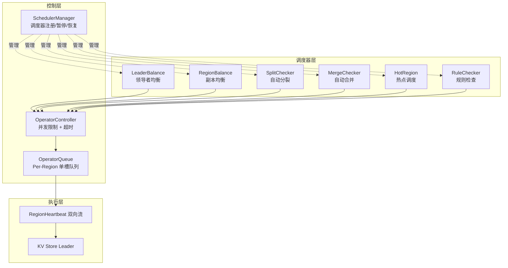
```mermaid
flowchart TD
    subgraph "调度器层"
        LB["LeaderBalance<br/>领导者均衡"]
        RB["RegionBalance<br/>副本均衡"]
        SC["SplitChecker<br/>自动分裂"]
        MC["MergeChecker<br/>自动合并"]
        HR["HotRegion<br/>热点调度"]
        RC["RuleChecker<br/>规则检查"]
    end

    subgraph "控制层"
        SM2["SchedulerManager<br/>调度器注册/暂停/恢复"]
        OC["OperatorController<br/>并发限制 + 超时"]
        OQ["OperatorQueue<br/>Per-Region 单槽队列"]
    end

    subgraph "执行层"
        HB["RegionHeartbeat 双向流"]
        KV2["KV Store Leader"]
    end

    LB & RB & SC & MC & HR & RC --> OC
    OC --> OQ
    OQ --> HB
    HB --> KV2
    SM2 -.管理.-> LB & RB & SC & MC & HR & RC
```

#### 6 种调度器详解

| 调度器 | 周期 | 每轮上限 | 算法 |
|--------|------|---------|------|
| **LeaderBalance** | 5s | 4 个 Operator | 统计每 Store 的 leader 数，max-min > 1 时转移 leader；偏好从 slowScore 高的 Store 迁出 |
| **RegionBalance** | 10s | 4 个 Operator | 统计每 Store 的 Region 数，找最多/最少的 Store 对；为多的 Store 上的 Region 在少的 Store 上添加副本。LOW_SPACE_RATIO=0.05 防止向磁盘告急的 Store 调度 |
| **HotRegion** | 5s | 2 个 Operator | 计算集群平均负载，标记 >2x 平均的 Region 为热点；将热点 Region 的 leader 从热点密集的 Store 转移到冷 Store |
| **SplitChecker** | 心跳驱动 | — | 当 Region 的 approximate_size 超过阈值时调度 APPROXIMATE split |
| **MergeChecker** | 10s | 2 个 Merge | 扫描所有 Region，找相邻且都小于阈值的 Region 对（需在相同 Store 集合上），调度 Merge |
| **RuleChecker** | 10s | 4 个 Operator | 双策略：简单副本数检查 + 标签约束规则检查。处理欠副本（AddNode）、超副本（RemoveNode）、Down/Tombstone 节点清理 |

#### Operator 生命周期

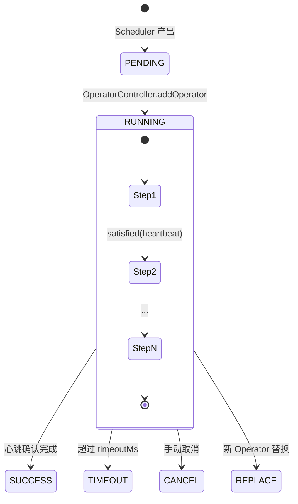
```mermaid
stateDiagram-v2
    [*] --> PENDING: Scheduler 产出
    PENDING --> RUNNING: OperatorController.addOperator
    RUNNING --> SUCCESS: 心跳确认完成
    RUNNING --> TIMEOUT: 超过 timeoutMs
    RUNNING --> CANCEL: 手动取消
    RUNNING --> REPLACE: 新 Operator 替换

    state RUNNING {
        [*] --> Step1
        Step1 --> Step2: satisfied(heartbeat)
        Step2 --> StepN: ...
        StepN --> [*]
    }
```

**OperatorController 设计**：
- per-Store 并发限制（`maxPerStore`）+ Operator 超时（`timeoutMs`）
- `dispatch(RegionHeartbeatRequest)` 在心跳响应中物化 Operator 步骤
- Step 类型：`ADD_LEARNER`, `ADD_VOTER`, `REMOVE_PEER`, `TRANSFER_LEADER`, `PROMOTE_LEARNER`, `DEMOTE_VOTER`, `SPLIT_REGION`, `MERGE_REGION`

#### 源码分析

| 文件 | 关键入口 |
|------|---------|
| `LeaderBalanceScheduler.java` | `runOnce()`：leader 计数 + 差值检查 |
| `RegionBalanceScheduler.java` | `runOnce()`：Region 计数 + AddPeer 调度 |
| `HotRegionScheduler.java` | `runOnce()`：热点识别 + leader 转移 |
| `OperatorControllerImpl.java` | `addOperator`（L49）：并发限制；`dispatch`（L112）：心跳驱动 |
| `SchedulerManager.java` | `pause/resume`：调度器暂停恢复 |

### 3.5 死锁检测

#### 设计实现

集中式 wait-for 图，KV 节点上报本地等待关系，PD 合并后运行 BFS 环检测。

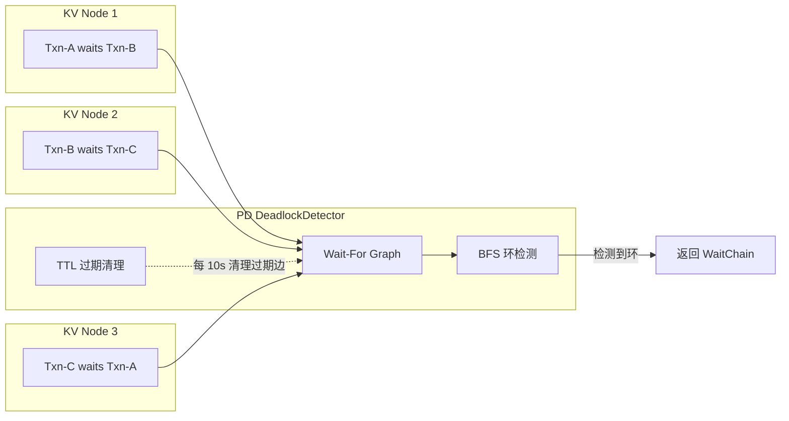
```mermaid
flowchart LR
    subgraph "KV Node 1"
        T1["Txn-A waits Txn-B"]
    end
    subgraph "KV Node 2"
        T2["Txn-B waits Txn-C"]
    end
    subgraph "KV Node 3"
        T3["Txn-C waits Txn-A"]
    end
    subgraph "PD DeadlockDetector"
        GRAPH["Wait-For Graph"]
        BFS["BFS 环检测"]
        TTL["TTL 过期清理"]
    end

    T1 & T2 & T3 --> GRAPH
    GRAPH --> BFS
    BFS -->|"检测到环"| CYCLE["返回 WaitChain"]
    TTL -.每 10s 清理过期边.-> GRAPH
```

- `addWaitFor(edge)` — 同步操作；检测自环、运行 BFS，找到环即返回路径（**不插入成环边**）
- `removeHolder/removeWaiter` — 事务提交/回滚时清理
- `cleanupExpired()` — 定期清理超过 TTL（默认 60s）的边
- `WaitForEdge` — `(waiterTxn, holderTxn, key[])`，使用 `Arrays.equals` 自定义 equals/hashCode

### 3.6 GC Safe-Point 管理

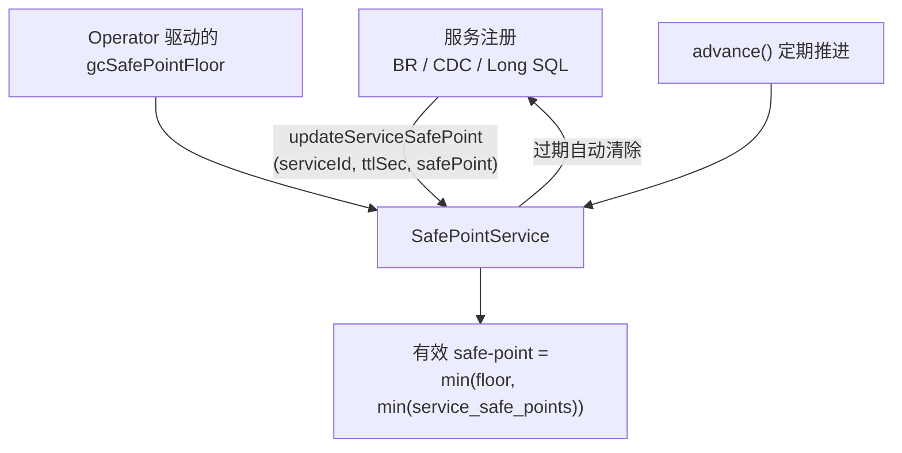
```mermaid
flowchart TD
    SERVICES["服务注册<br/>BR / CDC / Long SQL"]
    FLOOR["Operator 驱动的 gcSafePointFloor"]
    EFFECTIVE["有效 safe-point =<br/>min(floor, min(service_safe_points))"]
    ADVANCE["advance() 定期推进"]

    SERVICES -->|"updateServiceSafePoint<br/>(serviceId, ttlSec, safePoint)"| SP["SafePointService"]
    FLOOR --> SP
    SP --> EFFECTIVE
    ADVANCE --> SP
    SP -->|"过期自动清除"| SERVICES
```

- `ServiceEntry(serviceId, expiresAtMs, safePoint)` — 服务注册带 TTL 自动过期
- 有效 safe-point = min(operator floor, min(active services))
- 防止 GC 与 BR/CDC 竞争：服务注册 safe-point 下限，GC 不会越过

### 3.7 Placement Rules

**标签约束引擎**：每条规则包含 `groupId`, `id`, `key-range`, `role`（voter/learner）, `count`, `label_constraints`, `location_labels`。

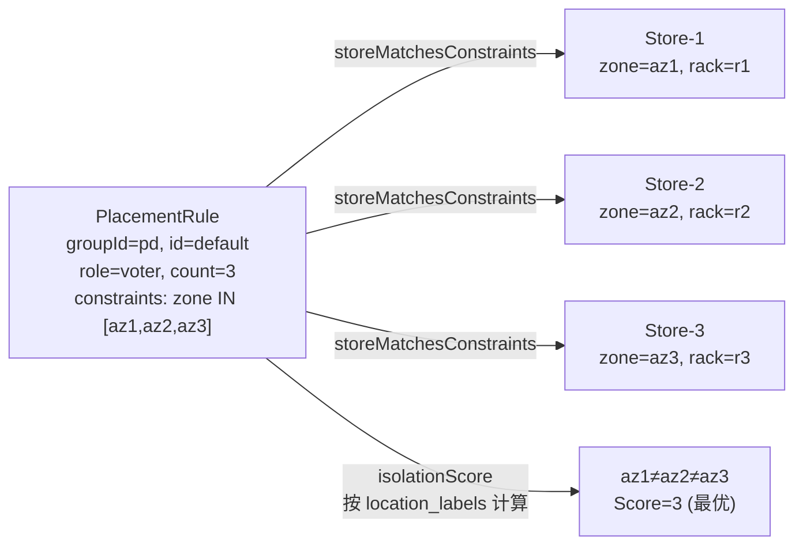
```mermaid
flowchart LR
    RULE["PlacementRule<br/>groupId=pd, id=default<br/>role=voter, count=3<br/>constraints: zone IN [az1,az2,az3]"]
    STORE1["Store-1<br/>zone=az1, rack=r1"]
    STORE2["Store-2<br/>zone=az2, rack=r2"]
    STORE3["Store-3<br/>zone=az3, rack=r3"]

    RULE -->|"storeMatchesConstraints"| STORE1 & STORE2 & STORE3
    RULE -->|"isolationScore<br/>按 location_labels 计算"| SCORE["az1≠az2≠az3<br/>Score=3 (最优)"]
```

**LabelConstraint 支持 4 种运算符**：`IN`, `NOT_IN`, `EXISTS`, `NOT_EXISTS`

**隔离度评分**：`isolationScore(candidate, existingPeers, locationLabels)` — 计算候选 Store 在 location_labels 的每一层与已有副本的差异数，差异越多隔离越好。

### 3.8 Keyspace 与 Resource Group

**Keyspace 管理**（多租户）：

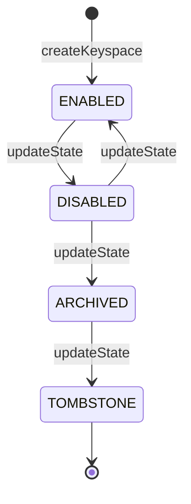
```mermaid
stateDiagram-v2
    [*] --> ENABLED: createKeyspace
    ENABLED --> DISABLED: updateState
    DISABLED --> ENABLED: updateState
    DISABLED --> ARCHIVED: updateState
    ARCHIVED --> TOMBSTONE: updateState
    TOMBSTONE --> [*]
```

- 默认 Keyspace：id=0, name="DEFAULT"
- 状态转换验证：只允许合法转换路径
- 通过 Raft 复制确保一致性

**Resource Group 管理**（资源控制）：

- 每组配置 `fill_rate`（令牌填充速率）和 `burst_limit`（突发上限）
- 默认资源组 "default" 不可删除
- 通过 Raft 复制确保一致性

### 3.9 gRPC 服务与 HTTP API

#### PdServiceImpl — gRPC 入口

**双模式操作**：单 PD（无 Raft，直接 apply）vs 多 PD HA（Raft 复制）。通过 `proposeOrApply()` 抽象：

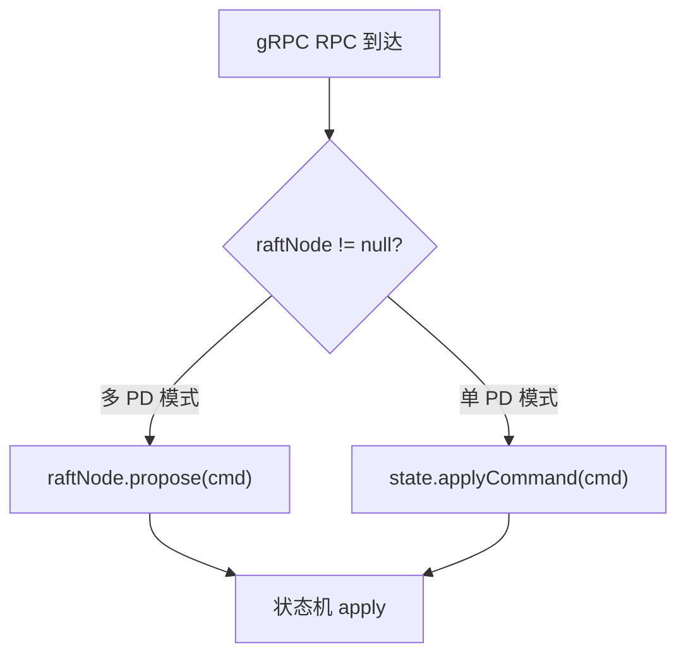
```mermaid
flowchart TD
    RPC["gRPC RPC 到达"]
    CHECK{raftNode != null?}
    RAFT["raftNode.propose(cmd)"]
    DIRECT["state.applyCommand(cmd)"]
    APPLY["状态机 apply"]

    RPC --> CHECK
    CHECK -->|多 PD 模式| RAFT
    CHECK -->|单 PD 模式| DIRECT
    RAFT --> APPLY
    DIRECT --> APPLY
```

**Region 心跳处理**：双向流，在响应中嵌入调度指令（change_peer, transfer_leader, split_region, merge, change_peer_v2）。

#### PdHttpApi — REST 接口

| 路径 | 方法 | 功能 |
|------|------|------|
| `/pd/api/v1/schedulers` | GET | 列出调度器状态 |
| `/pd/api/v1/schedulers/{name}/pause` | POST | 暂停调度器 |
| `/pd/api/v1/schedulers/{name}/resume` | POST | 恢复调度器 |
| `/pd/api/v1/config/schedule` | GET/POST | 调度配置查看/修改 |
| `/pd/api/v1/status` | GET | 集群状态概览 |
| `/pd/api/v1/keyspaces` | GET/POST | Keyspace 列表/创建 |
| `/pd/api/v1/keyspaces/{name}` | GET | Keyspace 详情 |
| `/pd/api/v1/keyspaces/{name}/state` | PUT | Keyspace 状态变更 |
| `/pd/api/v1/resource_groups` | GET/POST | 资源组列表/创建 |
| `/pd/api/v1/resource_groups/{name}` | PUT/DELETE | 资源组修改/删除 |

### 3.10 PD 服务器启动流程

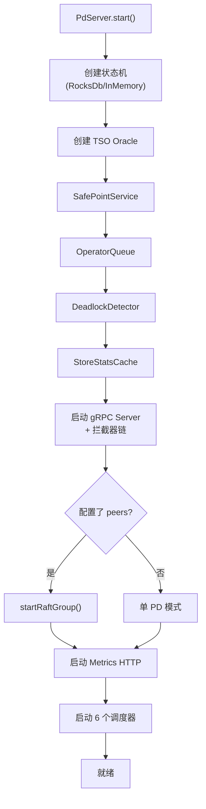
```mermaid
flowchart TD
    START["PdServer.start()"] --> SM["创建状态机<br/>(RocksDb/InMemory)"]
    SM --> TSO2["创建 TSO Oracle"]
    TSO2 --> SP["SafePointService"]
    SP --> OQ["OperatorQueue"]
    OQ --> DL["DeadlockDetector"]
    DL --> STATS["StoreStatsCache"]
    STATS --> GRPC["启动 gRPC Server<br/>+ 拦截器链"]
    GRPC --> RAFT2{配置了 peers?}
    RAFT2 -->|是| RAFTG["startRaftGroup()"]
    RAFT2 -->|否| SKIP["单 PD 模式"]
    RAFTG --> METRICS["启动 Metrics HTTP"]
    SKIP --> METRICS
    METRICS --> SCHED2["启动 6 个调度器"]
    SCHED2 --> READY["就绪"]
```

---

## 4. kv — Multi-Raft 存储引擎

### 4.1 功能清单

kv 模块是整个系统的数据平面，包含 **90 个 Java 类**，分布在 10 个子包中，提供 11 大功能域：

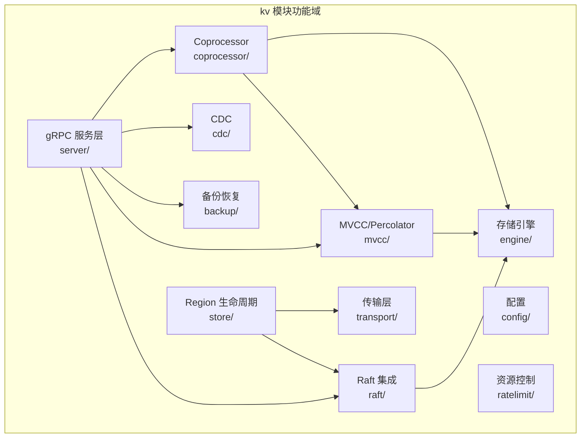
```mermaid
graph TD
    subgraph "kv 模块功能域"
        ENGINE["存储引擎<br/>engine/"]
        RAFT_INT["Raft 集成<br/>raft/"]
        MVCC["MVCC/Percolator<br/>mvcc/"]
        STORE["Region 生命周期<br/>store/"]
        SERVER["gRPC 服务层<br/>server/"]
        CDC_PKG["CDC<br/>cdc/"]
        BACKUP["备份恢复<br/>backup/"]
        COP["Coprocessor<br/>coprocessor/"]
        TRANS["传输层<br/>transport/"]
        CONF["配置<br/>config/"]
        RL["资源控制<br/>ratelimit/"]
    end

    SERVER --> RAFT_INT & MVCC & COP & CDC_PKG & BACKUP
    RAFT_INT --> ENGINE
    MVCC --> ENGINE
    STORE --> RAFT_INT & TRANS
    COP --> MVCC & ENGINE
```

| 功能域 | 类数 | 核心职责 |
|--------|------|---------|
| 存储引擎 | 8 | RocksDB 4CF 管理、Raft 日志/状态持久化、快照生成与安装 |
| Raft 集成 | 16 | BatchSystem 线程模型、RegionPeer/Mailbox、Apply 流水线、提案编解码 |
| MVCC/Percolator | 10 | 事务逻辑（prewrite/commit/rollback）、MVCC 读、并发管理、内存锁表 |
| Region 生命周期 | 9 | Split/Merge 驱动、GC Worker、日志压缩、心跳上报 |
| gRPC 服务层 | 8 | Tikv/KvRaft/ChangeData/Debug Service、事务/Raw KV/Coprocessor 分层 |
| CDC | 4 | 事件总线、增量扫描、Resolved TS 追踪 |
| 备份恢复 | 2 | SST 级备份/恢复 |
| Coprocessor | 20 | DAG 算子（行式+向量化）、表达式求值、索引扫描、统计收集 |
| 传输层 | 4 | Raft 消息传输、PD 连接管理、Raft 消息路由、死锁客户端 |
| 配置 | 3 | 静态配置 + 运行时在线配置 |
| 资源控制 | 2 | 资源组拦截器 + 令牌桶限速 |

### 4.2 存储引擎（engine/）

#### 功能概述

基于单个 RocksDB 实例，使用 4 个 Column Family 存储所有数据。

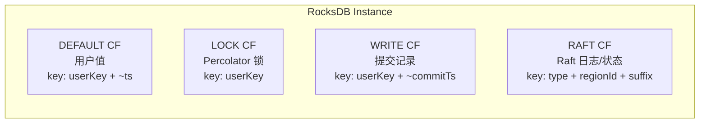
```mermaid
graph LR
    subgraph "RocksDB Instance"
        DEFAULT["DEFAULT CF<br/>用户值<br/>key: userKey + ~ts"]
        LOCK["LOCK CF<br/>Percolator 锁<br/>key: userKey"]
        WRITE["WRITE CF<br/>提交记录<br/>key: userKey + ~commitTs"]
        RAFT_CF["RAFT CF<br/>Raft 日志/状态<br/>key: type + regionId + suffix"]
    end
```

#### 设计实现

**StorageEngine 接口**定义统一抽象：`get`, `multiGet`, `newIterator`, `newSnapshot`, `newWriteBatch`, `write`, `flushWal`, `approximateSize`, `deleteRange`, `ingestSst`, `compactRange`。

**RocksStorageEngine** 实现要点：
- `open(Path, EngineConfig)` — per-CF 调优：Bloom Filter、Block Cache、Write Buffer
- 内部 `EnumMap<Cf, ColumnFamilyHandle>` 映射 4 个 CF
- 双 WriteOptions：`sync`（sync=true）和 `noSync`（sync=false），由 `write(batch, sync)` 参数控制
- 内部类 `RocksWriteBatch`、`RocksSnapshot`、`RocksReadOptions`、`RocksIter` 封装 RocksDB JNI 对象

**PerRegionRaftEngine** — per-region Raft 持久化：
- 基于共享 StorageEngine 的 RAFT CF，通过 `RaftCfKeys` 编码 key
- 支持：HardState、日志 Entry、Applied Index、去重 Map、快照元数据、Max TS、Merge State、Region 描述
- `RaftCfKeys` 布局：`[type=1B][regionId=8B BE][suffix]`，9 种 type

**快照引擎**（SnapshotEngineImpl）：
- `buildAndStream` — 按 CF 扫描 region key range，分 chunk 编码（含 CRC32C 校验）
- `receiveAndInstall` — 验证 CRC32C，通过 WriteBatch 原子安装

#### 源码分析

| 文件 | 关键入口 |
|------|---------|
| `RocksStorageEngine.java` | `open`（L90）：CF 调优；`write`（L282）；`flushWal`（L272） |
| `PerRegionRaftEngine.java` | `appendEntries`（L166）；`reload`（L57）：重启恢复 |
| `SnapshotEngineImpl.java` | `buildAndStream`（L69）；`receiveAndInstall`（L172） |
| `RaftCfKeys.java` | 9 种 key 编码的静态工厂方法 |

### 4.3 Raft 集成（raft/）

#### 功能概述

实现 BatchSystem 线程模型：固定 Poller 线程 + per-region Mailbox + 异步 Apply。

#### BatchSystem 架构

```mermaid
graph TD
    subgraph "BatchSystem 线程模型"
        TICK["TickDriver<br/>单线程定时器<br/>CopyOnWriteArrayList&lt;Mailbox&gt;"]
        POLLER["RaftPoller<br/>固定线程池<br/>(max(4, CPU cores))"]
        APPLY["ApplyWorker<br/>异步 Apply 线程池"]
    end

    subgraph "Per-Region 状态"
        MB1["RegionMailbox-1<br/>ConcurrentLinkedQueue&lt;Event&gt;"]
        MB2["RegionMailbox-2"]
        MBN["RegionMailbox-N"]
    end

    TICK -->|tick 事件| MB1 & MB2 & MBN
    MB1 & MB2 & MBN -->|加入 readyQueue| POLLER
    POLLER -->|processOnce()| MB1 & MB2 & MBN
    POLLER -->|ApplyTask| APPLY
```

**BatchRegionPeer** vs **RegionPeerImpl**：

| 特性 | RegionPeerImpl | BatchRegionPeer |
|------|---------------|----------------|
| 线程模型 | 每 Region 独立 readyThread + tickTimer | 共享 RaftPoller + TickDriver |
| 可扩展性 | ~200 Region 后线程/内存爆炸 | 支持数万 Region |
| Apply | 同步 | 异步（ApplyWorker） |

**RegionMailbox 事件类型**（sealed interface）：

`TickEvent`, `ProposeEvent`, `StepEvent`, `ReadIndexEvent`, `ConfChangeEvent`, `TransferLeaderEvent`

#### Apply 流水线

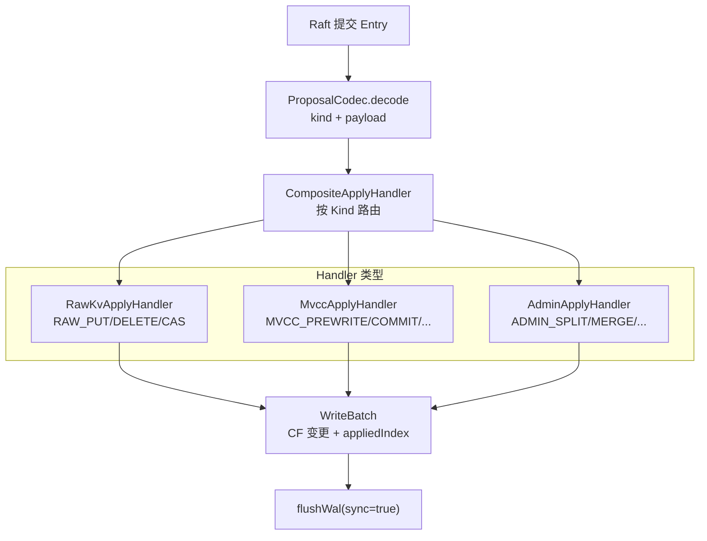
```mermaid
flowchart TD
    COMMIT["Raft 提交 Entry"]
    DECODE["ProposalCodec.decode<br/>kind + payload"]
    ROUTE["CompositeApplyHandler<br/>按 Kind 路由"]

    subgraph "Handler 类型"
        RAW["RawKvApplyHandler<br/>RAW_PUT/DELETE/CAS"]
        MVCC_H["MvccApplyHandler<br/>MVCC_PREWRITE/COMMIT/..."]
        ADMIN["AdminApplyHandler<br/>ADMIN_SPLIT/MERGE/..."]
    end

    BATCH["WriteBatch<br/>CF 变更 + appliedIndex"]
    FLUSH["flushWal(sync=true)"]

    COMMIT --> DECODE --> ROUTE
    ROUTE --> RAW & MVCC_H & ADMIN
    RAW & MVCC_H & ADMIN --> BATCH --> FLUSH
```

**ProposalCodec 编码格式**：`[version=0x01][kind=1B][proposeSeq=8B][len=4B][payload...]`

**20 种 Kind**：`RAW_PUT`, `RAW_DELETE`, `RAW_DELETE_RANGE`, `RAW_CAS`, `MVCC_PREWRITE`, `MVCC_COMMIT`, `MVCC_ROLLBACK`, `MVCC_PESSIMISTIC_LOCK`, `MVCC_PESSIMISTIC_ROLLBACK`, `MVCC_RESOLVE`, `MVCC_GC`, `MVCC_CHECK_TXN_STATUS`, `MVCC_TXN_HEARTBEAT`, `MVCC_CHECK_SECONDARY_LOCKS`, `TXN_DELETE_RANGE`, `ADMIN_COMPACT_LOG`, `ADMIN_SPLIT`, `ADMIN_COMMIT_MERGE`, `ADMIN_PREPARE_MERGE`, `ADMIN_ROLLBACK_MERGE`

**MvccApplyHandler 关键设计**：
- **两遍 Prewrite**：第一遍检查所有 key 的预写条件，全部通过后第二遍写入。避免部分孤儿锁
- **CDC 事件发射**：在 commit/rollback 时向 CdcEventBus 发送事件
- **Async-commit max_commit_ts 可行性检查**
- **GC 限界**：`MAX_GC_DELETES_PER_APPLY = 100,000`
- **ResolveLock 限界**：`MAX_RESOLVE_LOCKS_PER_APPLY = 16,384`

#### 源码分析

| 文件 | 关键入口 |
|------|---------|
| `BatchRegionPeer.java` | 委托给 RegionMailbox |
| `RegionMailbox.java` | `processOnce`（L192）：处理事件 + applyReady |
| `RaftPoller.java` | `pollLoop`（L55）：BlockingQueue 驱动 |
| `ApplyWorker.java` | `submit`（L52）：per-region 串行保证 |
| `MvccApplyHandler.java` | 两遍 Prewrite、CDC 事件发射 |
| `ProposalCodec.java` | `encode/decode`：20 种 Kind 编解码 |

### 4.4 MVCC / Percolator（mvcc/）

#### 功能概述

完整实现 TiKV 兼容的 Percolator 事务协议。

#### 核心组件

```mermaid
graph TD
    subgraph "MVCC 层"
        TXN["MvccTxn<br/>事务操作累加器"]
        READER["MvccReader<br/>快照读"]
        KEY["MvccKey<br/>编码: encodeBytes(userKey) || ~ts"]
        LOCK_T["Lock<br/>锁记录 (v3 format)"]
        WRITE_T["Write<br/>写记录 (v3 format)"]
    end

    subgraph "并发控制"
        CM["ConcurrencyManager<br/>32-stripe RWLock"]
        MAXTS["MaxTsTracker<br/>最大读时间戳"]
        LOCKTBL["InMemoryLockTable<br/>内存锁表<br/>ConcurrentHashMap"]
    end

    TXN --> READER & KEY & LOCK_T & WRITE_T
    TXN --> CM
    READER --> KEY
    CM --> MAXTS
```

#### MvccTxn — 事务操作

| 方法 | 行号 | 功能 |
|------|------|------|
| `checkPrewrite` | L79 | 验证乐观 Prewrite 前置条件 |
| `checkPessimisticPrewrite` | L153 | 验证悲观 Prewrite 前置条件 |
| `writePrewrite` | L212 | 写入 LOCK CF + DEFAULT CF（长值） |
| `commit` | L265 | 删除锁、写入 WRITE CF 提交记录，短值内联 |
| `rollback` | L341 | 删除锁、写入 ROLLBACK 记录，处理重叠回滚合并 |
| `acquirePessimisticLock` | L414 | 悲观锁获取 |
| `checkTxnStatus` | L475 | 检查主锁状态，处理 async-commit 主键 |
| `findCommitTsForStartTs` | L394 | 扫描 WRITE CF 查找提交时间戳 |

**Sealed 结果类型**：
- `PrewriteOutcome` — 8 种变体（Ok, WriteConflict, LockConflict, AlreadyExist, ...）
- `CommitOutcome` — 6 种变体（Ok, LockNotFound, Mismatch, ...）
- `CheckTxnStatusOutcome` — 6 种变体（含 `CtsAsyncCommitPrimary` 处理异步提交主键）

#### MvccKey 编码

```
encode(userKey, ts) = KeyCodec.encodeBytes(userKey) || bigEndian(~ts)
```

- `~ts`（按位取反）使新版本排在旧版本前面（RocksDB 默认字节序）
- `KeyCodec.encodeBytes` 使用 TiKV 兼容的 memcomparable 编码（8 字节分组 + 填充标记）

#### 并发管理

- **ConcurrencyManager**：32 条纹 RWLock，`withReader(key, readTs, work)` / `withWriter(keys, work)`
- **MaxTsTracker**：AtomicLong 追踪最大读时间戳，`minCommitTsFloor() = maxTs + 1`
- **InMemoryLockTable**：`ConcurrentHashMap<ByteBuffer, Lock>`，用于流水线悲观锁。崩溃后 PessimisticLockNotFound 触发客户端重试

#### 源码分析

| 文件 | 关键入口 |
|------|---------|
| `MvccTxn.java` | `checkPrewrite`（L79）、`commit`（L265）、`checkTxnStatus`（L475） |
| `MvccReader.java` | `get`（L64）、`scan`（L128） |
| `MvccKey.java` | `encode`、`userKey`、`ts` |
| `Lock.java` | `encode/decode`（v3 wire format, version byte 0x33） |
| `Write.java` | `encode/decode`（v3 format），`SHORT_VALUE_MAX_LEN = 64` |
| `ConcurrencyManager.java` | `withReader`（读锁 + ts observe）、`withWriter`（写锁） |
| `InMemoryLockTable.java` | `put/get/remove/onPersisted` |

### 4.5 Region 生命周期（store/）

#### 功能概述

管理 Region 的完整生命周期：创建、心跳、分裂、合并、GC、日志压缩、下线。

#### Region Split

```mermaid
sequenceDiagram
    participant PD as PD
    participant LEADER as KV Leader
    participant RAFT as Raft Group
    participant APPLY as AdminApplyHandler

    PD->>LEADER: 心跳响应: split_region
    LEADER->>PD: AskBatchSplit<br/>(请求新 Region/Peer ID)
    PD-->>LEADER: 分配的 IDs
    LEADER->>LEADER: 构建 SplitRegionProposal<br/>(bumped epoch version)
    LEADER->>RAFT: propose(ADMIN_SPLIT)
    RAFT->>RAFT: 共识复制
    RAFT->>APPLY: apply entry
    APPLY->>APPLY: 1. 缩小 parent range<br/>2. 持久化 child Region 描述<br/>3. 更新 RAFT CF region key
    APPLY->>LEADER: SplitObserver 回调
    LEADER->>LEADER: spawnChildPeer()
```

**SplitDriver 设计**：
- `split(parentPeer, splitKeys)` — 端到端编排
- `validateSplitKeys` — 验证 split key 在 region range 内且按序

#### Region Merge

```mermaid
sequenceDiagram
    participant PD as PD
    participant TARGET as Target Leader
    participant SOURCE as Source Leader
    participant RAFT_S as Source Raft

    PD->>TARGET: 心跳响应: merge
    TARGET->>SOURCE: PrepareMerge<br/>(通过 Raft propose)
    SOURCE->>RAFT_S: ADMIN_PREPARE_MERGE
    Note right of SOURCE: 写冻结：拒绝新写入
    RAFT_S-->>SOURCE: prepared
    SOURCE-->>TARGET: prepare OK
    TARGET->>TARGET: CommitMerge<br/>(通过 Raft propose)
    Note right of TARGET: 吸收 source range
    TARGET->>PD: 验证 epoch
    alt epoch 匹配
        TARGET->>TARGET: apply: 扩展 range, 销毁 source
    else epoch 不匹配（target 已变更）
        TARGET->>SOURCE: RollbackMerge
        Note right of SOURCE: 解除写冻结
    end
```

**MergeProtocolImpl 安全保证**：
- **3 阶段协议**：PrepareMerge → CommitMerge → Finalize/Rollback
- **PD 验证回滚**：Rollback 前必须检查 target epoch（通过 PD），防止 target 已提交时回滚导致数据重复

#### 后台 Worker

| Worker | 周期 | 功能 |
|--------|------|------|
| **GcWorker** | 可配置（默认 60s） | 从 PD 获取 GC safe-point，为每个 leader Region propose MVCC_GC |
| **LogCompactionWorker** | 可配置 | 当 `applied_index - first_index > gapThreshold`（默认 10000）时 propose ADMIN_COMPACT_LOG |
| **RegionHeartbeater** | 可配置 | 上报 region + leader + stats 到 PD；接收和分发 PD 调度指令 |
| **StoreHeartbeater** | 可配置 | 上报 store 级统计（region count, 磁盘 capacity/available/used） |

#### 源码分析

| 文件 | 关键入口 |
|------|---------|
| `SplitDriver.java` | `split`（L55）：AskBatchSplit + 构建提案 + Raft propose |
| `MergeDriver.java` | `merge`（L62）：3 阶段协议编排 |
| `MergeProtocolImpl.java` | `prepareAsSource`（L63）、`commitAsTarget`（L101）、`rollbackAsSource`（L152） |
| `GcWorker.java` | `runOnce`（L90）：PD safe-point 查询 + per-region GC propose |
| `RegionHeartbeater.java` | `dispatchOperator`（L148）：调度指令分发 |

### 4.6 gRPC 服务层（server/）

#### 功能概述

实现 Tikv、KvRaft、ChangeData、Debug 四个 gRPC 服务。

#### 服务分层

```mermaid
graph TD
    subgraph "gRPC 服务"
        TIKVSVC["TikvServiceImpl<br/>31 RPCs 入口"]
        KVRAFTSVC["KvRaftServiceImpl<br/>Raft 消息接收"]
        CDCSVC["ChangeDataServiceImpl<br/>CDC 事件流"]
        DBGSVC["DebugServiceImpl<br/>调试与配置"]
    end

    subgraph "业务逻辑层"
        TXNSVC["TransactionService<br/>事务 KV"]
        RAWSVC["RawKvService<br/>Raw KV"]
        COPSVC["CoprocessorService<br/>下推计算注册表"]
    end

    TIKVSVC --> TXNSVC & RAWSVC & COPSVC
    TIKVSVC --> BACKUP_M["BackupManager / RestoreManager"]
```

#### TransactionService 设计

**读路径**：
```
kvGet → ConcurrencyManager.withReader(key, readTs, work) → readIndex fence → MvccReader.get(snapshot)
```

**写路径**：
```
kvPrewrite → epoch/range 校验 → ProposalCodec.encode(MVCC_PREWRITE) → RegionPeer.propose() → Raft → Apply
```

**版本协商**：`getVersion` 返回 `CLUSTER_VERSION="8.0.0-xkv"` + 9 个支持的特性标志

#### KvServer 启动流程

```mermaid
flowchart TD
    START["KvServer.start()"]
    ENGINE["打开 RocksStorageEngine"]
    PD2["连接 PD"]
    BOOT["bootstrapOrJoin<br/>(注册/发现 regions)"]
    BATCH["创建 BatchSystem<br/>(RaftPoller + TickDriver + ApplyWorker)"]
    PEERS["创建 BatchRegionPeer<br/>(per region)"]
    GRPC2["启动 gRPC Server<br/>拦截器链：drain→auth→<br/>concurrency→resource_group→<br/>MDC→metrics"]
    HB["启动 Heartbeater"]
    BG["启动后台 Worker<br/>(GC + LogCompaction)"]
    COPS["注册 Coprocessor<br/>(TableScan=0, SQLScan=1,<br/>Analyze=2, IndexScan=3,<br/>SplitKeys=4)"]

    START --> ENGINE --> PD2 --> BOOT --> BATCH --> PEERS --> GRPC2 --> HB --> BG --> COPS
```

#### 源码分析

| 文件 | 关键入口 |
|------|---------|
| `KvServer.java` | `start`（L117）：全流程启动；`drain`（L610）：优雅下线 |
| `TikvServiceImpl.java` | 31 RPC 方法入口；`batchCommands`：双向流解复用 |
| `TransactionService.java` | `kvGet/kvPrewrite/kvCommit` 等事务 RPC 逻辑 |
| `RawKvService.java` | `rawGet/rawPut/rawScan` 等 Raw KV 逻辑 |
| `ChangeDataServiceImpl.java` | `eventFeed`：双向流 + 增量扫描 + resolvedTs 推送 |
| `DebugServiceImpl.java` | `modifyConfig`（L240）：在线配置变更 |

### 4.7 CDC（cdc/）

#### 设计实现

```mermaid
sequenceDiagram
    participant CLIENT as CDC Client
    participant SVC as ChangeDataServiceImpl
    participant BUS as CdcEventBus
    participant SCANNER as CdcIncrementalScanner
    participant APPLY as MvccApplyHandler
    participant TRACKER as RegionResolvedTsTracker

    CLIENT->>SVC: EventFeed(register, regionId, checkpointTs)
    SVC->>SCANNER: scan(checkpointTs, scanTs]
    SCANNER-->>CLIENT: 历史事件（追赶）
    SVC-->>CLIENT: resolvedTs 边界标记
    SVC->>BUS: subscribe(regionId)

    APPLY->>BUS: publish(CdcEvent) on commit/rollback
    BUS-->>CLIENT: 实时事件

    Note over TRACKER: trackLock / untrackLock
    SVC->>TRACKER: resolvedTs(regionId, fallbackTs)
    SVC-->>CLIENT: ResolvedTs 推送 (1s interval)
```

**无间隙覆盖**：增量扫描覆盖 `(checkpointTs, scanTs]`，实时事件覆盖 `(scanTs, ∞)`。

**RegionResolvedTsTracker**：追踪每 Region 的 in-flight 锁 startTs，`resolvedTs = min(in-flight locks) - 1`。

### 4.8 Coprocessor（coprocessor/）

#### 功能概述

实现 5 种 Coprocessor 处理器和完整的 DAG 算子体系（行式 + 向量化）。

```mermaid
graph TD
    subgraph "Coprocessor 处理器"
        TS["TableScan<br/>tp=0"]
        SQL["SQLScan<br/>tp=1"]
        ANALYZE["Analyze<br/>tp=2"]
        IDX["IndexScan<br/>tp=3"]
        SPLIT_K["SplitKeys<br/>tp=4"]
    end

    subgraph "向量化算子流水线"
        VTS["VecTableScanOp"]
        VIS["VecIndexScanOp"]
        VIL["VecIndexLookupOp"]
        VSEL["VecSelectionOp"]
        VTN["VecTopNOp"]
        VLM["VecLimitOp"]
    end

    subgraph "表达式求值"
        EXPR["ExprEvaluator<br/>30+ 运算/函数"]
        AGG["CopAggFunction<br/>COUNT/SUM/AVG/MIN/MAX"]
    end

    SQL --> VTS --> VSEL --> VTN & VLM
    IDX --> VIS --> VIL --> VSEL
    SQL --> EXPR & AGG
```

#### 5 种 Coprocessor 详解

| tp | 处理器 | 功能 |
|----|--------|------|
| 0 | **TableScanCoprocessor** | 通用 MVCC 表扫描，二进制格式：`[4B count][N × [4B keyLen][key][4B valLen][val]]` |
| 1 | **SQLScanCoprocessor** | SQL 感知 DAG 执行：向量化流水线 + 聚合（COUNT/SUM/AVG/MIN/MAX/GROUP_CONCAT with GROUP BY）+ TopN + 流式输出 |
| 2 | **AnalyzeCoprocessor** | 统计信息收集：NDV、null count、min/max、水塘抽样（Algorithm R） |
| 3 | **IndexScanCoprocessor** | 两种模式：覆盖索引扫描（无 double-read）+ 索引回查（double-read） |
| 4 | **SplitKeysCoprocessor** | 批量分裂键查找：扫描 WRITE CF，按字节大小等分 |

#### 向量化执行

```mermaid
flowchart LR
    subgraph "Chunk 处理"
        SCAN["VecTableScanOp<br/>nextChunk(batchSize)"]
        SEL["VecSelectionOp<br/>WHERE 过滤"]
        TOPN["VecTopNOp<br/>有界堆排序<br/>max 65536"]
        LIMIT["VecLimitOp<br/>chunk 截断"]
    end

    SCAN -->|CopChunk| SEL -->|CopChunk| TOPN -->|CopChunk| LIMIT

    subgraph "CopChunk"
        direction TB
        R1["CopRecord-1"]
        R2["CopRecord-2"]
        RN["CopRecord-N"]
    end
```

#### 表达式求值器

`ExprEvaluator` 支持：

| 类别 | 操作 |
|------|------|
| **常量/列引用** | CONSTANT, COLUMN_REF |
| **算术** | +, -, *, /, %, 整除 |
| **比较** | EQ, NE, LT, LE, GT, GE |
| **逻辑** | AND (短路), OR (短路), NOT |
| **一元** | NEG, IS_NULL, IS_NOT_NULL |
| **模式** | LIKE（通配符匹配） |
| **集合** | IN, BETWEEN |
| **类型** | CAST（类型强转） |
| **条件** | CASE_WHEN |
| **标量函数** | IF, IFNULL, NULLIF, COALESCE, CONCAT, LENGTH, UPPER, LOWER, TRIM, ABS, CEIL, FLOOR, ROUND, MOD, NOW, VERSION |

#### TiDB Key 编解码

`TidbKeyCodec` 实现 TiDB 兼容的 key 编码：

- **Record Key**：`0x74 || BE(tableId) || 0x5F 0x72 || BE(handle ^ MIN_VALUE)` — 19 字节
- **Index Key**：`0x74 || BE(tableId) || 0x5F 0x69 || BE(indexId) || encodedColumns...`

### 4.9 传输层（transport/）

| 类 | 职责 |
|----|------|
| `GrpcRaftTransport` | per-region Raft 消息传输。per-target-peer 惰性 Channel + StreamObserver。MsgSnapshot 走专用快照流 |
| `RaftMessageDispatcher` | per-store 路由表：regionId → local Transport。支持 `MissingRegionHandler` 按需创建 peer |
| `PdEndpointManager` | PD leader 发现与连接管理。探测所有配置端点的 GetMembers |
| `DeadlockClient` | KV 侧死锁检测门面。同步调用 PD DetectDeadlock RPC，失败安全回退到 NO_CYCLE |

### 4.10 配置与资源控制

#### 配置管理

| 类 | 职责 |
|----|------|
| `KvConfig` | 静态配置 POJO：EngineConfig（BlockCache/WriteBuffer）、RaftConfig（选举/心跳/lease）、RegionConfig（分裂/合并阈值）、WorkerConfig（GC/日志压缩间隔） |
| `KvConfigLoader` | 三层加载：YAML + `X_KV_*` 环境变量 + CLI 参数 |
| `ConfigManager` | 运行时可变配置注册表。Debug gRPC `modifyConfig` 在线修改，监听器通知 |

#### 资源组限速

| 类 | 职责 |
|----|------|
| `ResourceGroupInterceptor` | gRPC ServerInterceptor：读取 `x-resource-group` header，委托给 Throttler |
| `ResourceGroupThrottler` | per-group 令牌桶限速。CAS 无锁 refill。超限返回 `RESOURCE_EXHAUSTED` |

---

## 5. client — Java SDK

### 5.1 功能清单

client 模块提供 PD 感知的 Java SDK，包含 **28 个 Java 类**，分布在 9 个包中。

```mermaid
graph TD
    subgraph "Client SDK 功能"
        RAW_API["Raw KV API<br/>raw/"]
        TXN_API["事务 API<br/>txn/"]
        TSO_API["TSO 批量分配<br/>tso/"]
        REGION["Region 路由缓存<br/>region/"]
        BACKOFF["退避策略<br/>backoff/"]
        COP_API["Coprocessor 客户端<br/>cop/"]
        PD_CLI["PD 连接<br/>pd/"]
        CONF2["配置<br/>config/"]
        ERR["错误体系<br/>error/"]
    end

    RAW_API --> REGION & BACKOFF
    TXN_API --> TSO_API & REGION & BACKOFF
    REGION --> PD_CLI
```

| 功能 | 类数 | 核心职责 |
|------|------|---------|
| Raw KV API | 2 | get/put/delete/scan/batchGet/batchPut/batchDelete/deleteRange/CAS |
| 事务 API | 5 | Transaction + TwoPhaseCommitter + LockResolver |
| TSO | 2 | 双向流 TSO 批量分配，>100k TSO/s |
| Region 路由 | 4 | 双索引路由缓存 + Epoch 感知更新 + BatchCommands 复用 |
| 退避 | 2 | Per-error-class 指数退避 + 抖动 + 总预算控制 |
| Coprocessor | 3 | 跨 Region 并行下推计算 |
| PD 连接 | 1 | Leader 发现 + 故障切换 |
| 配置 | 2 | 静态配置 + YAML 加载 |
| 错误 | 1 | 机器可读的 Category 枚举 |

### 5.2 Raw KV 客户端

```mermaid
sequenceDiagram
    participant APP as Application
    participant RAW as RawKvClientImpl
    participant CACHE as RegionCache
    participant SENDER as RegionRequestSender
    participant STORE as KV Store

    APP->>RAW: batchPut(kvs)
    RAW->>CACHE: locateKey(key) for each
    RAW->>RAW: 按 Region 分组
    loop 每个 Region 组
        RAW->>SENDER: sendKeyed(key, RawBatchPut)
        SENDER->>CACHE: 获取 RegionInfo + leader
        SENDER->>STORE: gRPC RawBatchPut
        alt Region Error
            SENDER->>CACHE: invalidate
            SENDER->>SENDER: backoff + 重试
        end
        STORE-->>SENDER: response
    end
    SENDER-->>RAW: 合并结果
    RAW-->>APP: void
```

**关键设计**：
- **自动分组**：`batchGet/batchPut/batchDelete` 自动按 Region 分组，per-region 并行分发
- **跨 Region Scan**：`scan(start, end, limit)` 自动迭代 Region 边界，cursor-based
- **CAS**：`cas(key, expected, newValue)` 原子比较交换

### 5.3 事务客户端

#### 事务生命周期

```mermaid
stateDiagram-v2
    [*] --> ACTIVE: begin() / beginPessimistic()
    ACTIVE --> ACTIVE: get / put / delete / scan
    ACTIVE --> COMMITTED: commit() 成功
    ACTIVE --> ROLLED_BACK: rollback()
    ACTIVE --> UNKNOWN: commit() 网络错误
    COMMITTED --> [*]
    ROLLED_BACK --> [*]
    UNKNOWN --> [*]
```

#### TransactionImpl 设计

| 特性 | 实现方式 |
|------|---------|
| **Read-your-own-writes** | 写缓冲区（TreeMap）先查，再查服务端 |
| **Scan 合并** | 服务端 scan 结果与写缓冲区归并排序 |
| **锁解析** | 读遇到锁 → LockResolver.resolveLock → 清理后重试 |
| **悲观锁** | `lockKeysForUpdate` 按 Region 分组上锁 |
| **确定性主键** | TreeMap 保证最小 key 为主键 |

#### TwoPhaseCommitter 提交路径

```mermaid
flowchart TD
    START["commit(TxnContext, mutations)"]
    PW_P["Prewrite Primary<br/>(必须先成功)"]
    PW_S["Prewrite Secondaries<br/>(按 Region 分组并行)"]

    CHECK{1PC 可行?}
    ONEPC["1PC 短路<br/>直接提交"]

    FETCH_TS["获取 commitTs"]
    COMMIT_P["Commit Primary<br/>(决策点)"]
    COMMIT_S["Commit Secondaries<br/>(异步)"]

    RESULT["CommitResult<br/>COMMITTED / ROLLED_BACK / UNKNOWN"]

    START --> PW_P
    PW_P --> CHECK
    CHECK -->|是| ONEPC --> RESULT
    CHECK -->|否| PW_S --> FETCH_TS --> COMMIT_P --> COMMIT_S --> RESULT
```

**三态结果**：`COMMITTED`, `ROLLED_BACK`, `UNKNOWN` — UNKNOWN 绝不坍缩为其他两种状态。

#### LockResolver 设计

```mermaid
flowchart TD
    LOCK["遇到锁 LockInfo"]
    CACHE_CHECK{"Verdict 缓存<br/>命中?"}
    FLIGHT{"同 lock_ts<br/>正在解析?"}

    CTS["CheckTxnStatus<br/>(查主锁)"]
    VERDICT["判定: COMMITTED / ROLLED_BACK / ALIVE"]

    RESOLVE["ResolveLock<br/>(提交或回滚该锁)"]
    WAIT["等待 in-flight Future"]

    LOCK --> CACHE_CHECK
    CACHE_CHECK -->|命中| RESOLVE
    CACHE_CHECK -->|未命中| FLIGHT
    FLIGHT -->|有| WAIT --> RESOLVE
    FLIGHT -->|无| CTS --> VERDICT --> RESOLVE
```

- **Caffeine LRU 缓存**：有界大小 + TTL，防止重复查询
- **Per-lock_ts 单航班**：`ConcurrentMap<Long, CompletableFuture<Verdict>>`
- **Async-commit 锁升级**：CheckTxnStatus 发现 async-commit 主锁时，通过 CheckSecondaryLocks 升级

### 5.4 TSO Batcher

```mermaid
sequenceDiagram
    participant T1 as Thread-1
    participant T2 as Thread-2
    participant DISP as Dispatcher Thread
    participant PD as PD TSO Stream

    T1->>DISP: getTimestamp() → enqueue(count=1)
    T2->>DISP: getTimestamps(5) → enqueue(count=5)
    DISP->>DISP: 等待 batchWaitMicros 或 maxBatchSize
    DISP->>PD: TsoRequest(count=6)
    PD-->>DISP: TsoResponse(physical, logical, count=6)
    DISP->>DISP: 拆分: T1 gets ts[0], T2 gets ts[1..5]
    DISP-->>T1: CompletableFuture<Long> completes
    DISP-->>T2: CompletableFuture<Long> completes
```

**设计要点**：
- 单 Dispatcher 线程 + Deque + Condition 信号
- 将多个并发 TSO 请求合并为一个 PD RPC
- 支持 >100k TSO/s 单 TCP 连接

### 5.5 Region 路由缓存

**双索引结构**：
- `byId: ConcurrentHashMap<Long, RegionInfo>` — O(1) 按 regionId 查找
- `byStartKey: TreeMap<byte[], RegionInfo>` — O(log N) 按 key 路由

**Epoch 感知更新**：`update(RegionInfo)` 比较 `(conf_ver, version)` epoch 优势，防止过期 PD 回复覆盖缓存。

### 5.6 退避策略

**BackofferImpl** 实现 per-error-class 指数退避：

| Reason | 语义 |
|--------|------|
| REGION_MISS | Region 缓存未命中 |
| NOT_LEADER | 请求到达非 leader |
| TXN_LOCK | 遇到事务锁 |
| SERVER_BUSY | 服务器过载 |
| EPOCH_NOT_MATCH | Region epoch 不匹配 |

每个 Reason 独立跟踪 `attempts` 和 `baseMs → capMs` 指数增长 + 随机抖动。总预算由 `maxOverallElapsedMs` 控制。

### 5.7 源码分析

| 文件 | 关键入口 |
|------|---------|
| `TxnClientImpl.java` | `begin`（L63）：获取 TSO + 创建 Transaction；`executeWithRetry`（L82）：自动重试 |
| `TransactionImpl.java` | `get`（L88）：RYOW + 锁解析；`commit`（L392）：构建 TxnContext + 2PC |
| `TwoPhaseCommitterImpl.java` | `commit`（L68）：prewrite + 1PC/commit 路径 |
| `LockResolverImpl.java` | `resolveLock`（L68）：缓存 + 单航班 + CheckTxnStatus |
| `TsoBatcherImpl.java` | `getTimestamps`（L63）：入队；Dispatcher 线程合并发送 |
| `RegionCacheImpl.java` | `locateKey`：TreeMap floorEntry；`update`：epoch 优势检查 |
| `RegionRequestSenderImpl.java` | `sendKeyed`（L70）：路由 + region error 处理 + 重试 |
| `BatchCommandsClient.java` | `send`（L40）：per-store 双向流复用 |
| `RawKvClientImpl.java` | `batchPut`（L96）：按 Region 分组；`scan`（L161）：跨 Region 游标 |

---

## 6. ctl — 命令行工具

### 6.1 功能清单

ctl 模块提供集群运维 CLI，包含 **6 个 Java 类**，实现 5 组命令。

```mermaid
graph TD
    CTL_MAIN["XKvCtl<br/>--pd endpoint<br/>--store host:port<br/>--completion"]

    subgraph "命令组"
        CLUSTER["cluster<br/>health / id / members"]
        STORE_CMD["store<br/>list / info"]
        REGION_CMD["region<br/>list / info"]
        GC_CMD["gc<br/>safepoint"]
        CONFIG_CMD["config<br/>show / set"]
    end

    CTL_MAIN --> CLUSTER & STORE_CMD & REGION_CMD & GC_CMD & CONFIG_CMD
```

### 6.2 命令详解

#### cluster 命令组

| 命令 | 功能 | 实现 |
|------|------|------|
| `cluster health` | 显示引导状态、集群 ID、PD 成员、Store 数量 | `IsBootstrapped` + `GetMembers` + `GetAllStores` |
| `cluster id` | 打印集群 ID | `GetClusterInfo` |
| `cluster members` | 列出 PD 成员（含 leader 标注） | `GetMembers` |

#### store 命令组

| 命令 | 功能 | 实现 |
|------|------|------|
| `store list` | 表格列出所有 Store：ID、地址、peer_address、状态 | `GetAllStores` |
| `store info <id>` | 详细 Store 信息：版本、标签、容量/可用/已用（MB）、Region 数 | `GetStore` |

#### region 命令组

| 命令 | 功能 | 实现 |
|------|------|------|
| `region list [--limit N]` | 列出 Region：ID、epoch、conf_ver、start/end key、peer 数（默认 limit=16） | `ScanRegions` |
| `region info <id>` | 详细 Region 信息：peers（含角色）、leader | `GetRegionByID` |

#### gc 命令组

| 命令 | 功能 | 实现 |
|------|------|------|
| `gc safepoint` | 显示当前 GC safe-point（从 HLC 解码物理时间戳）+ 服务级 safe-point 列表 | `GetGCSafePoint` + `GetAllServiceGCSafePoints` |

#### config 命令组

| 命令 | 功能 | 实现 |
|------|------|------|
| `config show` | 显示所有运行时配置项（表格格式） | Debug gRPC `GetConfig` |
| `config set <key> <value>` | 修改运行时配置项 | Debug gRPC `ModifyConfig` |

**注意**：config 命令需要 `--store <host:port>` 参数，直连 KV Store 的 Debug 服务。

### 6.3 源码分析

| 文件 | 关键入口 |
|------|---------|
| `XKvCtl.java` | `main`（L45）：参数解析 + 命令分发 |
| `ClusterCommand.java` | `run`（L8）：health/id/members 子命令 |
| `StoreCommand.java` | `run`（L8）：list/info 子命令 |
| `RegionCommand.java` | `run`（L9）：list/info 子命令 |
| `GcCommand.java` | `run`（L12）：safepoint 子命令 |
| `ConfigCommand.java` | `run`（L21）：show/set 子命令 |

---

## 7. tests — 测试体系

### 7.1 功能清单

tests 模块包含 **63 个 Java 文件**（3 个基础设施 + 60 个测试类），约 **160+ 个测试方法**。

```mermaid
graph TD
    subgraph "测试基础设施"
        HARNESS["ClusterHarness<br/>进程内 3PD+3KV 集群"]
        LINEAR["Linearizability<br/>Wing-Gong 线性一致性检查"]
        HIST["LatencyHistogram<br/>无锁延迟直方图"]
    end

    subgraph "测试类别"
        E2E["E2E 集成测试"]
        CHAOS["混沌测试"]
        LIN_TEST["线性一致性测试"]
        BENCH["基准测试"]
        UNIT_T["单元测试"]
    end

    E2E --> HARNESS
    CHAOS --> HARNESS
    LIN_TEST --> HARNESS & LINEAR
    BENCH --> HARNESS & HIST
```

### 7.2 测试基础设施

#### ClusterHarness

进程内集群引导工具（727 行），能在单 JVM 内启动完整的 PD + N 个 KV Store 集群，使用真实 gRPC 传输。

**核心能力**：
- `start()` — 启动 PD + N 个 KV Node，注册 bootstrap region
- `leader()` — 等待 leader 选举完成
- `restartNode(i)` — 模拟节点崩溃重启
- `spawnChildPeer/spawnOnDemand` — Split 后创建子 peer
- `freePort/releasePort` — 动态端口管理

#### Linearizability Checker

Wing-Gong 风格的回溯检查器，验证并发操作的线性一致性。

#### LatencyHistogram

101 桶（每桶 1ms）的无锁直方图，使用 `LongAdder` 实现零竞争记录。

### 7.3 测试类别矩阵

| 类别 | 测试类数 | 测试方法数(约) | 覆盖范围 |
|------|---------|-------------|---------|
| **Proto/冒烟** | 1 | 9 | Proto 生成验证 |
| **服务器启动** | 1 | 2 | PD/KV 启动流程 |
| **Raw KV** | 1 | 7 | 单 Region 基础 CRUD |
| **Percolator/MVCC** | 1 | 24 | 完整事务协议 |
| **银行转账 SI** | 1 | 2 | 快照隔离正确性 |
| **客户端 SDK** | 1 | 16 | 全栈 SDK 验证 |
| **PD** | 6 | 27 | PD 服务、持久化、HA、Operator |
| **Region 路由** | 2 | 10 | PD 路由 + TxnClient 全栈 |
| **Multi-Peer Raft** | 2 | 5 | 3 副本集群 |
| **崩溃恢复** | 3 | 8 | 节点重启、日志回放 |
| **Split/Merge** | 7 | 18 | 分裂/合并全路径 |
| **Conf Change** | 2 | 3 | 成员变更 + Leader 转移 |
| **跨 Region 事务** | 2 | 8 | Split 后跨 Region 2PC |
| **压力/持续** | 4 | 6 | 并发压力 + 性能基准 |
| **线性一致性** | 1 | 3 | Jepsen 风格混沌测试 |
| **跟随者读** | 2 | 4 | Follower Read + Stale Read |
| **BatchCommands** | 1 | 2 | 双向流复用 |
| **Coprocessor** | 1 | 6 | 表扫描 + 索引扫描 |
| **快照/压缩** | 4 | 6 | 快照生成安装 + 日志压缩 |
| **可观测/安全** | 5 | 10 | Metrics + Health + TLS + Auth + Rate Limit |
| **混沌测试** | 2 | 4 | Leader Kill / Follower Kill / 网络分区 + 优雅下线 |
| **CDC** | 2 | 8 | CDC 事件 + Key 过滤 |
| **GC** | 2 | 3 | GC Worker + MaxTs 持久化 |
| **死锁** | 2 | 11 | 单元测试 + 分布式 E2E |
| **Debug** | 1 | 11 | Debug 服务全 RPC 覆盖 |
| **PD 调度器** | 4 | 8 | 4 种调度器单元测试 |

### 7.4 关键测试详解

#### 线性一致性测试

```mermaid
flowchart LR
    WRITE["并发写入<br/>N 线程"]
    READ["并发读取<br/>M 线程"]
    CHAOS2["混沌注入<br/>Leader Kill / 网络分区"]
    LOG["操作日志<br/>ConcurrentLinkedQueue&lt;Op&gt;"]
    CHECK["Wing-Gong Checker<br/>回溯验证"]

    WRITE & READ --> LOG
    CHAOS2 -.干扰.-> WRITE & READ
    LOG --> CHECK
    CHECK -->|"通过"| PASS["✅ Linearizable"]
    CHECK -->|"失败"| FAIL["❌ Violation"]
```

三种模式：无混沌、带混沌（随机节点杀死/恢复）、带 Leader 混沌。

#### 银行转账 SI 验证

8 账户、4 线程、每线程 60 次转账。验证：
1. `totalBalanceConservedUnderConcurrentTransfers` — 并发转账后总余额不变
2. `snapshotReadDuringConcurrentWritesSeesConservedTotal` — 快照读期间总余额一致

#### 混沌测试

| 测试 | 混沌类型 | 验证 |
|------|---------|------|
| `balanceConservedUnderLeaderKillChaos` | 随机杀死 Leader | 银行转账总余额守恒 |
| `balanceConservedUnderFollowerKillChaos` | 随机杀死 Follower | 银行转账总余额守恒 |
| `balanceConservedUnderNetworkPartition` | 网络分区 | 银行转账总余额守恒 |

### 7.5 源码分析

| 文件 | 关键入口 |
|------|---------|
| `ClusterHarness.java` | `start`（L77）：集群引导；`restartNode`（L211）：模拟崩溃 |
| `Linearizability.java` | `check`（L80）：Wing-Gong 回溯验证 |
| `LinearizabilityE2ETest.java` | 3 种模式的线性一致性测试 |
| `ChaosTest.java` | Leader Kill / Follower Kill / 网络分区 |
| `BankTransferTxnTest.java` | 快照隔离正确性验证 |

---

## 附录 A：跨模块数据流

### 写路径全链路

```mermaid
sequenceDiagram
    participant APP as Application
    participant SDK as client/TxnClient
    participant PD_MOD as pd/TSO
    participant KV_SVC as kv/TikvServiceImpl
    participant KV_TXN as kv/TransactionService
    participant RAFT_MOD as kv/RegionPeer
    participant APPLY_MOD as kv/MvccApplyHandler
    participant ENGINE_MOD as kv/RocksStorageEngine

    APP->>SDK: txn.put(key, value)
    SDK->>PD_MOD: getTimestamp (via TsoBatcher)
    PD_MOD-->>SDK: startTs
    SDK->>KV_SVC: KvPrewrite(key, value, startTs)
    KV_SVC->>KV_TXN: kvPrewrite(request)
    KV_TXN->>KV_TXN: epoch 校验 + key range 校验
    KV_TXN->>RAFT_MOD: propose(MVCC_PREWRITE)
    RAFT_MOD->>RAFT_MOD: Raft 共识复制
    RAFT_MOD->>APPLY_MOD: apply entry
    APPLY_MOD->>APPLY_MOD: 两遍 Prewrite：<br/>1. checkPrewrite (all keys)<br/>2. writePrewrite (all keys)
    APPLY_MOD->>ENGINE_MOD: WriteBatch {<br/>  LOCK CF: 写入锁<br/>  DEFAULT CF: 写入值<br/>  RAFT CF: appliedIndex<br/>}
    ENGINE_MOD->>ENGINE_MOD: flushWal(sync=true)
    ENGINE_MOD-->>APP: prewrite OK
```

### 读路径全链路

```mermaid
sequenceDiagram
    participant APP as Application
    participant SDK as client/TxnClient
    participant KV_SVC as kv/TikvServiceImpl
    participant KV_TXN as kv/TransactionService
    participant CM as kv/ConcurrencyManager
    participant RAFT_MOD as kv/RegionPeer
    participant READER as kv/MvccReader
    participant ENGINE_MOD as kv/RocksStorageEngine

    APP->>SDK: txn.get(key)
    SDK->>SDK: 检查写缓冲区 (RYOW)
    SDK->>KV_SVC: KvGet(key, startTs)
    KV_SVC->>KV_TXN: kvGet(request)
    KV_TXN->>RAFT_MOD: readIndex fence
    RAFT_MOD-->>KV_TXN: 线性一致性确认
    KV_TXN->>CM: withReader(key, readTs, work)
    CM->>CM: acquire stripe read lock + observe ts
    KV_TXN->>ENGINE_MOD: newSnapshot()
    KV_TXN->>READER: get(userKey, readTs)
    READER->>READER: 1. 检查 LOCK CF (锁冲突?)<br/>2. seek WRITE CF (找提交记录)<br/>3. 读 DEFAULT CF (取值)
    READER-->>APP: value or KeyLocked
```

### 调度链路全链路

```mermaid
sequenceDiagram
    participant SCHED as pd/Scheduler
    participant OC as pd/OperatorController
    participant OQ as pd/OperatorQueue
    participant HB_STREAM as pd/PdServiceImpl<br/>RegionHeartbeat 双向流
    participant KV_HB as kv/RegionHeartbeater
    participant PEER as kv/RegionPeer

    SCHED->>OC: addOperator(op)
    OC->>OC: 检查 per-store 并发限制
    OC->>OQ: 入队
    KV_HB->>HB_STREAM: RegionHeartbeatRequest
    HB_STREAM->>OQ: poll(regionId)
    OQ-->>HB_STREAM: Operator
    HB_STREAM->>OC: dispatch → 物化步骤
    HB_STREAM-->>KV_HB: RegionHeartbeatResponse<br/>(含调度指令)
    KV_HB->>KV_HB: dispatchOperator
    KV_HB->>PEER: transferLeader / confChange / split
```
